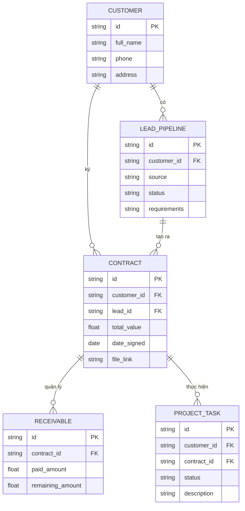

# Bách Khoa ERP System

Hệ thống Quản trị Doanh nghiệp (ERP) thiết kế chuyên biệt cho Công ty Đo đạc Bách Khoa.
Dự án được xây dựng với kiến trúc API hiện đại, giao diện React tương tác thời gian thực và tự động hóa quy trình nghiệp vụ (CRM, Kế toán, Sản xuất, AI).

## 🚀 Công nghệ sử dụng
- **Backend:** FastAPI (Python), SQLAlchemy, PostgreSQL
- **Frontend:** React (Vite), Lucide Icons, CSS Vanilla
- **Automation:** Tự động điền file Hợp đồng Word (docxtpl), chuẩn bị tích hợp Hanet AI, Zalo OA, Telegram.

## 🗄️ Cấu trúc Cơ sở dữ liệu (Database ERD)
Hệ thống sử dụng SQLAlchemy để tự động sinh các bảng trong PostgreSQL. Khi bàn giao cho team khác, không cần file `.sql` thủ công, chỉ cần chạy Backend là CSDL sẽ được khởi tạo.



## 🛠️ Hướng dẫn Cài đặt (Dành cho Developer)

### 1. Backend (FastAPI)
1. Cài đặt Python 3.10+.
2. Di chuyển vào thư mục backend: `cd dev/backend`
3. Cài thư viện: `pip install -r requirements.txt` (nếu chưa có thì tự động cài theo các thư viện trong file `index.py`).
4. Copy file cấu hình: `cp .env.example .env` và điền thông tin PostgreSQL của bạn.
5. Chạy server:
   ```bash
   uvicorn src.index:app --reload --port 8000
   ```
   *Lưu ý: Ngay khi Server chạy, SQLAlchemy sẽ tự động đọc `models.py` và tạo toàn bộ bảng trong Database nếu chưa có.*

### 2. Dữ liệu mẫu (Seed Data)
Để có dữ liệu hiển thị (Bảng điều khiển, Khách hàng, Hợp đồng, Hồ sơ), hãy chạy script tạo dữ liệu giả:
```bash
python scripts/seed_fake_data.py
```

### 3. Frontend (React)
1. Cài đặt Node.js.
2. Di chuyển vào thư mục frontend: `cd dev/frontend`
3. Cài dependencies: `npm install`
4. Khởi chạy ứng dụng:
   ```bash
   npm run dev
   ```

Hệ thống đã sẵn sàng để tích hợp tiếp các Module AI và Automation ở Giai đoạn 2!
