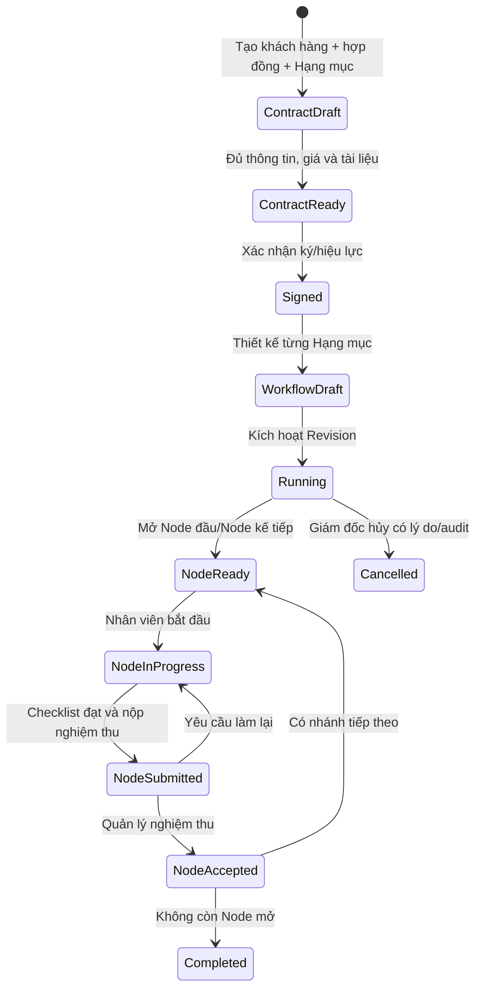

# Rà soát Hợp đồng, Workflow và MinIO — 2026-08-11

Tài liệu này đối chiếu frontend hiện tại, OpenAPI backend đang chạy và schema database live. Đây là danh sách kiểm tra trước khi sửa; không endpoint hay bảng nào bị xóa theo tài liệu này.

## 1. Kết luận nhanh

| Hạng mục | Hiện trạng | Nguyên nhân | Phương án |
|---|---|---|---|
| Xóa checklist | Không có hành động xóa; dòng mới dùng key `item_N` | Frontend chỉ có hàm thêm/cập nhật; key có thể trùng sau khi xóa/thêm lại | Thêm xóa cục bộ theo key duy nhất; lưu draft để đồng bộ graph; runtime pending/ready được Revision đánh dấu `not_applicable` |
| Minh chứng | Upload đã dùng MinIO nhưng cấu hình còn yêu cầu Google Drive | `drive_folder_url` được tự điền bằng URL hợp đồng; backend chỉ chấp nhận host Google Drive | MinIO là nguồn file chính; không bắt URL thư mục khi kích hoạt; giữ link cũ chỉ để tương thích dữ liệu lịch sử |
| Chuyển Node | Record module chỉ sinh lúc nhân viên bấm Bắt đầu | Logic tạo record nằm trong `start_task_node` | Sinh ngay khi Node chuyển sang `ready`; `start` giữ vai trò fallback idempotent cho dữ liệu cũ |
| Hồ sơ Đo vẽ từ gói Pháp lý | Không sinh record Đo vẽ | Code chặn nếu Hạng mục không thuộc `sp_001` | Node có cờ `creates_survey_record` được phép sinh record Đo vẽ kể cả khi workflow thuộc gói Pháp lý |
| Chống trùng Pháp lý | `ON CONFLICT DO NOTHING` không có tác dụng theo `task_node_id` | Bảng live chưa có UNIQUE trên trường này | Khóa Node trong transaction và tìm record theo `task_node_id` trước khi insert; chưa cần đổi schema |
| Phân công | Có validate nhân viên, vai trò, ngày và khoán; bản ghi Pháp lý tạo sớm có thể giữ người phụ trách cũ | Assignment hiện chủ yếu kiểm tra tính hợp lệ kỹ thuật và chưa đồng bộ snapshot liên hệ của hồ sơ Pháp lý | Giữ linh hoạt liên phòng; phân quyền giao việc theo capability; đồng bộ người phụ trách Pháp lý trước khi có mã biên nhận |
| Phân quyền workflow | Các route quản trị workflow trước đây dùng chung `contract.update` | Sales có `contract.update`, vì vậy có thể đi vào thao tác thiết kế/kích hoạt/nghiệm thu ngoài phạm vi | Tách quyền theo tài nguyên `workflow`, `task_node`, `checklist`; Giám đốc/Admin hiện là vai trò có toàn quyền |

## 2. Flow Hợp đồng đề xuất

### Điều kiện nghiệp vụ cần giữ

- Mỗi `service_line` có một `workflow_instance`; mỗi lần sửa logic tạo Revision mới.
- Khi workflow đang chạy, chỉ tọa độ UI được sửa trực tiếp. Thêm/xóa Node, checklist hoặc nhánh phải qua Revision.
- Ngày phân công không được trước `contracts.date_signed`; ngày kết thúc không trước ngày bắt đầu.
- Có thể kích hoạt khi chưa phân công để Giám đốc linh hoạt, nhưng UI phải cảnh báo rõ các Node chưa có người.
- Checklist có minh chứng nhận file từ MinIO. Việc có hay không có link Google Drive không phải điều kiện kích hoạt.
- Node Pháp lý chỉ tạo `legal_submissions` nếu Hạng mục thuộc gói Pháp lý (`sp_002`). Gói Đo vẽ có “hỗ trợ nộp” không tạo vòng đời pháp lý.
- Node Đo vẽ có `creates_survey_record = true` tạo `survey_records`, kể cả khi đó là bước hỗ trợ của một Hạng mục Pháp lý.
- Mỗi `task_node_id` chỉ có tối đa một record cùng loại module; revisit/retry trả lại record cũ.

## 3. Phân công công việc

### Đang đúng

- Chỉ nhân viên active mới được phân.
- Không trùng cùng nhân viên + vai trò trên một Node.
- Tối đa một người `is_primary`.
- Khoán bắt buộc có đúng vai trò đang được cấu hình đơn giá.
- Ngày dự kiến không trước ngày ký hợp đồng.
- Khi thay người, assignment cũ chuyển `replaced`; lịch sử và lương đã phát sinh không bị xóa.
- Nếu Node đã sinh hồ sơ Pháp lý nhưng chưa có mã biên nhận, đổi người phụ trách sẽ cập nhật `assigned_employee_id` và số điện thoại liên hệ. Khi đã có mã biên nhận, thông tin này được giữ làm lịch sử.

### Cần chỉnh/giữ kiểm soát

- Không khóa cứng nhân viên theo phòng vì nghiệp vụ cho phép phối hợp liên phòng; UI cần hiển thị phòng để Giám đốc chọn đúng.
- Khi workflow đang chạy, thay phân công nên có lý do bắt buộc và event audit.
- Node đã `submitted/accepted/cancelled` không được thay phân công.
- Việc tạo record module phải lấy người phụ trách chính hiện tại; nếu chưa phân thì để trống và đọc lại assignment khi hiển thị.

### Quyền đã chuẩn hóa

| Thao tác | Permission backend |
|---|---|
| Lưu workflow nháp, lưu tọa độ | `workflow.update` |
| Kích hoạt, sửa Revision đang chạy, hủy | `workflow.approve` |
| Phân công, nghiệm thu Node | `task_node.approve` |
| Duyệt minh chứng checklist | `checklist.approve` |
| Xem/duyệt phần khoán | `finance.read` / `finance.approve` |

Database live hiện cho `admin` đầy đủ các quyền trên; `sales` chỉ có quyền Hợp đồng và không có quyền quản trị workflow. Muốn ủy quyền trong tương lai chỉ cần cấp permission tương ứng, không cần sửa code theo tên vai trò.

## 4. MinIO

### Hiện trạng

- Upload minh chứng dùng endpoint `POST /api/employee-portal/tasks/{task_node_id}/checklist/{checklist_result_id}/submit`.
- Backend kiểm tra MIME và giới hạn 10 MB, upload vào bucket rồi lưu URL trong `task_node_checklist_results.evidence_data.files`.
- Bucket hiện được cấu hình public-read và URL được ghép từ `MINIO_PUBLIC_URL`.
- Designer vẫn hiển thị trường “Thư mục Google Drive” và backend còn `_validate_drive_url`.

### Chuẩn thống nhất

- `evidence_data.files[]` là nguồn sự thật của minh chứng: `name`, `url`, `note`, `submitted_at`.
- Không bắt buộc `drive_folder_url` khi lưu/kích hoạt workflow.
- Link Drive cũ chỉ được giữ để đọc tương thích, không được tự điền vào checklist mới.
- Môi trường production phải đặt `MINIO_ENDPOINT`, `MINIO_PUBLIC_URL`, access key, secret key và bucket qua secret; không dùng default `minioadmin`.

## 5. Endpoint audit

Backend runtime hiện mount 85 path. Các nhóm dưới đây là **ứng viên**, chưa được phép xóa chỉ dựa trên việc frontend web không gọi.

### Frontend đang gọi nhưng backend không mount

| Frontend path | Vị trí | Hướng xử lý |
|---|---|---|
| `/api/finance/departments` | `PrintVoucherScreen.jsx` | Gộp sang `/api/finance/employees/departments` |
| `/api/piece-rates/rates*` | `BangGiaKhoanScreen.jsx` | Màn hình cũ; thay bằng catalog `work_items/work_item_rates` trong workspace hoặc bỏ khỏi điều hướng |
| `/api/payroll/options` | `LuongKhoan3PScreen.jsx` | Màn hình cũ; nối lại mô hình `work_pay_entitlements` nếu còn sử dụng |
| `/api/payroll/employee-ledger` | `LuongKhoan3PScreen.jsx` | Như trên |
| `/api/payroll/close-employee-period` | `LuongKhoan3PScreen.jsx` | Như trên; không khôi phục endpoint cũ trước khi chốt flow kế toán |

### Backend không có lời gọi trực tiếp từ frontend hiện tại

| Nhóm | Endpoint ứng viên | Nhận xét |
|---|---|---|
| Hợp đồng cũ | `GET/POST /api/contracts/`, `GET /api/contracts/cache/status` | UI mới dùng `workspace-list`, `workspace`, `generate`; cần kiểm tra tích hợp ngoài trước khi gộp |
| Cashflow song song | `/api/cashflow/piece-rates`, `/api/cashflow/transactions` | UI dùng `/api/finance/*`; có dấu hiệu trùng module |
| Finance projection | `/api/finance/cashflow/by-contract/{id}`, `/by-project/{id}`, `POST /{id}/void` | Không có lời gọi trực tiếp từ frontend hiện tại |
| Payroll cũ | `/api/finance/payroll/workers*` | Không có lời gọi trực tiếp; cần đối chiếu báo cáo kế toán |
| Settings finance | `GET/POST /api/finance/settings` | UI dùng `/api/settings`; có khả năng trùng |
| AI/quotation | `/api/ai/analyze-planning`, `/api/quotations/calculate` | Có thể là API tích hợp, không kết luận rác |
| Hồ sơ nhân viên | `/api/employee-portal/employees/{employee_id}` | Không dùng trong UI hiện tại nhưng có giá trị cho quản trị nhân sự |
| Webhook | `/webhook/*` | Không được coi là rác vì được hệ thống ngoài gọi |

### Đề xuất dọn endpoint an toàn

1. Sửa 5 lời gọi frontend đang trỏ vào endpoint không tồn tại hoặc ẩn màn hình cũ.
2. Ghi access log 14–30 ngày cho các endpoint ứng viên.
3. Xác nhận không có Google Sheet/Zalo/cron/app ngoài sử dụng.
4. Đánh dấu deprecated một phiên bản trước khi xóa.
5. Chỉ gộp projection khi response contract đã thống nhất; không xóa hàng loạt trong đợt fix workflow này.

## 6. File và endpoint bị ảnh hưởng trong đợt sửa

- `dev/frontend/src/components/contracts/ContractWorkflowDesigner.jsx`
- `dev/frontend/src/components/contracts/ContractWorkspace.jsx`
- `dev/frontend/src/components/contracts/contracts.css`
- `dev/frontend/src/components/contracts/workflowChecklistState.js`
- `dev/frontend/src/components/contracts/workflowChecklistState.test.js`
- `dev/backend/src/contracts/workflow_runtime.py`
- `dev/backend/src/routes/routes_contracts.py`
- `dev/backend/tests/test_workflow_runtime.py`
- Có thể bổ sung test frontend/backend; không đổi schema.
- Endpoint giữ nguyên URL:
  - `PUT /api/contracts/workflow/{service_line_id}/draft`
  - `POST /api/contracts/workflow/{service_line_id}/activate`
  - `POST /api/contracts/workflow/acceptances/{acceptance_id}/review`
  - `POST /api/employee-portal/tasks/{task_node_id}/start`
  - `POST /api/employee-portal/tasks/{task_node_id}/checklist/{checklist_result_id}/submit`
