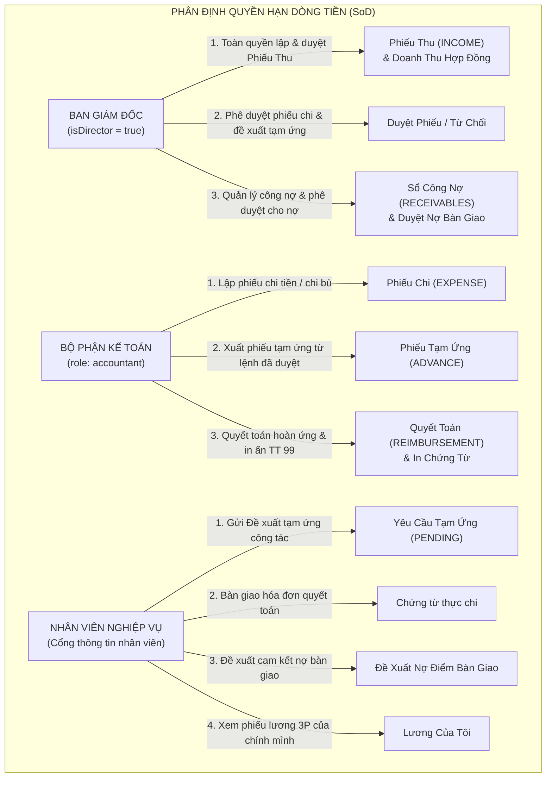
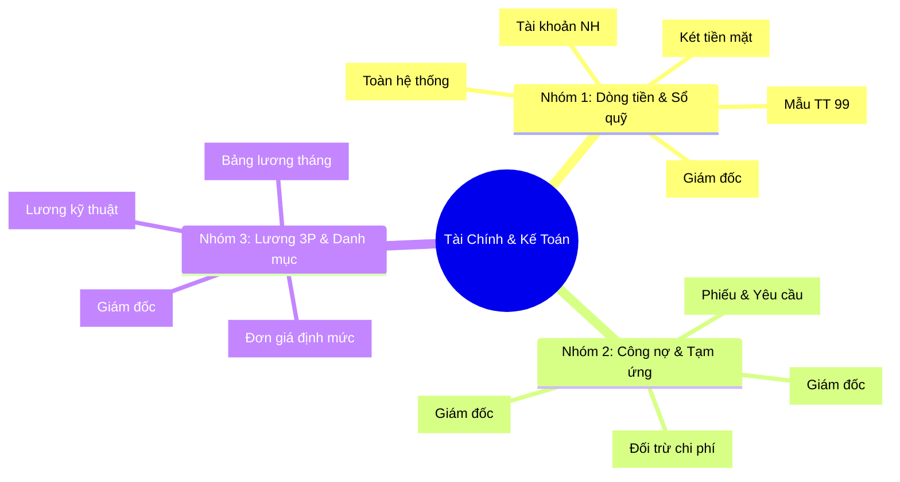
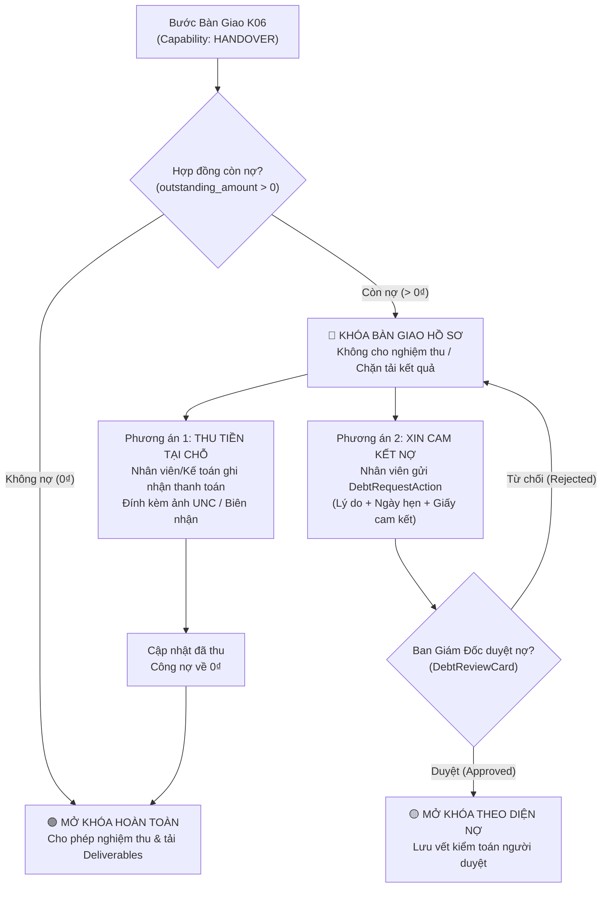
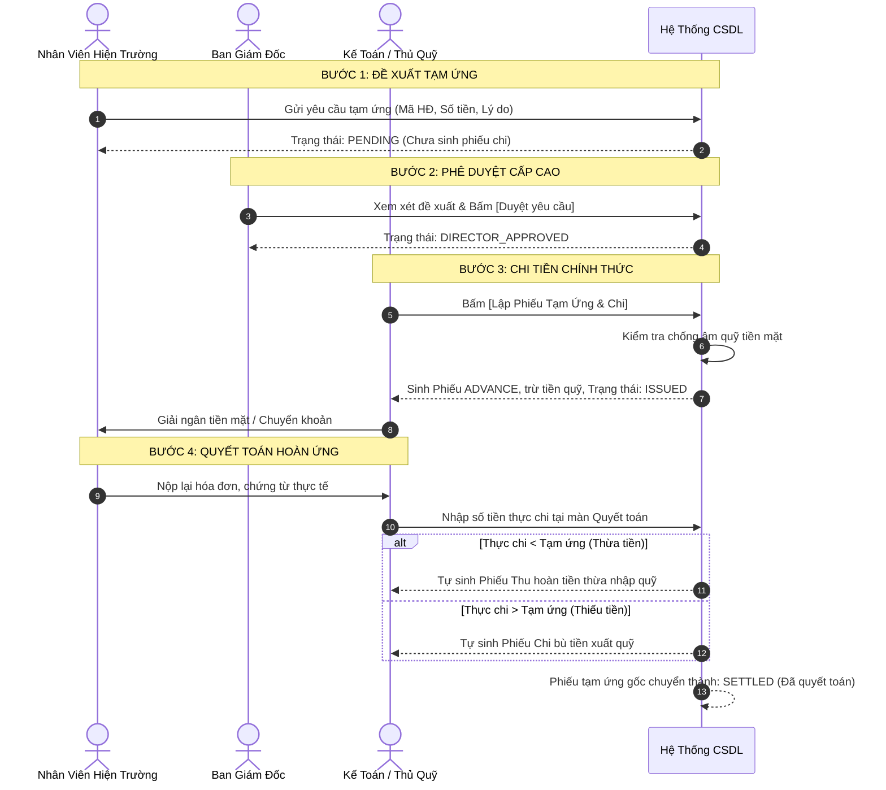
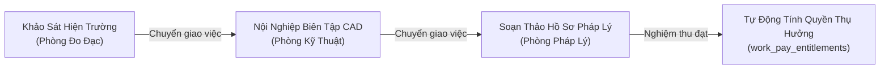

# SỔ TAY HƯỚNG DẪN SỬ DỤNG MODULE KẾ TOÁN & TÀI CHÍNH
### HỆ THỐNG QUẢN TRỊ DOANH NGHIỆP WIFIM ERP
**Đơn vị áp dụng**: Công Ty TNHH Kiến Trúc Xây Dựng và Đo Đạc Bản Đồ Bách Khoa  
**Cơ sở pháp lý**: Thông tư số 99/2025/TT-BTC của Bộ Tài Chính (áp dụng từ 01/01/2026)  
**Phiên bản tài liệu**: 3.2 (Cập nhật toàn diện: Cổng kiểm soát công nợ, Tuổi nợ Aging, In chứng từ TT 99 & Lương khoán Relay Race — Tháng 09/2026)

---

## 📌 MỤC LỤC
1. [Tổng Quan Kiến Trúc & Phân Định Trách Nhiệm (SoD)](#1-tổng-quan-kiến-trúc--phân-định-trách-nhiệm-sod)
2. [Cấu Trúc Giao Diện 3 Phân Hệ & 13 Tab Nghiệp Vụ](#2-cấu-trúc-giao-diện-3-phân-hệ--13-tab-nghiệp-vụ)
3. [Hướng Dẫn Nghiệp Vụ Dành Cho Ban Giám Đốc (Director / Admin)](#3-hướng-dẫn-nghiệp-vụ-dành-cho-ban-giám-đốc-director--admin)
4. [Hướng Dẫn Nghiệp Vụ Dành Cho Kế Toán & Thủ Quỹ (Accountant)](#4-hướng-dẫn-nghiệp-vụ-dành-cho-kế-toán--thủ-quỹ-accountant)
5. [Hướng Dẫn Nghiệp Vụ Dành Cho Nhân Viên Hiện Trường & Cổng Thông Tin (Employee Portal)](#5-hướng-dẫn-nghiệp-vụ-dành-cho-nhân-viên-hiện-trường--cổng-thông-tin-employee-portal)
6. [Cổng Kiểm Soát Công Nợ Tại Điểm Bàn Giao (Handover & Debt Control Gateway)](#6-cổng-kiểm-soát-công-nợ-tại-điểm-bàn-giao-handover--debt-control-gateway)
7. [Quản Lý Công Nợ Phải Thu & Phân Tích Tuổi Nợ (Aging Analysis)](#7-quản-lý-công-nợ-phải-thu--phân-tích-tuổi-nợ-aging-analysis)
8. [Quy Trình Tạm Ứng & Quyết Toán Hoàn Ứng 3 Bước](#8-quy-trình-tạm-ứng--quyết-toán-hoàn-ứng-3-bước)
9. [Quy Chuẩn In Ấn Chứng Từ & Sổ Sách (TT 99/2025/TT-BTC)](#9-quy-chuẩn-in-ấn-chứng-từ--sổ-sách-tt-992025tt-btc)
10. [Kế Toán Lương Khoán 3P & Cơ Chế Relay Race Đa Phòng Ban](#10-kế-toán-lương-khoán-3p--cơ-chế-relay-race-đa-phòng-ban)
11. [Danh Mục Thu Chi Chuẩn Ngành Trắc Địa & Bản Đồ](#11-danh-mục-thu-chi-chuẩn-ngành-trắc-địa--bản-đồ)
12. [Nguyên Tắc An Toàn Tài Chính & Giải Đáp Thắc Mắc (FAQ)](#12-nguyên-tắc-an-toàn-tài-chính--giải-đáp-thắc-mắc-faq)

---

## 1. TỔNG QUAN KIẾN TRÚC & PHÂN ĐỊNH TRÁCH NHIỆM (SoD)

Hệ thống Tài chính & Kế toán của WIFIM ERP được thiết kế theo nguyên tắc **Phân định trách nhiệm nghiêm ngặt (Segregation of Duties - SoD)** nhằm ngăn ngừa rủi ro thất thoát dòng tiền, bảo vệ an toàn ngân quỹ và bảo mật doanh thu hợp đồng:

### Bảng Ma Trận Phân Quyền Tài Chính Cốt Lõi:

| Nghiệp vụ / Tài nguyên | Ban Giám Đốc | Kế toán & Thủ quỹ | Nhân viên nghiệp vụ | Cơ chế an toàn trong hệ thống |
| :--- | :---: | :---: | :---: | :--- |
| **Lập & cập nhật Phiếu Thu** | ✅ Toàn quyền | ❌ Bị chặn 403 | ❌ Bị chặn | `assert_transaction_write_scope`: Chỉ Giám đốc được lập phiếu thu |
| **Xem Dòng tiền Thu & Doanh thu** | ✅ Toàn quyền | ❌ Ẩn tự động | ❌ Bị chặn | `finance_visibility`: Kế toán tự động chuyển sang chế độ `expense` (chỉ xem chi) |
| **Lập Phiếu Chi tiền** | ✅ Toàn quyền | ✅ Lập phiếu chờ duyệt | ❌ Bị chặn | Kế toán lập phiếu chi ở trạng thái `PENDING` gửi Giám đốc duyệt |
| **Phê duyệt Phiếu Thu / Chi** | ✅ Duyệt / Từ chối | ❌ Không tự duyệt | ❌ Bị chặn | `assert_director`: Chỉ Giám đốc mới có quyền duyệt để xuất quỹ |
| **Xem & Xử lý Công nợ Phải thu** | ✅ Toàn quyền | ❌ Ẩn màn hình | ❌ Bị chặn | Bảo mật tuyệt đối công nợ và giá trị hợp đồng khách hàng |
| **Duyệt Đề xuất Cho Nợ Bàn Giao** | ✅ Toàn quyền | ❌ Không tự duyệt | ❌ Bị chặn | Mở khóa điểm bàn giao K06 khi khách hàng có cam kết nợ |
| **Duyệt Yêu cầu Tạm ứng** | ✅ Duyệt / Từ chối | ❌ Không tự duyệt | ❌ Bị chặn | Nhân viên gửi $\rightarrow$ Giám đốc duyệt $\rightarrow$ Kế toán mới được chi |
| **Lập Phiếu Tạm ứng & Chi tiền** | ❌ Chờ kế toán xuất | ✅ Thực hiện chi | ❌ Bị chặn | Chỉ lập được khi có Yêu cầu đã được Giám đốc phê duyệt |
| **Hoàn trả tiền nộp thừa cho khách**| ✅ Toàn quyền | ❌ Bị chặn 403 | ❌ Bị chặn | `assert_director`: Chỉ Giám đốc được duyệt hoàn tiền thừa |
| **Chốt sổ quỹ / Khóa kỳ kế toán** | ✅ Toàn quyền | ❌ Bị chặn | ❌ Bị chặn | Khóa bất biến toàn bộ giao dịch trước ngày chốt sổ |
| **Khóa bảng lương tháng** | ✅ Khóa sổ lương | ❌ Không được khóa | ❌ Bị chặn | Chốt snapshot cố định lương toàn công ty |

---

## 2. CẤU TRÚC GIAO DIỆN 3 PHÂN HỆ & 13 TAB NGHIỆP VỤ

Màn hình Tài chính & Kế toán được quy hoạch khoa học thành **3 Nhóm Phân Hệ Chính** với **13 Tab chức năng**:

### Chi Tiết Phân Quyền & Chức Năng 13 Tab Nghiệp Vụ:

#### 📂 Nhóm 1: Dòng tiền & Sổ quỹ (Cashflow)
1. `monthly-dashboard` (**Báo cáo tháng**): Biểu đồ trực quan doanh số, chi phí, biên lợi nhuận ròng, cơ cấu nhóm chi, nút xuất Excel tổng hợp. *(Chỉ Giám đốc)*
2. `cashflow-all` (**Nhật ký thu chi**): Toàn bộ biến động dòng tiền (Kế toán chỉ thấy phiếu chi; Giám đốc thấy cả thu và chi). Hỗ trợ tìm kiếm tiếng Việt không dấu (`normalizeVietnamese`).
3. `cashflow-cash` (**Quỹ tiền mặt**): Quản lý sổ quỹ tiền mặt thực tế, kiểm kê két, đối soát phiếu thu/chi tiền mặt. Rào chắn chống âm quỹ tiền mặt theo thời gian thực.
4. `cashflow-bank` (**Quỹ ngân hàng**): Quản lý tài khoản ngân hàng công ty, giao dịch chuyển khoản, đối soát ủy nhiệm chi.
5. `cashflow-print` (**Chứng từ in Thu/Chi**): Công cụ soạn thảo và in ấn Phiếu Thu (01-TT), Phiếu Chi (02-TT), Phiếu Tạm Ứng (02-TT/TỨ), Giấy Thanh Toán Tạm Ứng (03-TT/HỨ) theo Thông tư 99/2025/TT-BTC. Tự động đóng tem cảnh báo lưu trữ nếu chứng từ chưa duyệt hoặc đã hủy.

#### 📂 Nhóm 2: Công nợ & Tạm ứng (Debt & Advances)
6. `debt-collection` (**Thu công nợ**): Theo dõi tiến độ thanh toán theo từng đợt của hợp đồng (Đợt 1 cọc, Đợt 2 nộp hồ sơ, Đợt 3 hoàn thành). *(Chỉ Giám đốc)*
7. `receivables` (**Công nợ phải thu**): Sổ chi tiết nợ khách hàng, phân tích tuổi nợ (Aging 5 dải), hợp đồng nộp thừa, nút hoàn tiền thừa tức thì. *(Chỉ Giám đốc)*
8. `advance-request` (**Đề xuất tạm ứng**): Theo dõi luồng tạm ứng từ nhân viên, Giám đốc duyệt, Kế toán chi tiền.
9. `advance-clear` (**Quyết toán hoàn ứng**): Đối soát chi phí thực tế, tự sinh phiếu hoàn tiền thừa nhập quỹ hoặc chi bù xuất quỹ.

#### 📂 Nhóm 3: Lương 3P & Danh mục (Payroll & Settings)
10. `payroll-worker` (**Lương khoán nhiệm vụ**): Bảng kê lương 3P theo hạng mục kỹ thuật/đo đạc. Đồng bộ tự động 100% từ kết quả nghiệm thu checklist, không nhập thủ công.
11. `bang-gia` (**Bảng giá khoán**): Danh mục 15 đơn giá khoán chuẩn, hiệu lực thời gian (`effective_from`, `effective_to`), trạng thái ban hành (`draft` / `published`).
12. `payroll-office` (**Lương VP & hoa hồng**): Bảng tính lương khối văn phòng, hoa hồng kinh doanh, nút Khóa sổ lương tháng (`locked`) và nút Kế toán xác nhận đã chi trả (`PAID`).
13. `cashflow-settings` (**Thiết lập tài chính**): Cấu hình số dư đầu kỳ, chốt kỳ sổ quỹ bất biến, cấu hình 5 chữ ký chứng từ in. *(Chỉ Giám đốc)*

---

## 3. HƯỚNG DẪN NGHIỆP VỤ DÀNH CHO BAN GIÁM ĐỐC (DIRECTOR / ADMIN)

> **Đối tượng áp dụng**: Tổng Giám Đốc, Giám Đốc Điều Hành, Phó Giám Đốc Tài Chính.  
> **Điều kiện tài khoản**: Tài khoản `admin` hoặc nhân sự có phân quyền `isDirector = true`.

### 3.1. Lập Phiếu Thu Tiền & Ghi Nhận Dòng Tiền Vào
> [!IMPORTANT]
> Nhằm đảm bảo an toàn tuyệt đối dòng tiền, hệ thống quy định **duy nhất Ban Giám Đốc** mới có quyền lập và duyệt Phiếu Thu. Kế toán không thể tự tạo phiếu thu tiền.

1. Vào tab **Nhật Ký Thu Chi** (hoặc Quỹ tiền mặt / Quỹ ngân hàng) $\rightarrow$ Bấm nút **`[+ Thu Tiền]`**.
2. Điền thông tin phiếu thu:
   - **Hợp đồng / Dự án**: Gõ tìm kiếm mã hợp đồng hoặc tên khách hàng. Hệ thống tự động điền Tên đối tác và Số điện thoại từ CRM.
   - **Hạng mục thu**: Chọn đúng danh mục (Thu tiền hợp đồng dịch vụ, Thu cọc, Thu hồi công nợ...).
   - **Số tiền**: Nhập số tiền thu được. Hệ thống tự động đọc số tiền thành chữ tiếng Việt chuẩn xác.
   - **Hình thức**: `Tiền mặt` (nhập quỹ két) hoặc `Chuyển khoản` (vào tài khoản ngân hàng).
   - **Trạng thái**: Chọn `Hoàn thành` (đã nhận tiền thực tế) hoặc `Chờ duyệt` (chờ đối soát ngân hàng).
3. Bấm **`[Lưu Phiếu Thu]`**. Nếu ở trạng thái `Hoàn thành`, hệ thống lập tức cộng số dư quỹ và tự động giảm trừ công nợ của hợp đồng tương ứng.

### 3.2. Phê Duyệt Phiếu Chi Tiền Của Kế Toán
- Khi Kế toán lập phiếu chi, giao dịch xuất hiện với huy hiệu màu vàng cam **`Chờ duyệt`** (PENDING). Lúc này, **quỹ tiền chưa bị trừ**.
- Giám đốc nhấp vào mã phiếu để mở `CashflowDetailModal`:
  - Xem kỹ nội dung chi, người nhận tiền, tài liệu/chứng từ gốc đính kèm qua `ReceiptLinks`.
  - Bấm **`[✓ Duyệt Phiếu]`**: Hệ thống trừ tiền quỹ, cập nhật số dư tức thì, ghi nhận lịch sử duyệt vào `AuditLog`.
  - Bấm **`[✕ Từ Chối]`**: **Bắt buộc nhập lý do từ chối** (Ví dụ: "Thiếu hóa đơn VAT", "Chi sai định mức") để Kế toán nắm rõ và bổ sung.

### 3.3. Xử Lý Hợp Đồng Nộp Thừa (Hoàn Tiền Cho Khách Hàng)
1. Vào tab **Công Nợ Phải Thu** $\rightarrow$ Hệ thống tự động gắn huy hiệu màu tím **`Nộp thừa`** cho các hợp đồng có số tiền đã thu lớn hơn giá trị hợp đồng.
2. Tại cột Xử lý, Giám đốc bấm nút **`[Hoàn tiền thừa]`** (kích hoạt `SensitiveActionModal`).
3. Nhập số tiền cần hoàn trả và lý do hoàn trả $\rightarrow$ Bấm xác nhận.
4. Hệ thống tự động lập một **Phiếu Chi hoàn tiền** (hạng mục `Chi hoàn trả khách hàng`), trừ số tiền nộp thừa và cân bằng lại công nợ hợp đồng về đúng 0₫.

### 3.4. Hủy Phiếu Sai Sót (Cơ Chế Bút Toán Đảo - Voiding)
> [!WARNING]
> Hệ thống áp dụng chuẩn kiểm toán quốc tế: **Tuyệt đối không xóa cứng (Hard Delete)** giao dịch tài chính đã ghi nhận trong cơ sở dữ liệu.

- Khi phát hiện một giao dịch đã duyệt bị sai sót: Mở chi tiết phiếu $\rightarrow$ Bấm nút **`[Hủy phiếu]`**.
- Bắt buộc nhập lý do hủy phiếu.
- Hệ thống tự động thực hiện **Bút toán đảo ngược**:
  - **Hủy phiếu chi**: Tự sinh nghiệp vụ hoàn tiền lại vào quỹ.
  - **Hủy phiếu thu**: Tự sinh nghiệp vụ điều chỉnh giảm quỹ và phục hồi lại công nợ gốc của khách hàng.
  - Toàn bộ thao tác hủy được gắn thẻ `CANCELLED`, gạch ngang số tiền và lưu rõ người hủy, ngày giờ, lý do.

### 3.5. Chốt Sổ Quỹ & Khóa Kỳ Kế Toán Bất Biến
1. Vào tab **Thiết Lập Tài Chính** $\rightarrow$ Mục **Chốt Sổ Quỹ / Khóa Kỳ Kế Toán**.
2. Chọn mốc thời gian cần chốt (Ví dụ: 23:59:59 ngày cuối tháng). Hệ thống tự động tính toán chính xác số dư thực tế của Quỹ Tiền Mặt và Quỹ Ngân Hàng đến từng giây.
3. Giám đốc kiểm đếm tiền thực tế trong két, nhập số dư xác nhận và ghi chú biên bản kiểm kê $\rightarrow$ Bấm **`[Xác Nhận Chốt Kỳ]`**.
4. **Hiệu lực khóa**: Toàn bộ giao dịch thu chi có ngày $\le$ ngày chốt sẽ bị khóa bất biến (`Immutable`). Kế toán không thể thêm, sửa, hay hủy các phiếu thuộc kỳ đã chốt.

### 3.6. Cấu Hình 5 Chức Danh Ký Chứng Từ & Signer Snapshot
1. Vào tab **Thiết Lập Tài Chính** $\rightarrow$ Mục **Cấu Hình Người Ký Chứng Từ**.
2. Điền thông tin chuẩn của ban điều hành:
   - **Giám đốc**: Họ tên (Mặc định: *Lê Văn Sáu*).
   - **Kế toán trưởng**: Họ tên & Chức danh (*Kế toán trưởng* hoặc *Kế toán phụ trách*).
   - **Thủ quỹ**: Họ tên thủ quỹ chịu trách nhiệm tiền mặt.
   - **Kế toán tiền lương**: Họ tên kế toán phụ trách bảng lương.
3. Bấm **`[Lưu Cấu Hình Người Ký]`**. Khi lập phiếu, hệ thống tự động chụp ảnh cấu hình (`signer_snapshot`) gắn chặt vào chứng từ in.

---

## 4. HƯỚNG DẪN NGHIỆP VỤ DÀNH CHO KẾ TOÁN & THỦ QUỸ (ACCOUNTANT)

> **Đối tượng áp dụng**: Kế toán trưởng, Kế toán thanh toán, Kế toán chi phí, Thủ quỹ.  
> **Quyền hạn hệ thống**: Tài khoản có phân quyền Role `accountant`.

### 4.1. Tầm Nhìn Dữ Liệu & Phạm Vi Thao Tác
> [!NOTE]
> Nhằm bảo mật doanh thu theo chính sách của Ban Giám Đốc, tài khoản Kế toán khi đăng nhập vào hệ thống sẽ hoạt động ở chế độ **`expense` (chỉ xem chi phí)**:
> - Chỉ hiển thị các tab: *Nhật ký thu chi, Quỹ tiền mặt, Quỹ ngân hàng, Chứng từ in, Đề xuất tạm ứng, Quyết toán hoàn ứng, Lương khoán, Bảng giá khoán, Lương văn phòng*.
> - Mọi số liệu và dòng tiền Thu (INCOME) được hệ thống tự động ẩn để tránh lộ dữ liệu doanh thu hợp đồng.
> - Kế toán **chỉ lập và cập nhật Phiếu Chi (EXPENSE)**. Không lập phiếu thu.

### 4.2. Lập Phiếu Chi Tiền Hàng Ngày
1. Tại tab **Nhật Ký Thu Chi** (hoặc Quỹ tiền mặt / Quỹ ngân hàng) $\rightarrow$ Bấm nút **`[- Chi Tiền]`**.
2. Nhập các thông tin chứng từ:
   - **Hạng mục chi**: Chọn đúng trong danh mục chuẩn (Văn phòng phẩm, Công tác phí, Xăng xe, Điện nước, Sửa máy đo...).
   - **Đối tác / Người nhận tiền**: Điền tên cá nhân/đơn vị nhận thanh toán.
   - **Số tiền**: Nhập số tiền chi.
   - **Hình thức**: `Tiền mặt` hoặc `Chuyển khoản`.
   - **Diễn giải**: Ghi rõ mục đích chi, số hóa đơn chứng từ gốc kèm theo.
   - **Đính kèm**: Tải lên ảnh chụp hóa đơn, biên nhận, phiếu xuất kho qua `ReceiptFileInput`.
3. Bấm **`[Lưu Phiếu Chi]`**. Phiếu được lưu ở trạng thái `Chờ duyệt` (PENDING) và chuyển ngay lên thông báo chờ Giám đốc phê duyệt.

### 4.3. Xuất Phiếu Tạm Ứng Từ Yêu Cầu Đã Được Giám Đốc Duyệt
> [!IMPORTANT]
> Kế toán **tuyệt đối không lập phiếu tạm ứng tự do** nếu chưa có đề xuất được Giám đốc phê duyệt trước trên hệ thống.

1. Vào tab **Đề Xuất Tạm Ứng**.
2. Tìm yêu cầu tạm ứng có huy hiệu màu xanh lá **`ĐÃ DUYỆT (DIRECTOR_APPROVED)`**.
3. Bấm nút **`[Lập Phiếu Tạm Ứng & Chi]`**.
4. Kiểm tra số tiền, chọn hình thức chi trả (`Tiền mặt` tại quỹ két hoặc `Chuyển khoản` vào STK nhân viên) $\rightarrow$ Xác nhận chi.
5. Hệ thống tự động sinh một **Phiếu Tạm Ứng (ADVANCE)** chính thức, trừ tiền quỹ và chuyển trạng thái yêu cầu của nhân viên thành `ĐÃ CHI TIỀN (ISSUED)`.

### 4.4. Thực Hiện Quyết Toán Hoàn Ứng (Advance Settlement)
1. Khi nhân viên công tác về và nộp lại toàn bộ hóa đơn/chứng từ thực chi: Vào tab **Quyết Toán Hoàn Ứng**.
2. Chọn phiếu tạm ứng cần quyết toán của nhân viên đó.
3. Nhập **Số tiền thực chi** theo tổng hóa đơn hợp lệ nộp lại.
4. Hệ thống tự động đối trừ:
   - **Nếu Thực chi < Tạm ứng (Thừa tiền)**: Nhân viên phải nộp lại tiền thừa vào quỹ $\rightarrow$ Hệ thống tự động sinh một **Phiếu Thu hoàn ứng (REIMBURSEMENT)** nhập lại quỹ két.
   - **Nếu Thực chi > Tạm ứng (Thiếu tiền)**: Công ty chi bù thêm cho nhân viên $\rightarrow$ Hệ thống tự động sinh một **Phiếu Chi bù (REIMBURSEMENT)** xuất quỹ.
   - **Nếu Thực chi = Tạm ứng**: Quyết toán cân bằng, không phát sinh dòng tiền bù trừ.
5. Bấm **`[Xác Nhận Quyết Toán]`** $\rightarrow$ Phiếu tạm ứng gốc chuyển sang trạng thái **`ĐÃ QUYẾT TOÁN (SETTLED)`**.

### 4.5. Soạn Thảo & In Chứng Từ Kế Toán Chuẩn Bộ Tài Chính
1. Vào tab **Chứng Từ In (Thu/Chi)** (`PrintVoucherScreen`).
2. Chọn biểu mẫu cần in:
   - **Phiếu Thu (Mẫu 01 - TT)**
   - **Phiếu Chi (Mẫu 02 - TT)**
   - **Phiếu Tạm Ứng (Mẫu 02 - TT/TỨ)**
   - **Giấy Thanh Toán Tạm Ứng (Mẫu 03 - TT/HỨ)**
3. Nhập/chọn mã phiếu cần in hoặc điền thông tin nhanh. Hệ thống tự động:
   - Điền tài khoản Nợ/Có chuẩn mực kế toán (1111, 1121, 141, 642, 334, 154, 131, 511).
   - Đọc số tiền thành chữ tiếng Việt chuẩn xác.
   - Lấy đúng tên các chức danh ký tên từ cấu hình hoặc snapshot chứng từ.
   - Hiển thị tem cảnh báo lưu trữ nếu chứng từ chưa duyệt hoặc đã bị từ chối/hủy.
4. Bấm **`[🖨️ In Phiếu]`** để xuất lệnh in máy in hoặc lưu thành file PDF khổ A4/A5.

### 4.6. Xác Nhận Chi Trả Lương Đã Khóa
1. Vào tab **Lương VP & Hoa Hồng**.
2. Với các kỳ lương đã được Giám đốc bấm Khóa sổ (`locked`), sau khi Kế toán/Thủ quỹ hoàn tất chuyển khoản hoặc phát tiền mặt cho nhân viên, bấm nút **`[Xác Nhận Đã Thanh Toán Lương]`**.
3. Kỳ lương chuyển trạng thái sang **`ĐÃ THANH TOÁN (PAID)`**.

---

## 5. HƯỚNG DẪN NGHIỆP VỤ DÀNH CHO NHÂN VIÊN HIỆN TRƯỜNG & CỔNG THÔNG TIN (EMPLOYEE PORTAL)

> **Đối tượng áp dụng**: Kỹ sư trắc địa, Đội trưởng đo đạc hiện trường, Chuyên viên thụ lý hồ sơ đất đai, Nhân viên kinh doanh.  
> **Giao diện thao tác**: **Cổng Thông Tin Nhân Viên (Employee Portal)**.

### 5.1. Gửi Đề Xuất Tạm Ứng Công Tác / Hiện Trường
1. Trước khi đi đo đạc thực địa, cắm mốc hoặc nộp lệ phí cơ quan nhà nước, nhân viên đăng nhập vào Cổng thông tin $\rightarrow$ Chọn mục **Tạm Ứng Của Tôi** $\rightarrow$ Bấm **`[+ Gửi Đề Xuất Tạm Ứng]`**.
2. Điền phiếu đề xuất:
   - **Hợp đồng / Dự án**: Chọn mã hợp đồng/công trình sắp thực hiện.
   - **Số tiền xin tạm ứng**: Nhập số tiền dự toán chi phí.
   - **Nội dung chi tiết**: Ghi rõ mục đích (Ví dụ: "Tạm ứng cắm mốc ranh 4 góc thửa đất và tiền trích lục bản đồ huyện Cần Giờ").
   - **Hình thức nhận**: `Tiền mặt` (nhận tại quầy thủ quỹ) hoặc `Chuyển khoản` (nhập STK ngân hàng cá nhân).
3. Bấm **`[Gửi Đề Xuất]`**. Yêu cầu chuyển ngay vào danh sách chờ Ban Giám Đốc duyệt.

### 5.2. Theo Dõi Tiến Độ Giải Ngân Đề Xuất Tạm Ứng
Nhân viên theo dõi cột trạng thái của đề xuất:
- 🟡 **Chờ duyệt (PENDING)**: Đang chờ Ban Giám Đốc xem xét.
- 🟢 **Giám đốc đã duyệt (DIRECTOR_APPROVED)**: Đã được phê duyệt, Kế toán đang chuẩn bị xuất tiền.
- 🔵 **Đã chi tiền (ISSUED)**: Kế toán đã lập phiếu chi. Nhân viên liên hệ Thủ quỹ nhận tiền mặt hoặc kiểm tra tài khoản ngân hàng.
- 🔴 **Từ chối (REJECTED)**: Đề xuất bị từ chối. Nhân viên rê chuột vào để xem lý do từ chối của Giám đốc để chỉnh sửa gửi lại.

### 5.3. Bàn Giao Hóa Đơn & Quyết Toán Hoàn Ứng
1. Sau khi hoàn thành công tác, nhân viên tập hợp toàn bộ hóa đơn đỏ, biên nhận nộp lệ phí, phiếu thu trích lục, hóa đơn xăng xe...
2. Nộp toàn bộ chứng từ gốc cho Kế toán để thực hiện quyết toán.
3. Kế toán nhập số tiền thực chi:
   - Nếu còn thừa tiền tạm ứng: Nhân viên hoàn trả lại tiền mặt cho Thủ quỹ.
   - Nếu chi vượt số tiền tạm ứng: Kế toán xuất quỹ chi bù thêm cho nhân viên.

### 5.4. Tra Cứu Bảng Lương Cá Nhân (Lương Của Tôi)
- Vào mục **Lương Của Tôi** trên Cổng nhân viên:
  - Xem chi tiết **Lương cơ bản**, ngày công chuẩn, ngày công thực tế.
  - Xem chi tiết **Lương khoán nhiệm vụ (Lương 3P)**: Liệt kê từng node công việc, mã hồ sơ đã đo vẽ/thụ lý thành công được nghiệm thu.
  - Xem các khoản phụ cấp, thưởng tiến độ, thưởng dự án ưu tiên.
  - Xem tổng thu nhập thực nhận (NET).
- **Nguyên tắc bảo mật**: Nhân viên chỉ xem được duy nhất bảng lương của chính mình, không thể xem bảng lương của người khác hay bảng lương toàn công ty.

---

## 6. CỔNG KIỂM SOÁT CÔNG NỢ TẠI ĐIỂM BÀN GIAO (HANDOVER & DEBT CONTROL GATEWAY)

> [!CAUTION]
> Điểm bàn giao kết quả (Node `K06` hoặc node có năng lực `HANDOVER`) là chốt chặn tài chính cuối cùng để thu hồi 100% công nợ hợp đồng trước khi giao giấy chứng nhận hoặc hồ sơ bản vẽ cho khách hàng.

### 6.1. Rào Chắn Khóa Bàn Giao Tự Động
- Khi một node công việc được cấu hình năng lực `HANDOVER` trong workflow:
  - Hệ thống tự động truy vấn tổng giá trị hợp đồng và số tiền đã thanh toán: `outstanding_amount = total_amount - paid_amount`.
  - Nếu `outstanding_amount > 0`: Giao diện hiển thị thanh tiến độ thu tiền màu đỏ cảnh báo **"HỢP ĐỒNG CÒN CÔNG NỢ: ...₫ — KHÓA BÀN GIAO"**.
  - Nút nghiệm thu checklist bàn giao và khu vực tải tài liệu bàn giao (`deliverables`) bị khóa chặt.

### 6.2. Ghi Nhận Thu Tiền Nhanh Tại Chỗ
- Nhân viên hoặc Kế toán bấm nút **`[Thu tiền tại chỗ]`** ngay trên bảng `HandoverPanel`:
  - Nhập số tiền khách thanh toán.
  - Chọn phương thức: `Tiền mặt` hoặc `Chuyển khoản`.
  - Tải lên chứng từ thanh toán (ảnh ủy nhiệm chi, biên lai chuyển khoản thành công) qua `ReceiptFileInput`.
  - Hệ thống lưu chứng từ qua `ReceiptLinks` và tự động cập nhật giảm trừ công nợ. Khi công nợ về 0₫, rào chắn lập tức mở khóa.

### 6.3. Quy Trình Xin Cho Nợ & Phê Duyệt Cấp Giám Đốc
Nếu khách hàng xin nhận hồ sơ trước và hẹn thanh toán sau:
1. **Nhân viên lập yêu cầu xin nợ (`DebtRequestAction`)**:
   - Nhập **Lý do xin nợ** (bắt buộc, ví dụ: "Khách hàng quen, cam kết thanh toán sau khi công chứng").
   - Chọn **Ngày hẹn thanh toán** (`promised_payment_date`).
   - Đính kèm **Biên bản cam kết thanh toán** có chữ ký khách hàng (`commitment_file`).
   - Bấm **`[Gửi Yêu Cầu Duyệt Nợ]`**.
2. **Ban Giám Đốc thẩm định (`DebtReviewCard`)**:
   - Giám đốc xem xét đề xuất, lịch sử thanh toán của khách hàng và file cam kết.
   - Bấm **`[Duyệt Cho Nợ]`**: Hệ thống mở khóa bước bàn giao K06, cho phép bàn giao kết quả và ghi nhận vào sổ theo dõi công nợ đặc biệt.
   - Bấm **`[Từ Chối]`**: Bắt buộc nhập lý do từ chối. Hồ sơ tiếp tục bị giữ lại cho đến khi khách thanh toán đủ.

---

## 7. QUẢN LÝ CÔNG NỢ PHẢI THU & PHÂN TÍCH TUỔI NỢ (AGING ANALYSIS)

Tab **Công Nợ Phải Thu** (`ReceivablesScreen`) cung cấp cái nhìn toàn diện về các khoản phải thu từ khách hàng:

### 7.1. Bảng 5 Dải Tuổi Nợ Chuẩn Kế Toán (Aging Buckets):

| Dải Tuổi Nợ | Mã Hệ Thống | Định Nghĩa Thời Gian | Mức Độ Rủi Ro & Hành Động Đề Xuất |
| :--- | :---: | :--- | :--- |
| **Trong hạn** | `in_term` | Chưa đến ngày hẹn thanh toán | Dòng tiền an toàn, chăm sóc bình thường |
| **Quá hạn $\le 30$ ngày** | `overdue_30` | Trễ từ 1 đến 30 ngày so với hạn | Sales/Kế toán gọi điện nhắc nợ lần 1 |
| **Quá hạn 31 – 60 ngày** | `overdue_60` | Trễ từ 31 đến 60 ngày | Gửi thông báo nhắc nợ văn bản lần 2 |
| **Quá hạn 61 – 90 ngày** | `overdue_90` | Trễ từ 61 đến 90 ngày | Tạm dừng các dịch vụ/hợp đồng phát sinh mới |
| **Quá hạn $> 90$ ngày** | `overdue_plus` | Trễ trên 90 ngày | Chuyển bộ phận Pháp lý xử lý thu hồi nợ khó đòi |
| **Đã tất toán** | `settled` | Số tiền còn lại $\le 0$ | Đã thu đủ hoặc nộp thừa |

### 7.2. Bộ Lọc Thông Minh & Tìm Kiếm Không Dấu
- **Tìm kiếm đa năng**: Gõ tên khách hàng, số điện thoại, hoặc mã hợp đồng. Hệ thống ứng dụng thuật toán `normalizeVietnamese` giúp tìm kiếm chính xác kể cả khi gõ tiếng Việt không dấu hoặc sai dấu.
- **Lọc theo dải nợ**: Lọc tức thì các hợp đồng thuộc dải nợ `overdue_plus` để tập trung xử lý nợ đọng.
- **Lọc theo khoảng tiền nợ**: Dưới 10 triệu, 10 - 50 triệu, trên 50 triệu.

### 7.3. Xuất Báo Cáo & In Sổ Công Nợ Chuẩn
- Bấm **`[Xuất Excel]`**: Tải file bảng tính chi tiết toàn bộ danh sách công nợ khách hàng.
- Bấm **`[🖨️ In Sổ Công Nợ]`**: Sử dụng thành phần `FinancePrintReport` để xem trước và in khổ A4 ngang:
  - Hàng tiêu đề cột lặp lại ở đầu mỗi trang in.
  - Dòng **TỔNG CỘNG CÔNG NỢ** chỉ xuất hiện duy nhất 1 lần ở cuối trang cuối cùng.

---

## 8. QUY TRÌNH TẠM ỨNG & QUYẾT TOÁN HOÀN ỨNG 3 BƯỚC

Quy trình tạm ứng trong WIFIM ERP được thiết kế khép kín theo chuẩn kiểm soát nội bộ 3 bước nhằm chống thất thoát:

---

## 9. QUY CHUẨN IN ẤN CHỨNG TỪ & SỔ SÁCH (TT 99/2025/TT-BTC)

Toàn bộ hệ thống in ấn trong WIFIM ERP tuân thủ nghiêm ngặt các quy định về chứng từ kế toán của Bộ Tài Chính theo **Thông tư số 99/2025/TT-BTC** (áp dụng cho các doanh nghiệp đo đạc bản đồ, tư vấn xây dựng):

### 9.1. Bảng Tiêu Chuẩn Các Biểu Mẫu Chứng Từ:

| Biểu Mẫu | Mã Số TT 99 | Tài Khoản Nợ | Tài Khoản Có | Chữ Ký Tiền Mặt (5 Chữ Ký) | Chữ Ký Chuyển Khoản (3 Chữ Ký) |
| :--- | :---: | :---: | :---: | :--- | :--- |
| **Phiếu Thu** | **01 - TT** | `1111` | `131`, `511` | Giám đốc, Kế toán trưởng, Thủ quỹ, Người lập phiếu, Người nộp tiền | Giám đốc, Kế toán trưởng, Người lập phiếu |
| **Phiếu Chi** | **02 - TT** | `642`, `334`, `154` | `1111` | Giám đốc, Kế toán trưởng, Thủ quỹ, Người lập phiếu, Người nhận tiền | Giám đốc, Kế toán trưởng, Người lập phiếu |
| **Phiếu Tạm Ứng** | **02 - TT/TỨ**| `141` | `1111` / `1121` | Giám đốc, Kế toán trưởng, Thủ quỹ, Người lập, Người nhận tạm ứng | Giám đốc, Kế toán trưởng, Người lập, Người nhận tạm ứng |
| **Giấy Thanh Toán Tạm Ứng** | **03 - TT/HỨ**| `642`, `154` | `141` | Giám đốc, Kế toán trưởng, Thủ quỹ, Người thanh toán | Giám đốc, Kế toán trưởng, Người thanh toán |

### 9.2. Tem Cảnh Báo Lưu Trữ Tự Động (Non-Posting Archive Warning)
Khi in chứng từ qua `PrintVoucherScreen`, hệ thống tự động kiểm tra trạng thái phiếu:
- 🔴 **Chứng từ BỊ TỪ CHỐI (`REJECTED`)**: In con dấu khung đỏ nổi bật:  
  **`CHỨNG TỪ BỊ TỪ CHỐI — KHÔNG GHI SỔ CÁI (NON-POSTING ARCHIVE WARNING)`**. Chứng từ này chỉ dùng để lưu trữ hồ sơ kiểm toán lý do từ chối, tuyệt đối không dùng để kê khai thuế.
- 🟡 **Chứng từ CHỜ PHÊ DUYỆT (`PENDING`)**: In khung vàng cam cảnh báo chứng từ chưa có hiệu lực xuất quỹ.
- ⚪ **Chứng từ ĐÃ HỦY (`CANCELLED`)**: In khung xám cảnh báo chứng từ đã bị vô hiệu hóa bởi bút toán đảo.

### 9.3. Cơ Chế Snapshot Chữ Ký Bất Biến (Signer Snapshot)
- Khi một phiếu tài chính được khởi tạo hoặc phê duyệt, hệ thống tự động chụp ảnh cấu hình người ký tại thời điểm đó (`signer_snapshot` trong CSDL).
- **Lợi ích**: Kể cả sau này công ty có thay đổi Kế toán trưởng, Thủ quỹ hay Giám đốc thì các chứng từ in của những năm trước vẫn giữ nguyên vẹn họ tên của người đã ký tại thời điểm lịch sử đó, bảo đảm tính pháp lý trước cơ quan Thuế và Kiểm toán.

### 9.4. Quy Chuẩn Sổ Sách Nhiều Trang
- **Phông chữ chuẩn mực**: Toàn bộ chứng từ in sử dụng phông chữ *Times New Roman*, kích thước chữ rõ ràng, căn lề chuẩn trang in văn bản hành chính.
- **Tiêu đề bảng lặp lại**: Khi in sổ Nhật ký thu chi hoặc Sổ công nợ nhiều trang, hàng tiêu đề cột sẽ tự động lặp lại ở đầu mỗi trang để tránh nhầm lẫn.
- **Dòng TỔNG CỘNG kế toán**: Áp dụng quy tắc kế toán: Dòng **TỔNG CỘNG** chỉ xuất hiện **duy nhất 1 lần ở chân trang cuối cùng**, không bị in lặp rác ở các trang giữa.

---

## 10. KẾ TOÁN LƯƠNG KHOÁN 3P & CƠ CHẾ RELAY RACE ĐA PHÒNG BAN

Hệ thống tính lương khoán nhiệm vụ (`PieceRatePayrollScreen`) áp dụng phương pháp khoán sản phẩm 3P theo chuỗi chuyển tiếp (Relay Race):

### 10.1. Nguyên Tắc Khoán Không Trả Hai Lần
- Hệ thống áp dụng kiểm soát chặt chẽ: **Một hạng mục công việc chỉ được thanh toán lương khoán duy nhất một lần**.
- Khi một node công việc bị trả về sửa chữa (Rework) hoặc Rollback, hệ thống không tạo thêm khoản lương khoán mới. Khi nghiệm thu lại, chỉ cập nhật bản ghi đã có.

### 10.2. Chuyển Giao Công Việc & Tỷ Lệ Thụ Hưởng (Handover Share)
- Khi có sự thay đổi nhân sự thực hiện giữa chừng qua `EmployeeHandoverModal`:
  - Phân công cũ được chuyển trạng thái sang `replaced` và ghi nhận thời điểm kết thúc `ended_at = now()`.
  - Phân công mới được tạo cho nhân sự tiếp nhận.
  - Tỷ lệ % chia sẻ lương khoán (`share_percent`) được phân bổ chính xác theo thỏa thuận bàn giao công việc giữa hai nhân sự.

### 10.3. Bảng Giá Khoán Chuẩn 15 Định Mức (`PieceRatePricingScreen`)
- Quản lý danh mục 15 đơn giá khoán định mức chuẩn ngành đo đạc bản đồ.
- Mỗi đơn giá có ngày bắt đầu hiệu lực (`effective_from`) và ngày kết thúc (`effective_to`).
- Phải được Ban Giám Đốc duyệt ban hành (`published`) mới có hiệu lực áp dụng tự động cho các hợp đồng mới.

---

## 11. DANH MỤC THU CHI CHUẨN NGÀNH TRẮC ĐỊA & BẢN ĐỒ

Hệ thống đã chuẩn hóa sẵn toàn bộ danh mục tài chính đặc thù của ngành Đo đạc, Địa chính và Xây dựng:

### 11.1. Danh Mục Thu (INCOME)
1. **Thu tiền hợp đồng dịch vụ**: Thu tiền theo hợp đồng đo vẽ, hồ sơ cấp sổ, chuyển mục đích sử dụng đất, trích lục bản đồ.
2. **Thu hoàn tiền tạm ứng thừa**: Thu hồi tiền thừa từ nhân viên sau khi quyết toán công tác phí/hiện trường.
3. **Thu chênh lệch kiểm kê quỹ**: Thu hồi khoản tiền thừa sau khi kiểm kê quỹ két tiền mặt.
4. **Thu lãi tiền gửi & Tài chính**: Lãi suất ngân hàng từ tài khoản thanh toán công ty.
5. **Thu hoàn tác (Hủy phiếu chi)**: Dòng tiền phục hồi lại quỹ sau khi hủy phiếu chi sai.
6. **Thu khác**: Các khoản thu thanh lý thiết bị cũ, thu hỗ trợ khác.

### 11.2. Danh Mục Chi (EXPENSE)
1. **Chi phí tạm ứng công tác**: Tạm ứng đi đo đạc thực địa, cắm mốc, dẫn mốc ranh.
2. **Chi ngoại giao & Xử lý hồ sơ**: Chi phí quan hệ công việc, giải quyết nhanh thủ tục hồ sơ địa chính.
3. **Bồi dưỡng thẩm định & Hiện trường**: Bồi dưỡng cán bộ thẩm định hiện trường, cán bộ địa chính dẫn ranh mốc.
4. **Chi thụ lý bản vẽ & Trích lục**: Lệ phí trích lục bản đồ địa chính, lấy bản vẽ nội nghiệp.
5. **Công chứng, Lệ phí & Nghĩa vụ thuế**: Lệ phí nộp ngân sách, công chứng vi bằng, trước bạ.
6. **Chi tiếp khách & Giao tế**: Chi phí cà phê, tiếp đối tác, mở rộng khách hàng của phòng Kinh doanh.
7. **Chi lương, Thù lao & Hoa hồng 3P**: Chi lương văn phòng, lương khoán kỹ thuật viên đo vẽ và hoa hồng kinh doanh.
8. **Công tác phí & Di chuyển hiện trường**: Tiền xăng xe, thuê xe đo đạc, bưu chính chuyển phát nhanh bản đồ.
9. **Văn phòng phẩm & In ấn kỹ thuật**: Mua giấy in A0, A3, mực máy plotter, ghim, bìa hồ sơ địa chính.
10. **Điện - Nước - Internet**: Chi phí điện sinh hoạt, nước văn phòng, đường truyền cáp quang.
11. **Sửa chữa, Kiểm định máy đo & Thiết bị**: Chi phí hiệu chuẩn, kiểm định trạm Total Station, máy GPS RTK, sửa chữa máy tính.
12. **Chi hoàn trả khách hàng**: Hoàn trả tiền thừa hợp đồng hoặc tiền cọc cho khách.
13. **Chi điều chỉnh hủy phiếu (Hủy phiếu thu)**: Bút toán đảo giảm quỹ khi hủy phiếu thu sai.
14. **Chi chênh lệch kiểm kê quỹ**: Hạch toán khoản thiếu hụt tiền mặt sau khi kiểm kê két.
15. **Chi phí hành chính & Khác**: Các chi phí lặt vặt văn phòng khác.

---

## 12. NGUYÊN TẮC AN TOÀN TÀI CHÍNH & GIẢI ĐÁP THẮC MẮC (FAQ)

### 12.1. Các Rào Chắn Kiểm Soát Tự Động (Hard Rules)
- 🛡️ **Quy tắc 1 - Chống âm quỹ tiền mặt**: Khi Kế toán hoặc Giám đốc duyệt chi bất kỳ khoản tiền nào, nếu `Số dư quỹ tiền mặt < Số tiền chi`, hệ thống sẽ lập tức chặn đứng giao dịch và báo lỗi: `"Âm quỹ tiền mặt! Số dư: ...₫ < ...₫ cần chi"`.
- 🛡️ **Quy tắc 2 - Khóa bất biến kỳ đã chốt**: Bất kỳ chứng từ nào có ngày giao dịch trước hoặc bằng ngày chốt sổ quỹ gần nhất đều bị từ chối chỉnh sửa hoặc hủy bỏ.
- 🛡️ **Quy tắc 3 - Không trừ nợ trên phiếu chờ duyệt**: Chỉ các phiếu thu có trạng thái `Hoàn thành (COMPLETED)` mới được tính vào số tiền khách đã trả. Phiếu ở trạng thái `Chờ duyệt (PENDING)` tuyệt đối không làm giảm công nợ hợp đồng.
- 🛡️ **Quy tắc 4 - Không tạo lương khoán thủ công**: Hệ thống loại bỏ hoàn toàn tính năng thêm phiếu lương khoán bằng tay. Toàn bộ tiền khoán 3P bắt buộc phải sinh tự động từ các Checklist công việc đã được nghiệm thu hoàn thành trong Workflow.
- 🛡️ **Quy tắc 5 - Khóa bàn giao khi còn công nợ**: Không thể hoàn tất nghiệm thu bước bàn giao hoặc tải gói hồ sơ kết quả nếu hợp đồng còn nợ tiền, trừ khi có phê duyệt cho nợ bằng văn bản điện tử từ Ban Giám Đốc.

---

### 12.2. Giải Đáp Thắc Mắc Thường Gặp (FAQ)

#### ❓ Câu hỏi 1: Vì sao tài khoản Kế toán của tôi không thấy nút `[+ Thu Tiền]`?
> **Giải đáp**: Để ngăn ngừa thất thoát dòng tiền, hệ thống thiết lập nguyên tắc phân định trách nhiệm (SoD): **Chỉ Ban Giám Đốc mới có quyền lập và duyệt Phiếu Thu**. Kế toán phụ trách kiểm soát các khoản chi, tạm ứng và đối soát công nợ.

#### ❓ Câu hỏi 2: Tại sao số dư tiền mặt của tôi hiển thị khác với số tiền thực tế đếm trong két?
> **Giải đáp**: Có 2 nguyên nhân phổ biến:
> 1. Có phiếu chi đang ở trạng thái **`Chờ duyệt`**: Hệ thống chưa trừ tiền quỹ cho đến khi Giám đốc bấm Duyệt.
> 2. Kế toán chưa thực hiện **Chốt Sổ Quỹ** kỳ trước: Vào tab *Thiết lập tài chính*, đối chiếu lại số dư đầu kỳ và bấm chốt sổ quỹ định kỳ.

#### ❓ Câu hỏi 3: Nếu nhân viên làm mất hóa đơn khi đi hiện trường thì xử lý quyết toán thế nào?
> **Giải đáp**: Kế toán yêu cầu nhân viên lập "Bản tường trình kiêm Giấy cam đoan thanh toán không có hóa đơn" có chữ ký phê duyệt của Giám đốc. Khi nhập quyết toán tại tab *Quyết Toán Hoàn Ứng*, Kế toán nhập đúng số tiền Giám đốc đã chuẩn chi và đính kèm ảnh chụp bản tường trình có chữ ký lên hệ thống.

#### ❓ Câu hỏi 4: Khách hàng chuyển khoản nộp thừa tiền hợp đồng, làm sao để hoàn lại?
> **Giải đáp**: Ban Giám Đốc vào tab **Công Nợ Phải Thu** $\rightarrow$ Tìm hợp đồng có huy hiệu tím **`Nộp thừa`** $\rightarrow$ Bấm nút **`[Hoàn tiền thừa]`** $\rightarrow$ Hệ thống sẽ tự động lập phiếu chi xuất trả cho khách và cân đối lại giá trị công nợ hợp đồng về 0₫.

#### ❓ Câu hỏi 5: Tôi lỡ nhập sai một Phiếu Chi đã được duyệt tuần trước, làm sao để sửa?
> **Giải đáp**: Không thể sửa đè trực tiếp lên phiếu đã duyệt để bảo đảm tính toàn vẹn của sổ sách. Bạn mở chi tiết phiếu $\rightarrow$ Bấm **`[Hủy phiếu]`** $\rightarrow$ Nhập lý do (Ví dụ: "Nhập sai số tiền, lập lại phiếu mới"). Hệ thống sẽ tạo bút toán đảo phục hồi quỹ, sau đó bạn lập lại phiếu chi mới với thông tin chính xác để Giám đốc duyệt lại.

#### ❓ Câu hỏi 6: Tại sao bước Bàn giao K06 bị khóa và không bấm Nghiệm thu được?
> **Giải đáp**: Bước bàn giao được tích hợp Cổng kiểm soát công nợ (`HandoverPanel`). Nếu hợp đồng còn nợ tiền, hệ thống sẽ tự động khóa. Để mở khóa, bạn cần:
> 1. Bấm **`[Thu tiền tại chỗ]`** để khách thanh toán dứt điểm phần nợ còn lại; HOẶC
> 2. Bấm **`[Xin duyệt cho nợ]`**, nhập lý do, ngày hẹn thanh toán và đính kèm giấy cam kết nợ để gửi Ban Giám Đốc phê duyệt mở khóa.

---
**TÀI LIỆU LƯU HÀNH NỘI BỘ — CÔNG TY TNHH KIẾN TRÚC XÂY DỰNG VÀ ĐO ĐẠC BẢN ĐỒ BÁCH KHOA**  
*Mọi thay đổi về quy chế tài chính và nghiệp vụ hệ thống phải được Tổng Giám Đốc phê duyệt.*
