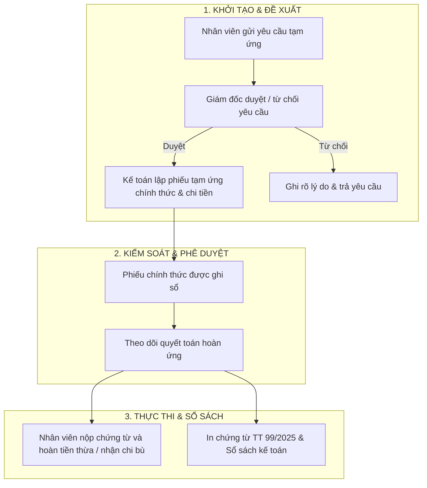

# SỔ TAY HƯỚNG DẪN SỬ DỤNG MODULE KẾ TOÁN & TÀI CHÍNH
### HỆ THỐNG QUẢN TRỊ DOANH NGHIỆP WIFIM ERP
**Đơn vị áp dụng**: Công Ty TNHH Kiến Trúc Xây Dựng và Đo Đạc Bản Đồ Bách Khoa  
**Cơ sở pháp lý**: Thông tư số 99/2025/TT-BTC của Bộ Tài Chính (áp dụng từ 01/01/2026)  
**Phiên bản tài liệu**: 2.1 (Cập nhật Tháng 09/2026)

---

## 📌 MỤC LỤC
1. [Tổng Quan Kiến Trúc & Phân Định Trách Nhiệm (SoD)](#1-tổng-quan-kiến-trúc--phân-định-trách-nhiệm-sod)
2. [Hướng Dẫn Dành Cho Ban Giám Đốc](#2-hướng-dẫn-dành-cho-ban-giám-đốc)
3. [Hướng Dành Cho Kế Toán & Thủ Quỹ](#3-hướng-dẫn-dành-cho-kế-toán--thủ-quỹ)
4. [Hướng Dẫn Dành Cho Nhân Viên (Khảo Sát / Đo Vẽ / Pháp Lý)](#4-hướng-dẫn-dành-cho-nhân-viên-khảo-sát--đo-vẽ--pháp-lý)
5. [Quy Chuẩn In Ấn & Biểu Mẫu Kế Toán TT 99/2025](#5-quy-chuẩn-in-ấn--biểu-mẫu-kế-toán-tt-992025)
6. [14 Hạng Mục Thu Chi Chuẩn Ngành Đo Đạc & Trắc Địa](#6-14-hạng-mục-thu-chi-chuẩn-ngành-đo-đạc--trắc-địa)
7. [Nguyên Tắc An Toàn Dữ Liệu & Giải Đáp Thắc Mắc (FAQ)](#7-nguyên-tắc-an-toàn-dữ-liệu--giải-đáp-thắc-mắc-faq)

---

## 1. TỔNG QUAN KIẾN TRÚC & PHÂN ĐỊNH TRÁCH NHIỆM (SoD)

Module Kế toán của WIFIM ERP được xây dựng theo chuẩn mực kế toán doanh nghiệp hiện đại, tuân thủ nguyên tắc **Phân định trách nhiệm (Segregation of Duties - SoD)**: Người lập chứng từ không tự phê duyệt, và Ban Giám Đốc nắm quyền kiểm soát tài chính tối cao nhưng không can thiệp vào các thao tác nhập liệu lẻ của kế toán.

---

## 2. HƯỚNG DẪN DÀNH CHO BAN GIÁM ĐỐC

> **Đối tượng**: Tổng Giám Đốc, Giám Đốc Điều Hành, Phó Giám Đốc phụ trách Tài chính.  
> **Quyền hạn hệ thống**: `isDirector = true` hoặc tài khoản `admin`.

### 2.1. Giám Sát Số Dư & Sổ Quỹ Thời Gian Thực
- Truy cập menu: **Tài chính - Dòng tiền** $\rightarrow$ chọn tab **Quỹ Tiền Mặt** hoặc **Quỹ Ngân Hàng**.
- 3 thẻ tổng quan đầu trang hiển thị tự động:
  - **Số dư hiện tại**: Tiền thực tế đang có trong két tiền mặt hoặc tài khoản ngân hàng.
  - **Tổng thu trong kỳ**: Toàn bộ dòng tiền đã vào hợp lệ trong tháng/kỳ báo cáo.
  - **Tổng chi trong kỳ**: Toàn bộ dòng tiền đã duyệt chi trong tháng/kỳ báo cáo.

### 2.2. Phê Duyệt Chi Tiền & Tạm Ứng Trực Tuyến
- Các khoản chi do Kế toán lập sẽ xuất hiện với huy hiệu màu vàng cam **`Chờ duyệt`**. Đề xuất tạm ứng của nhân viên là một **yêu cầu riêng**, chưa phải phiếu và chưa làm giảm số dư quỹ.
- Nhân viên chỉ được gửi yêu cầu. Sau khi Giám đốc duyệt, Kế toán mới dùng yêu cầu đó để lập phiếu tạm ứng chính thức và thực hiện chi.
- Nhấp vào mã phiếu để mở cửa sổ **Chi tiết chứng từ**:
  - Bấm **`[✓ Duyệt Phiếu]`**: Hệ thống trừ tiền quỹ, cập nhật số dư và tự động đối trừ vào công nợ hợp đồng nếu phiếu thuộc luồng công nợ.
  - Bấm **`[✕ Từ Chối]`**: Bắt buộc nhập lý do từ chối để Kế toán/Nhân viên bổ sung hồ sơ chứng từ.

### 2.3. Hủy Phiếu Chi/Thu Sai Sót (Bút Toán Đảo - Voiding)
- Khi phát hiện một giao dịch đã duyệt bị sai sót: Mở chi tiết phiếu $\rightarrow$ Bấm **`[Hủy phiếu]`**.
- Nhập lý do hủy. Hệ thống sẽ tự động thực hiện **Bút toán đảo**, phục hồi lại tiền quỹ và hoàn lại công nợ gốc mà không làm mất dấu vết kiểm toán (Audit Trail).

### 2.4. Phê Duyệt Xóa Nợ & Chuyển Nợ Hợp Đồng
- **Xóa nợ / Miễn giảm**: Tại tab **Thu Công Nợ**, với các khoản nợ khó đòi hoặc được chiết khấu theo thỏa thuận, Giám đốc bấm **`[Xóa nợ]`** $\rightarrow$ Nhập lý do $\rightarrow$ Công nợ chuyển sang trạng thái `Đã miễn giảm/xóa`.
- **Chuyển nợ sang HĐ mới (Carry Forward)**: Trường hợp khách hàng gộp nợ sang dự án mới, Giám đốc bấm **`[Chuyển nợ]`** $\rightarrow$ Chọn hợp đồng đích $\rightarrow$ Nợ cũ được kết chuyển sang HĐ mới.

### 2.5. Khóa & Chốt Sổ Bảng Lương Tháng
- Tại tab **Lương VP & Hoa Hồng**, Giám đốc rà soát bảng lương toàn công ty và bấm **`[🔒 Khóa / Chốt Sổ Lương]`**. Hệ thống lưu snapshot theo từng nhân viên và chuyển các entitlement sang `locked`; kỳ đã khóa không được sửa trực tiếp.
- Nếu phát sinh sai sau khi khóa, lập điều chỉnh ở kỳ sau hoặc mở lại theo quy trình có kiểm toán.

---

## 3. HƯỚNG DẪN DÀNH CHO KẾ TOÁN & THỦ QUỸ

> **Đối tượng**: Kế toán trưởng, Kế toán thanh toán, Kế toán công nợ, Thủ quỹ.  
> **Quyền hạn hệ thống**: Role `accountant`.

### 3.1. Lập Phiếu Thu Tiền
1. Vào tab **Nhật Ký Thu Chi** (hoặc Quỹ tiền mặt / Quỹ ngân hàng) $\rightarrow$ Bấm **`[+ Thu Tiền]`**.
2. Nhập các thông tin:
   - **Số tiền**: Nhập số, hệ thống tự động đọc số tiền thành chữ tiếng Việt.
   - **Hạng mục**: Chọn đúng trong 14 hạng mục (Thu tiền hợp đồng, Thu nợ...).
   - **Hợp đồng / Dự án**: Gắn mã HĐ để hệ thống tự động gán tên khách hàng và đối chiếu công nợ.
   - **Hình thức**: `Tiền mặt` hoặc `Chuyển khoản`.
3. Bấm **`[Lưu Phiếu Thu]`**.

### 3.2. Lập Phiếu Chi Tiền
1. Bấm nút **`[- Chi Tiền]`**.
2. Điền nội dung chi, người nhận tiền, số tiền, hình thức và đính kèm hóa đơn/biên nhận.
3. Phiếu sau khi tạo sẽ ở trạng thái `Chờ duyệt` gửi lên Ban Giám Đốc.

### 3.3. Xử Lý Hợp Đồng Nộp Thừa & Lập Phiếu Hoàn Tiền
1. Vào tab **Công Nợ Phải Thu**. Hệ thống tự động gắn huy hiệu màu tím **`Nộp thừa`** cho các hợp đồng có số tiền đã thu lớn hơn giá trị hợp đồng.
2. Tại cột Xử lý, bấm nút **`[Hoàn tiền thừa]`**.
3. Điền lý do hoàn trả $\rightarrow$ Hệ thống tự động tạo **Phiếu Chi hoàn tiền** ở trạng thái `Chờ duyệt` gửi Giám đốc phê duyệt xuất quỹ.

### 3.4. Phát hành Phiếu Tạm Ứng Chính Thức
1. Vào tab **Đề Xuất Tạm Ứng** và chọn yêu cầu có trạng thái **`DIRECTOR_APPROVED`**.
2. Kiểm tra các thông tin nhân viên đã gửi:
   - **Nhân viên nhận tiền**: Chọn đúng tên kỹ sư/chuyên viên cần tạm ứng.
   - **Mã Hợp Đồng / Hồ Sơ thực hiện**: Gắn đúng mã công trình để đối soát và hạch toán chi phí dự án.
   - **Số tiền xin tạm ứng** & **Lý do chi tiết** (Xăng xe, cắm mốc ranh, trích lục bản đồ, công tác phí...).
   - **Hình thức**: `Tiền mặt` hoặc `Chuyển khoản`.
3. Bấm **`[Lập phiếu chính thức & Chi]`**. Hệ thống gắn phiếu với yêu cầu, ghi nhận người duyệt là Giám đốc và cập nhật sổ quỹ. Không được lập phiếu nếu không có yêu cầu đã được Giám đốc duyệt.

### 3.5. Quyết Toán Hoàn Ứng Cho Nhân Viên
1. Vào tab **Quyết Toán Hoàn Ứng** $\rightarrow$ Chọn phiếu tạm ứng của nhân viên cần quyết toán.
2. Nhập **Số tiền chi thực tế** theo chứng từ/hóa đơn nhân viên nộp lại.
3. Hệ thống tự động tính toán:
   - **Nếu chi < tạm ứng**: Nhân viên nộp lại tiền thừa $\rightarrow$ Tự sinh Phiếu Thu nhập quỹ.
   - **Nếu chi > tạm ứng**: Công ty chi bù thêm $\rightarrow$ Tự sinh Phiếu Chi bù tiền.
4. Bấm **`[Xác nhận quyết toán]`**.

### 3.6. Soạn Thảo & In Chứng Từ Kế Toán Hàng Ngày
1. Vào tab **Chứng Từ In (Thu/Chi)** *(chỉ Kế toán mới có tab này)*.
2. Chọn loại phiếu (**Phiếu Thu Mẫu 01-TT** hoặc **Phiếu Chi Mẫu 02-TT**).
3. Nhập đầy đủ thông tin: Họ tên người nộp/nhận, địa chỉ, lý do, số tiền, chứng từ gốc đính kèm.
4. Bấm **`[🖨️ In Phiếu]`** để in ra máy in hoặc xuất file PDF.

---

## 4. HƯỚNG DẪN DÀNH CHO NHÂN VIÊN (KHẢO SÁT / ĐO VẼ / PHÁP LÝ)

> **Đối tượng**: Kỹ sư đo trắc địa, Đội trưởng hiện trường, Chuyên viên thụ lý hồ sơ đất đai.  
> **Quyền hạn hệ thống**: Truy cập qua **Cổng Thông Tin Nhân Viên (Employee Portal)**.

### 4.1. Đề Xuất Tạm Ứng Chi Phí Hiện Trường
1. Trước khi đi công tác/thực địa hoặc nộp lệ phí hành chính, nhân viên tạo **Yêu cầu tạm ứng** trên Cổng Nhân Viên:
   - **Mã Hợp Đồng / Hồ Sơ thực hiện**: Mã dự án cần triển khai.
   - **Số tiền xin tạm ứng** & **Bảng kê chi tiết** (xăng xe, cắm mốc, trích lục, công chứng...).
   - **Hình thức nhận tiền**: Tiền mặt tại két hoặc chuyển khoản vào số tài khoản cá nhân.
2. Giám đốc duyệt hoặc từ chối yêu cầu. Nếu được duyệt, Kế toán lập phiếu tạm ứng chính thức và thực hiện giải ngân.

### 4.2. Bàn Giao Hóa Đơn & Quyết Toán Hoàn Ứng
1. Sau khi hoàn thành nhiệm vụ, nhân viên tập hợp toàn bộ hóa đơn, biên nhận, phiếu thu lệ phí hợp lệ.
2. Bàn giao chứng từ gốc cho Bộ phận Kế toán để thực hiện đối soát quyết toán tại tab **Quyết Toán Hoàn Ứng** (nộp lại tiền thừa hoặc nhận chi bù nếu phát sinh thêm).

### 4.3. Theo Dõi Phiếu Lương Cá Nhân
- Nhân viên vào mục **Lương Của Tôi** trên Cổng Nhân Viên để kiểm tra:
  - Lương cơ bản và danh mục Lương khoán 3P chi tiết theo từng hồ sơ mình đã thực hiện.
  - Phụ cấp, thưởng hiệu suất, phạt và tổng thu nhập NET thực nhận sau khi kỳ lương được Giám đốc chốt.
- Nhân viên chỉ xem được lương của chính mình. Chỉ Kế toán và Giám đốc được xem bảng lương tổng hợp hoặc lương của nhân viên khác.
- Lương khoán không được tạo bằng phiếu chi thủ công; hệ thống chỉ phát sinh từ checklist/workflow đã được nghiệm thu.

---

## 5. QUY CHUẨN IN ẤN & BIỂU MẪU KẾ TOÁN TT 99/2025

Toàn bộ hệ thống in ấn trong WIFIM ERP tuân thủ nghiêm ngặt các quy chuẩn của Bộ Tài Chính:

| Tên Mẫu In | Vị Trí Thao Tác | Quy Chuẩn Kỹ Thuật |
| :--- | :--- | :--- |
| **Phiếu Thu (Mẫu 01-TT)** | Tab *Chứng Từ In* $\rightarrow$ Phiếu Thu | Ban hành theo **TT 99/2025/TT-BTC**, có đủ 5 chữ ký, số tiền đọc thành chữ |
| **Phiếu Chi (Mẫu 02-TT)** | Tab *Chứng Từ In* $\rightarrow$ Phiếu Chi | Ban hành theo **TT 99/2025/TT-BTC**, kiểm tra chống âm quỹ trước khi in |
| **Sổ Nhật Ký Thu Chi** | Tab *Nhật Ký Thu Chi* $\rightarrow$ `[🖨️ In Báo Cáo]` | Phông Times New Roman, chống ngắt dòng `STT`/`HÌNH THỨC`, **Tổng cộng chỉ in ở trang cuối** |
| **Sổ Công Nợ Phải Thu** | Tab *Công Nợ Phải Thu* $\rightarrow$ `[🖨️ In Sổ Công Nợ]` | Hiển thị tên Khách hàng/Đối tác từ CRM, chia rõ Đã thu / Còn phải thu / Nộp thừa |
| **Bảng Lương Văn Phòng** | Tab *Lương VP & Hoa Hồng* $\rightarrow$ `[🖨️ In Bảng Lương]` | Bảng lương khổ A4 ngang, tổng hợp Lương cơ bản, Phụ cấp, Thưởng, Thực nhận |

---

## 6. 14 HẠNG MỤC THU CHI CHUẨN NGÀNH ĐO ĐẠC & TRẮC ĐỊA

Hệ thống đã thiết lập sẵn 14 danh mục thu chi chuẩn trắc địa, phân bổ đúng vào các phòng ban:

1. **Thu tiền hợp đồng dịch vụ đo đạc / địa chính** *(Phòng Sale / Kế toán)*
2. **Thu hồi công nợ khách hàng** *(Phòng Kế toán)*
3. **Chi phí tạm ứng công tác / đo vẽ hiện trường** *(Phòng Đo vẽ)*
4. **Chi phí xăng xe, di chuyển phục vụ dự án** *(Phòng Đo vẽ)*
5. **Chi phí cắm mốc ranh giới, vật tư mốc đo** *(Phòng Đo vẽ)*
6. **Chi phí nộp lệ phí trích lục bản đồ, hồ sơ địa chính** *(Phòng Pháp lý)*
7. **Chi phí công chứng, thẩm định hồ sơ đất đai** *(Phòng Pháp lý)*
8. **Chi phí kiểm định, hiệu chuẩn máy đo đạc (Total Station, GPS RTK)** *(Phòng Kỹ thuật)*
9. **Chi trả lương khoán nhiệm vụ kỹ thuật (Lương 3P)** *(Phòng Kế toán / Nhân sự)*
10. **Chi trả lương văn phòng & hoa hồng kinh doanh** *(Phòng Kế toán / Nhân sự)*
11. **Chi phí văn phòng phẩm, in ấn bản đồ, hồ sơ kỹ thuật** *(Phòng Hành chính)*
12. **Chi phí tiếp khách, phát triển thị trường** *(Phòng Sale / CSKH)*
13. **Chi hoàn trả tiền thừa hợp đồng cho khách hàng** *(Phòng Kế toán)*
14. **Chi phí quản lý chung & chi phí khác** *(Ban Giám Đốc)*

---

## 7. NGUYÊN TẮC AN TOÀN DỮ LIỆU & GIẢI ĐÁP THẮC MẮC (FAQ)

### ❓ Câu hỏi 1: Vì sao tạo Phiếu Thu rồi mà Sổ Công Nợ chưa thấy trừ tiền?
> **Giải đáp**: Để đảm bảo tính minh bạch và chống gian lận, **phiếu ở trạng thái `Chờ duyệt` tuyệt đối không được trừ nợ**. Chỉ khi **Ban Giám Đốc duyệt phiếu** thì công nợ mới chính thức được ghi nhận giảm; không có cơ chế Kế toán tự duyệt phiếu do mình lập.

### ❓ Câu hỏi 2: Có thể xóa vĩnh viễn một phiếu thu/chi bị sai khỏi CSDL không?
> **Giải đáp**: **Không.** Hệ thống áp dụng chuẩn kiểm toán doanh nghiệp: Không xóa cứng (Hard Delete) giao dịch. Mọi sai sót phải được xử lý qua nút **`[Hủy phiếu]` (Bút toán đảo)** để lưu lại lịch sử người hủy, ngày giờ hủy và lý do hủy.

### ❓ Câu hỏi 3: Khi in sổ sách nhiều trang (3-5 trang) thì dòng Tổng Cộng xuất hiện ở đâu?
> **Giải đáp**: Hệ thống đã cấu hình chuẩn in ấn: Tiêu đề bảng sẽ tự động lặp lại ở đầu mỗi trang để người đọc dễ đối chiếu, còn **dòng TỔNG CỘNG kế toán sẽ chỉ xuất hiện duy nhất 1 lần ở chân bảng trên trang in cuối cùng**.

### ❓ Câu hỏi 4: Ai được xem lương?
> **Giải đáp**: Sales, Survey và Legal chỉ xem được mục **Lương Của Tôi** của chính họ. Họ không thể truyền `employee_id` để xem người khác. Kế toán và Giám đốc được xem bảng lương tổng hợp và xuất báo cáo theo nhân viên/phòng ban.

### ❓ Câu hỏi 5: Vì sao không thấy nút tạo lương khoán thủ công?
> **Giải đáp**: Lương khoán thuộc Workflow. Khi checklist có tính khoán được nghiệm thu, hệ thống tự sinh `work_pay_entitlement`; endpoint tạo phiếu lương thủ công đã được gỡ để tránh ghi nhận trùng hoặc không có căn cứ công việc.

---
**TÀI LIỆU LƯU HÀNH NỘI BỘ — CÔNG TY TNHH KIẾN TRÚC XÂY DỰNG VÀ ĐO ĐẠC BẢN ĐỒ BÁCH KHOA**
