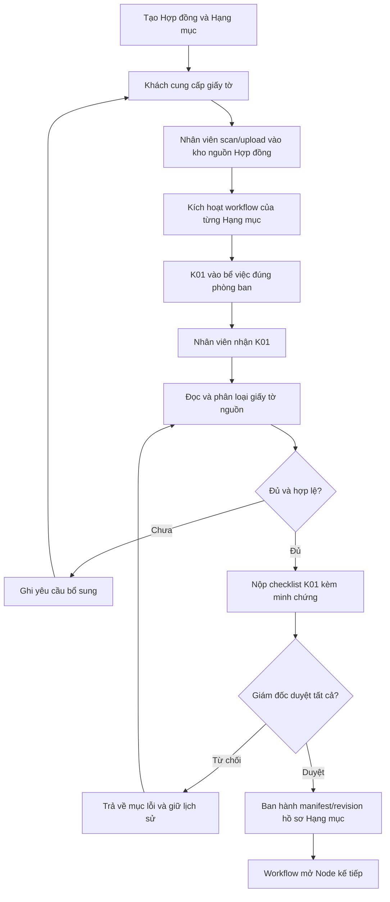

# MASTER PLAN — HỒ SƠ ĐẦU VÀO HỢP ĐỒNG VÀ NODE K01

## 1. Mục tiêu tài liệu

Tài liệu này khóa nghiệp vụ tiếp nhận giấy tờ khách hàng và xử lý tại Node K01 để đội phát triển không nhầm giữa:

1. **Kho giấy tờ gốc của Hợp đồng**: toàn bộ giấy tờ khách cung cấp khi lập hợp đồng.
2. **Bộ hồ sơ của từng Hạng mục**: các giấy tờ được K01 đọc, phân loại và liên kết từ kho gốc vào đúng Hạng mục.
3. **Checklist thực thi K01**: công việc nhân viên phải nộp và Giám đốc phải nghiệm thu.
4. **Bộ hồ sơ đã ban hành**: bản chụp cấu trúc hồ sơ của Hạng mục sau khi K01 được duyệt.

Đây là kế hoạch phân tích và thi công. Không tự ý sửa schema hoặc code trước khi kiểm tra database và code thực tế.

---

## 2. Các quyết định nghiệp vụ bất biến

### 2.1. Đơn vị dữ liệu

- Một **Hợp đồng** có một kho giấy tờ đầu vào chung.
- Một Hợp đồng có một hoặc nhiều **Hạng mục** (`service_lines`).
- Mỗi Hạng mục chạy một workflow instance riêng.
- K01 thuộc workflow instance của Hạng mục, không thuộc chung toàn Hợp đồng.
- Một file gốc có thể phục vụ nhiều Hạng mục trong cùng Hợp đồng.
- File dùng chung chỉ upload **một lần**; các Hạng mục chỉ tạo liên kết/phân loại, không nhân bản object lưu trữ.
- Tuyệt đối không cho phép Hạng mục của Hợp đồng A tham chiếu file của Hợp đồng B.

### 2.2. Vai trò của K01

K01 không phải nơi khách upload giấy tờ lần đầu. K01 là bước nhân viên:

1. Mở kho giấy tờ nguồn của Hợp đồng.
2. Đọc và nhận dạng từng giấy tờ.
3. Chọn giấy tờ cần cho Hạng mục đang xử lý.
4. Gán đúng loại giấy tờ và nhóm thư mục nghiệp vụ.
5. Ghi nhận hợp lệ, thiếu, mờ, hết hạn hoặc cần khách bổ sung.
6. Nộp từng checklist K01 kèm minh chứng.
7. Chờ Giám đốc duyệt.

K01 chỉ được hoàn thành khi toàn bộ checklist bắt buộc đã được duyệt đạt hoặc duyệt trễ theo enum chuẩn của hệ thống.

### 2.3. Đầu ra sau nghiệm thu

Sau khi Giám đốc duyệt toàn bộ K01:

- Hệ thống tạo một **manifest/bản chụp bộ hồ sơ đầu vào của Hạng mục**.
- Manifest ghi rõ file nguồn nào được dùng, loại giấy tờ, trạng thái kiểm tra, phiên bản và người duyệt.
- Hạng mục chuyển sang trạng thái `READY_FOR_NEXT_NODE` theo transition của workflow.
- Kho file nguồn của Hợp đồng không bị sửa hoặc xóa.
- Nếu khách bổ sung/thay giấy tờ sau đó, phải tạo phiên bản mới và giữ lịch sử cũ.

Không dùng một boolean kiểu `documents_ready = true` làm nguồn sự thật duy nhất. Trạng thái tổng hợp phải suy ra được từ checklist, phê duyệt và revision/manifest đã ban hành.

---

## 3. Cấu trúc lưu trữ khi có nhiều Hợp đồng

### 3.1. Góc nhìn nghiệp vụ

Ví dụ có 10 Hợp đồng, hệ thống có 10 vùng dữ liệu độc lập:

```text
HOP_DONG_01
├── 00_HOP_DONG
├── 01_HO_SO_KHACH_CUNG_CAP
├── 02_HANG_MUC
│   ├── HANG_MUC_01
│   │   ├── K01_DAU_VAO
│   │   ├── K02
│   │   └── ...
│   └── HANG_MUC_02
│       ├── K01_DAU_VAO
│       └── ...
└── 03_BAN_GIAO_TONG

HOP_DONG_02
└── cấu trúc tương tự

...

HOP_DONG_10
└── cấu trúc tương tự
```

Đây là cấu trúc hiển thị cho người dùng. Không nhất thiết tạo thư mục vật lý rỗng trong object storage.

### 3.2. Object key kỹ thuật đề xuất

Object key phải dùng ID ổn định, không dùng tên khách hàng, số CCCD hoặc dữ liệu cá nhân:

```text
contracts/{contract_id}/source-documents/{document_id}/{safe_filename}
contracts/{contract_id}/service-lines/{service_line_id}/nodes/{task_node_id}/evidence/{file_id}/{safe_filename}
contracts/{contract_id}/service-lines/{service_line_id}/published-manifests/{revision_no}.json
```

Các “file trong thư mục Hạng mục” phần lớn là record tham chiếu tới `source-documents`, không phải bản sao object.

---

## 4. Luồng nghiệp vụ đầy đủ



### 4.1. Trạng thái tài liệu nguồn

Tên enum cuối cùng phải đối chiếu schema hiện có. Về nghiệp vụ cần thể hiện tối thiểu:

- Đã tải lên, chưa kiểm tra.
- Đã phân loại.
- Hợp lệ.
- Không hợp lệ/mờ/hết hạn.
- Cần bổ sung.
- Đã được thay thế bởi phiên bản mới.

### 4.2. Trạng thái checklist

Tái sử dụng enum checklist chuẩn hiện tại; frontend không tự suy luận bằng nhiều field rời rạc:

- `NOT_STARTED`
- `PENDING_APPROVAL`
- `LATE_PENDING_APPROVAL`
- `APPROVED`
- `LATE_APPROVED`
- `REJECTED` nếu backend hiện đã hỗ trợ
- `NOT_APPLICABLE` nếu checklist cho phép miễn áp dụng

Checklist trễ hạn vẫn dùng deadline của Node K01. Không tạo deadline riêng cho từng checklist.

---

## 5. Checklist đầu ra bắt buộc của K01

Danh mục cụ thể thay đổi theo loại Hạng mục, nhưng engine phải hỗ trợ các nhóm sau:

| Checklist | Đầu ra cần nộp | Điều kiện nghiệm thu |
|---|---|---|
| Kiểm kê giấy tờ nguồn | Danh sách toàn bộ file khách đã giao | Không bỏ sót file nguồn đang hoạt động |
| Phân loại giấy tờ | Mỗi file có loại giấy tờ chuẩn | Không còn file bắt buộc ở trạng thái chưa phân loại |
| Gắn vào Hạng mục | Danh sách reference file → Hạng mục | Reference cùng `contract_id`, không sao chép object |
| Kiểm tra chất lượng | Trạng thái rõ/mờ, còn hạn, đủ trang | File lỗi phải có lý do và yêu cầu xử lý |
| Xác định hồ sơ thiếu | Danh sách giấy tờ còn thiếu | Có người yêu cầu bổ sung và trạng thái theo dõi |
| Xác nhận cấu trúc hồ sơ | Preview cây hồ sơ của Hạng mục | Đúng nhóm nghiệp vụ và đúng phiên bản |
| Nộp bộ hồ sơ K01 | Manifest + minh chứng bắt buộc | Tất cả checklist bắt buộc đã nộp |

### 5.1. Điều kiện hoàn thành K01

```text
K01_CAN_COMPLETE =
  tất cả checklist bắt buộc thuộc {APPROVED, LATE_APPROVED}
  AND không còn giấy tờ bắt buộc chưa được xử lý
  AND manifest revision đã được tạo thành công
  AND audit event nghiệm thu đã được ghi
```

Nếu Giám đốc chấp nhận cho chuyển tiếp khi còn thiếu giấy tờ, đó phải là một quyết định ngoại lệ có lý do, quyền hạn và audit riêng; không âm thầm đánh dấu “đủ hồ sơ”.

---

## 6. Mô hình dữ liệu cần đối chiếu trước khi thiết kế migration

### 6.1. Bảng hiện có phải kiểm tra bằng Supabase MCP

- `contracts`
- `service_lines`
- `workflow_instances`
- `task_nodes`
- các bảng template/result/approval của checklist
- các bảng file/evidence hiện có
- bảng audit/event hiện có

### 6.2. Các khái niệm dữ liệu bắt buộc phải có

Không mặc định phải tạo bảng mới nếu schema hiện tại đã thể hiện được các khái niệm sau:

| Khái niệm | Phạm vi | Dữ liệu tối thiểu |
|---|---|---|
| Tài liệu nguồn | Hợp đồng | contract, object key, tên file, loại MIME, checksum, phiên bản, trạng thái |
| Reference phân loại | Hạng mục | source document, service line, loại giấy tờ, nhóm thư mục, trạng thái kiểm tra |
| Yêu cầu bổ sung | Hạng mục/K01 | loại giấy tờ thiếu, lý do, người yêu cầu, trạng thái, thời điểm |
| Manifest revision | Hạng mục | revision, snapshot JSONB, trạng thái draft/published/superseded, người duyệt |
| Checklist evidence | Checklist K01 | checklist result, file reference, submitted/approved metadata |
| Audit event | Mọi cấp | actor, action, entity, before/after hoặc payload, timestamp |

### 6.3. Nguyên tắc thiết kế

- Quan hệ chính phải lưu dạng bảng và khóa ngoại để lọc, phân quyền và audit.
- JSONB phù hợp cho snapshot manifest đã ban hành hoặc metadata linh hoạt; không thay thế quan hệ Contract → Hạng mục → File reference.
- Không lưu URL public cố định làm nguồn sự thật. Lưu object key/reference và sinh quyền đọc theo storage service.
- Không xóa record/file cũ khi thay thế; đánh dấu revision mới và liên kết `supersedes` nếu schema hỗ trợ.
- Dùng checksum để nhận diện upload trùng trong cùng Hợp đồng.
- Mọi unique constraint/idempotency key phải ngăn tạo reference hoặc manifest trùng khi retry API.

---

## 7. Backend và API dự kiến

### 7.1. Thành phần phải tái sử dụng

- `dev/backend/src/services/storage_service.py`: upload/download MinIO hoặc R2.
- `dev/backend/src/files/references.py`: mở rộng đúng phạm vi nếu cần, không tạo hệ file song song.
- `dev/backend/src/employee_portal/service.py`: mẫu submit/review checklist hiện có.
- `dev/backend/src/contracts/workflow_runtime.py`: điều kiện nghiệm thu và mở Node kế tiếp.

### 7.2. Năng lực API cần có

Tên endpoint cuối cùng phải theo convention hiện tại:

1. Upload/list/version tài liệu nguồn theo Hợp đồng.
2. Liệt kê kho nguồn khi người dùng mở K01 của một Hạng mục.
3. Tạo/cập nhật reference phân loại cho Hạng mục.
4. Tạo yêu cầu bổ sung giấy tờ.
5. Submit checklist K01 và minh chứng bằng luồng checklist chung.
6. Giám đốc review từng checklist.
7. Publish manifest idempotent khi toàn bộ điều kiện đạt.
8. Lấy revision hiện hành và lịch sử revision.

### 7.3. Quy tắc transaction và idempotency

- Publish manifest, hoàn thành K01, ghi event và mở Node kế tiếp phải nằm trong một transaction hoặc có cơ chế bù/idempotency rõ ràng.
- Retry không được tạo hai manifest cùng revision hoặc hai Node kế tiếp.
- File upload thành công nhưng DB thất bại phải có cơ chế dọn object mồ côi an toàn.

---

## 8. UI/UX dự kiến

### 8.1. Tạo/chỉnh Hợp đồng

- Một khối “Giấy tờ khách cung cấp”.
- Cho upload nhiều file, xem tiến độ, loại file, dung lượng và trạng thái scan.
- Không buộc người lập Hợp đồng phân loại chi tiết theo từng Hạng mục ngay lúc này.
- Hiển thị số file nguồn và cảnh báo file lỗi; không dùng đoạn hướng dẫn dài trên card.

### 8.2. Workspace K01 của nhân viên

Bố cục hai vùng:

- Trái: kho giấy tờ nguồn của Hợp đồng, có preview và bộ lọc.
- Phải: cấu trúc hồ sơ của Hạng mục, danh sách giấy tờ đã liên kết và checklist.

Hành động chính:

- Phân loại/gắn file vào Hạng mục.
- Đánh dấu hợp lệ hoặc cần bổ sung.
- Nộp từng checklist bằng nút chuẩn hiện có.
- Xem deadline chung của Node K01.

Không tạo UI quản lý file riêng tách khỏi component upload/preview và checklist đang có.

### 8.3. Màn Giám đốc

- Xem manifest dự kiến, file nguồn và kết quả từng checklist.
- Duyệt hoặc từ chối từng mục, bắt buộc lý do khi từ chối.
- Chỉ hiển thị nút ban hành/hoàn tất khi mọi điều kiện đạt.
- Sau duyệt hiển thị revision đã ban hành và lịch sử, không cho sửa trực tiếp bản cũ.

---

## 9. Phân quyền và bảo mật

- Giám đốc/Admin: toàn quyền xem, duyệt và xem lịch sử.
- Sale/CSKH: upload giấy tờ nguồn theo Hợp đồng và xem phạm vi được cấp.
- Nhân viên Đo vẽ/Pháp lý: chỉ xem file cần cho Hạng mục/Node mình được giao hoặc phòng được cấu hình.
- Kế toán: không mặc định được xem giấy tờ nhạy cảm nếu không phục vụ công việc.
- File là private; download/preview qua endpoint kiểm quyền hoặc URL ký có thời hạn.
- Không đưa CCCD, tên khách hoặc số điện thoại vào object key/log kỹ thuật.
- Mọi upload, thay thế, phân loại, submit, reject, approve và publish đều có audit.

---

## 10. Kế hoạch thi công có cổng duyệt

### Giai đoạn 0 — Khảo sát, chưa sửa

1. Đọc các master plan liên quan và xác định mã Node chuẩn đang dùng thực tế.
2. Dùng Supabase MCP đọc schema, constraint, RLS và dữ liệu mẫu liên quan.
3. Dùng code graph/GitNexus truy vết flow Contract → Service Line → Workflow → K01 → Checklist → Storage.
4. Báo cáo hiện trạng, khoảng thiếu và blast radius.
5. Đề xuất bảng/cột/index/RLS cần thêm nếu thực sự thiếu.
6. Chờ người dùng duyệt trước khi migration hoặc sửa lớn.

### Giai đoạn 1 — Data và Storage

1. Viết test cho cô lập file giữa các Hợp đồng.
2. Viết test một file nguồn được nhiều Hạng mục tham chiếu mà không upload trùng.
3. Bổ sung migration tối thiểu đã được duyệt.
4. Dùng storage service hiện có; bổ sung scope reference nếu cần.
5. Kiểm tra rollback và object mồ côi.

### Giai đoạn 2 — K01 Backend

1. Viết test cho phân loại, thiếu giấy tờ, thay thế revision.
2. Viết test submit/review checklist và điều kiện hoàn thành K01.
3. Cài transaction publish manifest + transition.
4. Bổ sung audit và quyền truy cập.

### Giai đoạn 3 — Frontend

1. Tái sử dụng component upload, modal, preview và checklist hiện có.
2. Thêm khối kho nguồn ở form Hợp đồng.
3. Thêm workspace phân loại K01 theo bố cục hai vùng.
4. Thêm màn review Giám đốc.
5. Tối ưu render danh sách file lớn và responsive.

### Giai đoạn 4 — Kiểm thử và chuyển giao

1. Chạy backend tests và frontend tests.
2. Chạy kiểm thử phân quyền và truy cập file chéo Hợp đồng.
3. Chạy test retry/idempotency.
4. Chạy detect changes theo quy định dự án.
5. Báo cáo file, endpoint, migration và test đã ảnh hưởng.

---

## 11. Checklist tự nghiệm thu

- [ ] 10 Hợp đồng tạo ra 10 vùng file độc lập.
- [ ] Một Hợp đồng có nhiều Hạng mục, mỗi Hạng mục có K01 và manifest riêng.
- [ ] Một file nguồn có thể tham chiếu vào hai Hạng mục cùng Hợp đồng mà không sinh object thứ hai.
- [ ] Không thể tham chiếu hoặc tải file chéo Hợp đồng nếu không có quyền.
- [ ] File thay thế tạo revision mới; file cũ vẫn xem được trong lịch sử.
- [ ] Nhân viên có thể ghi giấy tờ thiếu và theo dõi bổ sung.
- [ ] Mỗi checklist K01 có nút nộp và minh chứng theo cấu hình.
- [ ] Giám đốc từ chối một checklist thì K01 không hoàn thành.
- [ ] K01 chỉ mở Node kế tiếp sau khi mọi checklist bắt buộc được duyệt.
- [ ] Publish/retry không tạo manifest hoặc Node kế tiếp trùng.
- [ ] Storage dùng MinIO/R2 qua `storage_service.py`, không tạo module upload khác.
- [ ] Database không lưu public URL cố định hoặc PII trong object key.
- [ ] UI không nhân bản file khi người dùng kéo vào cấu trúc Hạng mục.
- [ ] Audit truy được ai upload, phân loại, thay thế, nộp và duyệt.

---

## 12. Prompt hoàn chỉnh giao cho Claude Code

```text
Bạn là Senior Software Architect phụ trách chuẩn hóa nghiệp vụ hồ sơ đầu vào và Node K01 của Bách Khoa ERP.

Hãy đọc toàn bộ file:
docs/MASTER_PLAN_HO_SO_DAU_VAO_VA_K01.md

Mục tiêu nghiệp vụ bắt buộc:
1. Khi tạo Hợp đồng, toàn bộ giấy tờ khách cung cấp được scan/upload một lần vào kho nguồn cấp Hợp đồng.
2. Mỗi Hợp đồng có nhiều Hạng mục (service_lines); mỗi Hạng mục chạy workflow instance và K01 riêng.
3. Nhân viên nhận K01 phải đọc kho nguồn, phân loại và tạo reference giấy tờ vào đúng Hạng mục. Không sao chép object file.
4. Mỗi checklist K01 phải được nộp như checklist chuẩn, có minh chứng theo cấu hình và được Giám đốc duyệt.
5. Khi toàn bộ checklist bắt buộc được duyệt, hệ thống ban hành manifest revision của bộ hồ sơ Hạng mục rồi mới mở Node tiếp theo.
6. Giữ toàn bộ lịch sử file, reference, checklist và revision; không ghi đè hoặc xóa bản cũ.

Quy trình thực hiện bắt buộc:
- Trước tiên chỉ khảo sát, chưa sửa code/database.
- Dùng Supabase MCP đọc schema, constraint, index, RLS và dữ liệu liên quan đến contracts, service_lines, workflow_instances, task_nodes, checklist, file/evidence và audit.
- Dùng code graph/GitNexus truy vết flow và chạy impact upstream trước mọi symbol dự kiến sửa.
- Đối chiếu storage hiện có tại dev/backend/src/services/storage_service.py và file reference hiện có; cấm tạo storage module song song.
- Báo cáo theo bảng: hiện trạng → khoảng thiếu → phương án tối thiểu → file/endpoint/schema bị ảnh hưởng → rủi ro.
- Không tự ý migration. Chỉ đề xuất migration nếu schema thật không thể biểu diễn nghiệp vụ và chờ xác nhận.
- Sau khi được duyệt, thi công theo TDD, tái sử dụng component/API hiện có và chạy toàn bộ test liên quan.

Các điều cấm:
- Không lưu một bản sao file cho mỗi Hạng mục.
- Không dùng một JSONB khổng lồ thay toàn bộ quan hệ dữ liệu.
- Không lưu URL public cố định hoặc PII trong object key.
- Không cho hoàn thành K01 chỉ bằng một boolean thủ công.
- Không mở Node tiếp theo nếu checklist bắt buộc chưa được duyệt.
- Không xóa lịch sử khi khách thay/bổ sung giấy tờ.

Đầu ra vòng khảo sát phải gồm:
1. Sơ đồ flow thực tế từ code và DB.
2. Danh sách bảng/cột hiện có tái sử dụng được.
3. Danh sách gap có bằng chứng.
4. Hai phương án nếu cần thay schema, kèm đánh đổi và phương án khuyến nghị.
5. Kế hoạch implementation chia phase và test cases.
6. Dừng lại xin duyệt trước thay đổi lớn.
```

---

## 13. Kết luận kiến trúc

Nguồn sự thật không phải là một “file chung” đơn lẻ và cũng không phải một field JSON duy nhất. Nguồn sự thật gồm:

1. File vật lý lưu một lần trong kho riêng của Hợp đồng.
2. Record tài liệu nguồn có version và checksum.
3. Reference phân loại vào từng Hạng mục.
4. Checklist K01 chứng minh công việc đã làm.
5. Manifest revision đã được Giám đốc duyệt làm bản chụp đầu vào chính thức của Hạng mục.

Thiết kế này vừa cô lập dữ liệu của nhiều Hợp đồng, vừa cho phép một giấy tờ dùng chung giữa nhiều Hạng mục, đồng thời giữ được lịch sử và khả năng nghiệm thu chi tiết.
