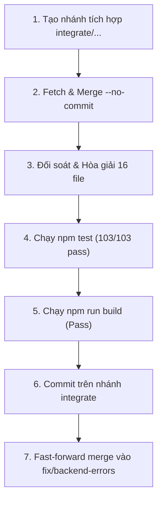

# BẢNG DẶN DÒ & CẨM NANG HỢP NHẤT DÀNH RIÊNG CHO LUNA
> **Dự án**: Bách Khoa ERP  
> **Nhánh đích (Target)**: `fix/backend-errors` (Commit nền: `e586b08`)  
> **Nhánh nguồn (Source)**: `origin/feature/accounting-module` (6 commit: `4511342` → `6597c5c`)  
> **Tài liệu tham chiếu**: [`docs/MERGE_PLAN_FOR_LUNA.md`](./MERGE_PLAN_FOR_LUNA.md)

---

## I. 5 NGUYÊN TẮC VÀNG TRƯỚC KHI BẮT ĐẦU (GOLDEN RULES)

> [!CAUTION]
> **1. TUYỆT ĐỐI KHÔNG MERGE TRỰC TIẾP TRÊN NHÁNH CHÍNH**  
> Bắt buộc phải tạo nhánh trung gian độc lập: `integrate/accounting-into-backend-fix`. Nếu xảy ra bất kỳ sự cố logic nào không thể tháo gỡ, Luna chỉ cần xóa nhánh trung gian là nhánh chính vẫn an toàn 100%.

> [!IMPORTANT]
> **2. LUÔN MERGE VỚI CỜ `--no-commit --no-ff`**  
> Lệnh chuẩn: `git merge origin/feature/accounting-module --no-commit --no-ff`. Cờ này ngăn Git tự động tạo commit merge, giúp Luna kiểm tra, đối soát và tinh chỉnh từng dòng code của 16 file giao thoa trước khi nghiệm thu.

> [!IMPORTANT]
> **3. KHÔNG ĐƯỢC ĐỂ MẤT TÍNH NĂNG CỦA BÊN NÀO**  
> Cả 2 nhánh đều đã sửa đúng các bài toán nghiệp vụ khác nhau:
> - Phía **Accounting**: Phân quyền Thu/Chi, xoay vòng Refresh Token qua Cookie, quản lý đơn giá khoán, validate tiền tệ `> 0`.
> - Phía **Backend-Fix**: Luồng hợp đồng Combo-first, API Hủy/Xóa hợp đồng rác, tự động duyệt checklist giấy tờ, giao diện Đặt mật khẩu Bách Khoa ERP mới, tối ưu Cache L1/L2.

> [!WARNING]
> **4. BẢO VỆ 103 TEST SUITES (744 TESTS) VÀ PRODUCTION BUILD**  
> Hiện tại nhánh `fix/backend-errors` đang đạt **103/103 test files PASS (744/744 tests PASS)** và `npm run build` thành công 100%. Sau khi hòa giải, nếu test rớt (đặc biệt là `SetPassword.test.jsx`), **tuyệt đối không tạo commit merge**.

> [!NOTE]
> **5. TIMELINE CƠ SỞ DỮ LIỆU ĐÃ CỰC KỲ ĐẸP**  
> Có tổng cộng 7 file liên quan DB (5 migration + 2 rollback):
> - `20260912*` (Accounting): Tạo bảng phiên đăng nhập & cleanup index.
> - `20260914*` (Backend-Fix): Bổ sung kiến trúc Combo, loại giấy tờ, danh mục.
> Vì ngày 12 đứng trước ngày 14 và không trùng tên file, Git sẽ tự động hợp nhất cả 7 file vào repo mà không gây ra xung đột file (file conflict).

---

## II. MA TRẬN HÒA GIẢI CHI TIẾT 16 FILE GIAO THOA (THE RECONCILIATION MATRIX)

Luna hãy tham chiếu bảng này khi giải quyết từng file trong quá trình merge:

```
┌─────────────────────────────────────────────────────────────────────────────────┐
│                      MA TRẬN HÒA GIẢI 16 FILE GIAO THOA                         │
├────┬───────────────────────────────────┬─────────────────────────────────────────┤
│ STT│ FILE                              │ CHIẾN LƯỢC HÒA GIẢI CHO LUNA            │
├────┼───────────────────────────────────┼─────────────────────────────────────────┤
│ 1  │ contracts/schemas.py              │ Ghép: contract_value > 0 + paid_amount  │
│ 2  │ pages/CRM.jsx                     │ Lấy validate price > 0 của Accounting   │
│ 3  │ App.jsx                           │ Ghép: Refresh Token + Click thông báo   │
│ 4  │ lib/api.js                        │ Ghép: 401 Refresh loop + Cache L1/L2    │
│ 5  │ main.jsx                          │ Ghép: Fetch credentials + ResizeObserver│
│ 6  │ contracts/workflow_runtime.py     │ Ghép: Khóa kỳ lương + Năng lực SURVEY   │
│ 7  │ employee_portal/service.py        │ Ghép: Lương khoán + Pre-load O(1) N+1   │
│ 8  │ routes/routes_contracts.py        │ GIỮ NGUYÊN 2 API HỦY / XÓA HỢP ĐỒNG     │
│ 9  │ dossiers/handover.py              │ Ghép: parse_issued_money + HANDOVER node│
│ 10 │ routes/routes_crm.py              │ Lấy parse_issued_money của Accounting   │
│ 11 │ index.py                          │ Ghép: Cleanup loop + Route /set-password│
│ 12 │ tests/conftest.py                 │ Ghép: Fixture finance + _ensure_columns │
│ 13 │ index.css                         │ Giữ cả class TimePicker và Modal bo góc │
│ 14 │ pages/Cashflow.jsx                │ Giữ quyền Thu/Chi + bắt voucherId       │
│ 15 │ pages/SetPassword.jsx             │ GIỮ NGUYÊN GIAO DIỆN ERP + credentials  │
│ 16 │ contracts/services.py             │ Lấy chặn xóa nợ hợp đồng thu đủ tiền    │
└────┴───────────────────────────────────┴─────────────────────────────────────────┘
```

### Hướng dẫn chi tiết cho 4 file nhạy cảm nhất:

#### 1. `dev/backend/src/routes/routes_contracts.py` (CỰC KỲ QUAN TRỌNG)
- **Accounting mang sang**: Import hàm `parse_issued_money` và validate tiền tệ hợp đồng.
- **Backend-Fix đang có**: 2 API mới rất quan trọng ở cuối file:
  ```python
  @router.put("/{contract_id}/cancel")
  def cancel_contract(...):
      # Xử lý hủy hợp đồng và cập nhật trạng thái

  @router.delete("/{contract_id}")
  def delete_contract(...):
      # Xử lý xóa hợp đồng nháp/rác
  ```
- **Dặn dò Luna**: Đảm bảo **GIỮ NGUYÊN 100% 2 API NÀY**. Không được để nhánh Accounting ghi đè làm mất 2 API trên.

#### 2. `dev/frontend/src/pages/SetPassword.jsx` (DỄ GÂY LỖI TEST NHẤT)
- **Accounting mang sang**: Gọi fetch với `{ credentials: 'include' }`.
- **Backend-Fix đang có**: Giao diện mới chuẩn nhận diện Bách Khoa ERP (Logo vector SVG, hiệu ứng gradient, form responsive, password strength indicator, đã sửa lỗi duplicate fetch, test `SetPassword.test.jsx` pass 3/3).
- **Dặn dò Luna**: Giữ trọn vẹn file `SetPassword.jsx` hiện tại của nhánh `fix/backend-errors` (vì nhánh này đã có sẵn `{ credentials: 'include' }` bên trong các lệnh fetch rồi!).

#### 3. `dev/frontend/src/App.jsx` & `dev/frontend/src/lib/api.js`
- **Accounting mang sang**: Quản lý phiên đăng nhập Refresh Session (hàm `refreshAccessToken`, `logoutSession`, tự động gọi refresh khi gặp lỗi 401).
- **Backend-Fix đang có**:
  - `App.jsx`: Logic bắt param `checklistResultId` và `documentTypeId` khi user click vào thông báo giấy tờ trên thanh chuông.
  - `api.js`: Bộ nhớ đệm Cache L1/L2 cho Employee Workspace, tránh gọi API dồn dập khi chuyển tab.
- **Dặn dò Luna**: Khi hòa giải, giữ cả logic Refresh Token của Accounting và logic Cache + Notification của Backend-Fix.

#### 4. `dev/backend/src/contracts/workflow_runtime.py`
- **Accounting mang sang**: Di chuyển bước kiểm tra khóa kỳ lương vào khối có phát sinh việc khoán.
- **Backend-Fix đang có**: Nhận diện năng lực `SURVEY_FIELD` thay vì fix cứng `K02`, tự động duyệt checklist giấy tờ khi nghiệm thu node.
- **Dặn dò Luna**: Ghép cả hai vì hai đoạn logic này nằm ở các vị trí khác nhau trong workflow engine.

---

## III. QUY TRÌNH 7 BƯỚC THỰC THI (STEP-BY-STEP CHECKLIST FOR LUNA)



### Bước 1: Tạo nhánh tích hợp độc lập
```bash
git checkout fix/backend-errors
git checkout -b integrate/accounting-into-backend-fix
```

### Bước 2: Kéo code và merge tạm dừng
```bash
git fetch origin feature/accounting-module
git merge origin/feature/accounting-module --no-commit --no-ff
```

### Bước 3: Hòa giải các xung đột (nếu có)
- Mở danh sách 16 file trong ma trận ở Mục II.
- Nếu có conflict markers (`<<<<<<< HEAD`, `=======`, `>>>>>>> origin/feature/accounting-module`), chọn lọc code theo đúng hướng dẫn ma trận.
- Chạy `git status` để đảm bảo tất cả file đã được resolve và `git add`.

### Bước 4: Chạy kiểm thử tự động Frontend
```bash
cd dev/frontend
npm test -- --run
```
> **Tiêu chuẩn vượt qua**: **103 test files passed (744 tests passed)**. Không có bất kỳ test nào fail.

### Bước 5: Kiểm tra đóng gói Production
```bash
npm run build
```
> **Tiêu chuẩn vượt qua**: Mã thoát `0`. (Cảnh báo chunk elk > 500KB là bình thường, không ảnh hưởng).

### Bước 6: Kiểm tra nhanh Backend (Nghiệp vụ Python)
```bash
cd ../backend
pytest tests/
```
> **Tiêu chuẩn vượt qua**: Tất cả test auth, contracts, schemas đều pass.

### Bước 7: Hoàn tất & Fast-Forward vào nhánh chính
```bash
# 1. Commit kết quả hoàn chỉnh trên nhánh tích hợp
git commit -m "chore(merge): successfully integrate feature/accounting-module into fix/backend-errors"

# 2. Chuyển về nhánh fix/backend-errors và cập nhật
git checkout fix/backend-errors
git merge integrate/accounting-into-backend-fix --ff-only

# 3. Dọn dẹp nhánh tích hợp tạm
git branch -d integrate/accounting-into-backend-fix
```

---

## IV. KẾ HOẠCH DỰ PHÒNG & THOÁT HIỂM (ROLLBACK PLAN)

Nếu trong quá trình hòa giải phát sinh lỗi quá phức tạp hoặc kiểm thử không đạt mà chưa tìm ra nguyên nhân ngay:
```bash
# Hủy bỏ hoàn toàn tiến trình merge đang dở dang
git merge --abort

# Quay về nhánh an toàn ban đầu
git checkout fix/backend-errors

# Xóa bỏ nhánh tích hợp bị lỗi
git branch -D integrate/accounting-into-backend-fix
```
> **Kết quả**: Toàn bộ mã nguồn trên nhánh `fix/backend-errors` sẽ trở về đúng trạng thái sạch sẽ tại commit `e586b08` ban đầu mà không bị ảnh hưởng hay thất thoát bất kỳ byte code nào!
