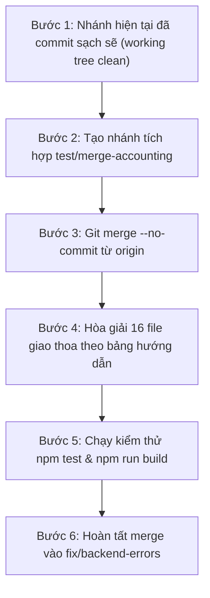

# KẾ HOẠCH HỢP NHẤT AN TOÀN (MERGE PLAN) DÀNH CHO LUNA
> **Nhánh đích (Target)**: `fix/backend-errors`  
> **Nhánh nguồn (Source)**: `origin/feature/accounting-module`  
> **Mục tiêu**: Tích hợp toàn bộ tính năng mới của cả 2 bên mà không làm mất code, không xung đột logic nghiệp vụ, và vượt qua 100% kiểm thử tự động.

---

## I. TỔNG QUAN TÌNH TRẠNG TRƯỚC KHI MERGE

1. **Phía bạn của bạn (`feature/accounting-module`) có 6 commit mới**:
   - `4511342`: Tách thẩm quyền Thu - Chi (Giám đốc xem/lập Phiếu Thu; Kế toán xem/lập Phiếu Chi).
   - `8adff38`: Favicon logo vector trong suốt & cập nhật component.
   - `3e91aac`: Toàn vẹn tiền tệ (ràng buộc giá trị hợp đồng `> 0`, kiểm tra đối soát nợ).
   - `fae168a`: Phân hệ quản lý đơn giá khoán (`WorkItem`, `WorkItemRate`) và khóa giá khoán khi giao việc.
   - `c986c1b`: Cơ chế Refresh Token xoay vòng (rotating refresh session) qua HTTP-only cookie.
   - `6597c5c`: Tái cấu trúc mockup giao diện nhân viên.

2. **Phía nhánh hiện tại (`fix/backend-errors`)**:
   - Hoàn thiện luồng hợp đồng Combo first, đồng bộ checklist loại giấy, document register.
   - Bổ sung 2 API lớn: Hủy hợp đồng (`PUT /cancel`) & Xóa hợp đồng rác (`DELETE /{id}`).
   - Nâng cấp toàn diện giao diện đặt mật khẩu `SetPassword.jsx` chuẩn nhận diện Bách Khoa ERP.
   - Tối ưu hiệu năng: Cache L1/L2 Employee Portal, loại bỏ vòng lặp re-render, CSS Modal bo góc.
   - **Đã commit lưu trữ toàn bộ code an toàn**: Mã commit nền `66dd859`.

3. **Cơ sở dữ liệu & Rollback (Supabase Migrations)**:
   - Nhánh `feature/accounting-module` có 2 migration và 2 script rollback tương ứng:
     + `supabase/migrations/20260912000000_auth_refresh_sessions.sql`
     + `supabase/migrations/20260912000001_auth_refresh_session_cleanup.sql`
     + `supabase/rollback/20260912000000_auth_refresh_sessions_down.sql`
     + `supabase/rollback/20260912000001_auth_refresh_session_cleanup_down.sql`
   - Nhánh `fix/backend-errors` có 3 migration mới:
     + `supabase/migrations/20260914000000_combo_first_workflow_and_document_architecture.sql`
     + `supabase/migrations/20260914130000_drop_task_nodes_node_code_fkey.sql`
     + `supabase/migrations/20260914140000_add_color_to_catalog.sql`
   - **Tổng cộng**: 5 file migration chính và 2 file rollback (tổng 7 file DB). Do tên các file hoàn toàn khác nhau và tác động lên các bảng độc lập, Git sẽ tự động hợp nhất vào codebase mà không xảy ra bất kỳ xung đột file nào.

---

## II. QUY TRÌNH THỰC HIỆN TỪNG BƯỚC (STEP-BY-STEP FOR LUNA)



---

### BƯỚC 1: XÁC NHẬN NHÁNH HIỆN TẠI ĐÃ COMMIT SẠCH SẼ
Nhánh `fix/backend-errors` hiện tại đã được commit lưu trữ sạch sẽ (`working tree clean`).

---

### BƯỚC 2: TẠO NHÁNH TÍCH HỢP TRUNG GIAN
Không merge trực tiếp trên nhánh làm việc chính. Tạo nhánh test độc lập:
```bash
git checkout -b integrate/accounting-into-backend-fix
```

---

### BƯỚC 3: FETCH & MERGE KHÔNG TỰ ĐỘNG COMMIT
```bash
git fetch origin feature/accounting-module
git merge origin/feature/accounting-module --no-commit --no-ff
```

---

### BƯỚC 4: HƯỚNG DẪN HÒA GIẢI 16 FILE GIAO THOA

| # | File | Hướng dẫn hòa giải chi tiết cho Luna |
|---|---|---|
| **1** | `dev/backend/src/contracts/schemas.py` | **Thống nhất lấy quy tắc của Accounting**: Dùng `contract_value: FiniteFloat = Field(gt=0)` (hợp đồng bắt buộc > 0); đồng thời giữ `paid_amount: Optional[float] = Field(default=0.0, ge=0)` của backend-fix. |
| **2** | `dev/frontend/src/pages/CRM.jsx` | Lấy validation của Accounting: khi chốt lead yêu cầu giá hợp đồng `> 0` (`min="1"`). |
| **3** | `dev/frontend/src/App.jsx` | • Giữ nguyên cơ chế của Accounting: `validateSession`, `sessionRetrying`, `refreshAccessToken`, `logoutSession`.<br>• Giữ nguyên cải tiến của Backend-Fix: điều hướng `/set-password` linh hoạt, và truyền `checklistResultId`, `documentTypeId` khi click thông báo. |
| **4** | `dev/frontend/src/lib/api.js` | • Giữ các hàm của Accounting: `refreshAccessToken()`, `logoutSession()`, `hasRefreshSessionHint()`, tự động gọi refresh khi gặp lỗi 401.<br>• Giữ các hàm của Backend-Fix: Cache L1/L2 cho employee-portal, `markLocalMutation()`, tối ưu `invalidateOnMutation()`. |
| **5** | `dev/frontend/src/main.jsx` | • Giữ `window.fetch` wrapper của Accounting (đính kèm cookie refresh session).<br>• Giữ listener chặn lỗi `ResizeObserver loop` của Backend-Fix ở cuối file. |
| **6** | `dev/backend/src/contracts/workflow_runtime.py` | • Giữ đoạn Accounting: di chuyển kiểm tra khóa kỳ lương vào bên trong khi có việc khoán phát sinh.<br>• Giữ đoạn Backend-Fix: nhận diện năng lực `SURVEY_FIELD` thay cho hardcode `K02`, và đoạn tự động duyệt checklist giấy tờ runtime khi nghiệm thu. |
| **7** | `dev/backend/src/employee_portal/service.py` | • Giữ query của Accounting: `_ITEM_NODE_DETAIL_QUERY` tính lương khoán theo `work_item_rates` và tỷ lệ chia.<br>• Giữ các query của Backend-Fix: `LEFT JOIN workflow_nodes`, đọc tên node fallback, pre-load hệ số ưu tiên O(1), `limit(30)` cho chấm công/phép. |
| **8** | `dev/backend/src/routes/routes_contracts.py` | • Giữ import `parse_issued_money` của Accounting.<br>• Giữ nguyên toàn bộ 2 API lớn của Backend-Fix: Hủy hợp đồng (`PUT /{contract_id}/cancel`) và Xóa hợp đồng rác (`DELETE /{contract_id}`). |
| **9** | `dev/backend/src/dossiers/handover.py` | • Giữ `parse_issued_money` trong hàm `debt_summary` của Accounting.<br>• Giữ nhận diện năng lực `HANDOVER` hoặc `K06` trong hàm `is_handover_node` của Backend-Fix. |
| **10** | `dev/backend/src/routes/routes_crm.py` | Lấy hàm `parse_issued_money(body.price)` của Accounting để validate tiền trước khi chốt lead. |
| **11** | `dev/backend/src/index.py` | • Giữ background task `refresh_session_cleanup_loop` trong `lifespan` của Accounting.<br>• Giữ route redirect fallback `@app.get("/set-password")` của Backend-Fix ở cuối file. |
| **12** | `dev/backend/tests/conftest.py` | • Giữ fixture `finance_clerk_user` của Accounting.<br>• Giữ hàm `_ensure_task_nodes_columns` trong `init_test_db` của Backend-Fix. |
| **13** | `dev/frontend/src/index.css` | Giữ cả hai: các class `.time-picker__*` của Accounting và các class `.modal*` bo góc cuộn đẹp của Backend-Fix (ở 2 vùng tách biệt). |
| **14** | `dev/frontend/src/pages/Cashflow.jsx` | • Giữ logic phân quyền Giám đốc / Kế toán của Accounting.<br>• Giữ `voucherId` camelCase trong event listener của Backend-Fix. |
| **15** | `dev/frontend/src/pages/SetPassword.jsx` | Giữ nguyên 100% giao diện đẹp của Backend-Fix vừa thiết kế, đảm bảo có `{ credentials: 'include' }` trong 2 lệnh fetch. |
| **16** | `dev/backend/src/contracts/services.py` | Giữ `parse_issued_money` và logic chặn xóa nợ khi hợp đồng đã thu đủ tiền của Accounting. |

---

### BƯỚC 5: KIỂM THỬ XÁC MINH TOÀN DIỆN (VERIFICATION)

Chạy các lệnh kiểm thử sau trong thư mục `dev/frontend`:
```bash
# 1. Chạy toàn bộ test suites frontend
npm test -- --run

# 2. Kiểm tra đóng gói build production
npm run build
```
> Tiêu chuẩn đạt: **103 test files (744 tests) đều PASS**, `npm run build` không có lỗi cú pháp.

---

### BƯỚC 6: ÁP DỤNG VÀO NHÁNH CHÍNH
Khi kiểm thử trên nhánh tích hợp thành công:
```bash
# Commit trên nhánh tích hợp
git commit -m "chore(merge): integrate feature/accounting-module into fix/backend-errors"

# Chuyển về nhánh chính và merge kết quả
git checkout fix/backend-errors
git merge integrate/accounting-into-backend-fix --ff-only

# Xoá nhánh test tạm thời
git branch -d integrate/accounting-into-backend-fix
```

