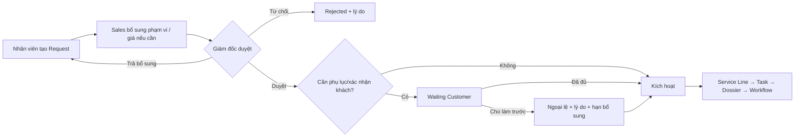
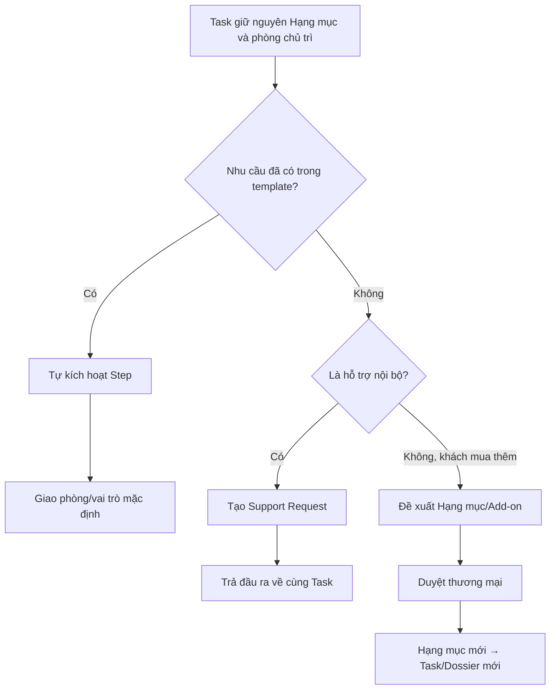

# Phase 01 — Khóa phạm vi, thuật ngữ và Decision Log

Ngày lập: 02/08/2026  
Ngày đồng bộ mô hình live: 07/08/2026  
Trạng thái: **Đã chốt và đã đồng bộ sang mô hình Service Line/Workflow Instance**  
Tài liệu cha: `WORKFLOW_HOSO_MASTER_PLAN.md`  
Tên cũ trong master plan: Phase A0

> Nguồn trạng thái hiện hành: [PHASE_STATUS_CURRENT_MODEL.md](./PHASE_STATUS_CURRENT_MODEL.md). Từ “Task” trong phần lịch sử phân tích chỉ mang nghĩa công việc nghiệp vụ; không còn bảng `projects_tasks` trong database live.

## 1. Mục tiêu Phase 01

Phase này chưa thiết kế schema chi tiết và chưa sửa code. Mục tiêu là tạo một nền nghiệp vụ không mâu thuẫn để các phase sau không phải làm lại.

Kết thúc Phase 01 phải trả lời được:

1. Hệ thống đang quản lý những thực thể nghiệp vụ nào?
2. Gói, Hạng mục, Task, bước công việc và Support Request khác nhau ra sao?
3. Khi công việc đi qua phòng khác, hệ thống tự chuyển bước hay cần gửi yêu cầu hỗ trợ?
4. Giám đốc, Kế toán, Sales và từng nhân viên được nhìn thấy phạm vi dữ liệu nào?
5. Ai được thêm Hạng mục phát sinh và khi nào Task mới được kích hoạt?
6. Phạm vi MVP gồm những gì và nội dung nào để phase sau?

## 2. Đầu vào của Phase 01

- Tài liệu hỏi–đáp nghiệp vụ của khách hàng.
- Ý kiến tham khảo cách FastDo thiết kế workflow.
- Danh mục ba gói và 22 Hạng mục trong database.
- Phân tích hiện trạng database, backend và frontend.
- Quyết định đã xác nhận về “Hỗ trợ nộp” và người đi nộp.
- Master plan hiện tại.

Không sử dụng các giả định kỹ thuật chưa được xác minh làm quyết định nghiệp vụ.

## 3. Các quyết định đã chốt trước Phase 01

Các nội dung dưới đây không hỏi lại trừ khi khách hàng chủ động thay đổi yêu cầu.

### D01 — Cấu trúc hợp đồng

- Một hợp đồng có nhiều Hạng mục.
- Mỗi Hạng mục là một `service_line`/Contract Item.
- Mỗi Hạng mục có tối đa một `workflow_instance` chính và một bộ hồ sơ nghiệp vụ; không tạo thêm “Task chính” để đại diện lại Hạng mục.

### D02 — Gói và Hạng mục

- Có ba Gói: Đo Vẽ, Pháp Lý và Xây Dựng.
- Mỗi gói chỉ hiển thị `task_types`/Hạng mục thuộc đúng gói đó.
- Hạng mục không được đổi gói khi phối hợp phòng khác.

### D03 — Công việc con

- K01–K09 là cụm/bước công việc bên trong Workflow Instance của Hạng mục.
- Công việc con không phải Hạng mục khách mua và không tạo Service Line ngang cấp.
- Một bước có thể được giao cho nhân viên phòng khác nhưng Hạng mục vẫn giữ gói/phòng chủ trì.

### D04 — “Hỗ trợ nộp”

- Hủy “Hỗ trợ nộp” khỏi danh mục Hạng mục/TaskType độc lập.
- Không ghi khách đã mua Gói Pháp Lý khi chỉ hỗ trợ nộp cho Hạng mục Đo Vẽ.
- Hỗ trợ này thường miễn phí và không tự phát sinh doanh thu Pháp Lý.
- Nhân viên Pháp Lý là người đi nộp trong quy trình chuẩn.
- Người thực hiện được lưu bằng assignment vai trò `SUBMITTER`.
- K05/K06 được ghi nhận tối thiểu để giao người và thống kê phụ cấp.
- Với Gói Đo Vẽ, hệ thống dừng theo dõi sau hành động nộp; không theo dõi tiến độ hồ sơ tại cơ quan.
- Với Gói Pháp Lý, hệ thống tiếp tục theo dõi mã H29, tiến độ, bổ sung, ngày hẹn và kết quả sau khi nộp.

### D05 — Hồ sơ tại cơ quan nhà nước

- Bị trả tại quầy: không có mã H29.
- Được tiếp nhận: có biên nhận/mã H29 và bắt đầu theo dõi.
- Đã có mã rồi bị yêu cầu bổ sung: giữ mã/lịch sử và tạo lượt bổ sung mới.
- Không tạo Task/bộ hồ sơ mới cho mỗi lần nộp lại.

### D06 — Mô hình lương

- Cả Đo Vẽ và Pháp Lý đều có lương cơ bản.
- Pháp Lý: lương cơ bản + phụ cấp riêng cho khâu viết/soạn hồ sơ và đi nộp.
- Đo Vẽ: lương cơ bản + khoán theo bảng khoán Đo Vẽ và vai trò thực tế.
- Công thức tổng quát: `Lương cơ bản + Khoán/Phụ cấp đã duyệt + Điều chỉnh hợp lệ`.
- Doanh nghiệp cần xây dựng lại toàn bộ bảng lương.
- Khoán/phụ cấp biến đổi chỉ tính theo cụm có đầu ra nghiệm thu.
- Công việc checklist không được tính trùng.
- Workflow/Hạng mục hoàn thành không tự động làm phát sinh khoản trả; căn cứ trả tiền là checklist payable được nghiệm thu và assignment hợp lệ.
- Cuối tháng tổng hợp người đã hoàn thành từng khâu để làm dữ liệu tính phụ cấp/khoán.
- Kế toán lập bảng tính kỳ lương; Giám đốc duyệt và khóa kỳ.
- Giám đốc được cấu hình linh hoạt mức, vai trò, điều kiện và ngoại lệ nhưng phải có ngày hiệu lực, lý do và audit.
- Không sửa ngược chính sách đã snapshot hoặc kỳ lương đã khóa; điều chỉnh qua bản ghi mới.

### D07 — Đo Vẽ phát sinh hỗ trợ nộp

- Hạng mục vẫn thuộc Gói Đo Vẽ và không tạo Hạng mục “Hỗ trợ nộp”.
- Khách không được ghi nhận là đã mua Gói Pháp Lý; hỗ trợ thường miễn phí.
- K05/K06 chỉ ghi nhận công việc hỗ trợ, người phụ trách và phụ cấp.
- Sau khi nộp, Workflow Đo Vẽ không chạy quy trình theo dõi tiến độ tại cơ quan.
- Chỉ Workflow của Hạng mục Pháp Lý mới tiếp tục vòng đời theo dõi sau nộp.

### D08 — Tự kích hoạt bước có kiểm soát

- Bước kế tiếp tự kích hoạt khi bước trước được nghiệm thu `Đạt`.
- Tự kích hoạt chỉ đưa bước sang `READY`, tạo assignment dự kiến và hiển thị trong work queue/lịch; không tự chuyển thành `IN_PROGRESS`.
- Nhân viên được giao bấm `Bắt đầu` khi thực sự thực hiện công việc.
- Nếu thiếu người, thiếu dữ liệu hoặc lịch không còn năng lực, bước dừng tại `WAITING_ASSIGNMENT`/`BLOCKED`.
- Giám đốc có quyền tạm dừng, đổi người, đổi lịch, kích hoạt thủ công, mở lại bước và bỏ qua bước tùy chọn.
- Không được bỏ qua bước bắt buộc nếu không có quyền Giám đốc, lý do và audit log.
- Node workflow hỗ trợ bốn chế độ: `AUTO_AFTER_ACCEPTANCE`, `MANUAL_RELEASE`, `CONDITIONAL`, `SCHEDULED`.
- K07 và bước phụ thuộc cơ quan chỉ mở theo sự kiện nghiệp vụ phù hợp.

### D09 — Phân quyền, lương cá nhân và lịch nhân sự

- Hệ thống hiện không có vai trò Trưởng phòng.
- Giám đốc có toàn quyền trên khách hàng, hợp đồng, Hạng mục, workflow, hồ sơ, lịch và lương.
- Giám đốc và Kế toán là hai vai trò được tính/xem lương toàn công ty.
- Mỗi nhân viên có profile riêng, xem việc/lịch được giao và chỉ xem chi tiết lương của mình.
- Nhân viên Pháp Lý và Đo Vẽ chỉ cập nhật phần việc/tài liệu thuộc quyền.
- Sales phụ trách lead pipeline, bao gồm lead tự động đưa vào từ Zalo OA, khách hàng và thông tin thương mại được phép.
- Phòng hỗ trợ thấy toàn bộ hồ sơ hay chỉ dữ liệu cần cho Step tùy cấu hình của Giám đốc; mặc định chỉ thấy dữ liệu tối thiểu.
- Cần giao diện lịch tuần Thứ 2–Chủ nhật theo ngày/giờ và từng nhân viên.
- Hệ thống đề xuất sắp lịch dựa trên thời gian rảnh, deadline, ưu tiên, vai trò, địa điểm và thời gian di chuyển; Giám đốc xác nhận trước khi lịch được chốt.

### D12 — Danh sách tiêu chí nghiệm thu công việc

- Mỗi Step/cụm công việc phải có một `Acceptance Checklist` riêng.
- Checklist nghiệm thu dùng để xác nhận chất lượng đầu ra công việc; khác với checklist giấy tờ của bộ hồ sơ.
- Mỗi tiêu chí có thể bắt buộc hoặc tùy chọn và quy định loại minh chứng cần nộp.
- Nhân viên hoàn thành checklist, đính kèm minh chứng rồi bấm `Gửi nghiệm thu`.
- Hệ thống không cho gửi nếu còn tiêu chí bắt buộc chưa hoàn thành hoặc thiếu minh chứng bắt buộc.
- Giám đốc hoặc người được Giám đốc cấu hình ủy quyền chọn `Đạt`, `Yêu cầu làm lại` hoặc `Không áp dụng` đối với tiêu chí được phép.
- `Không áp dụng` bắt buộc có lý do; nhân viên thực hiện không tự bỏ qua tiêu chí bắt buộc.
- Chỉ khi checklist của Step được nghiệm thu `Đạt`, bước tiếp theo mới tự kích hoạt và sự kiện khoán/phụ cấp mới có thể phát sinh.
- Mọi lần gửi duyệt, trả làm lại và duyệt đạt phải giữ lịch sử; không ghi đè kết quả cũ.
- Checklist nằm trong graph có phiên bản/revision; Workflow Instance đang chạy giữ Revision đã kích hoạt để thay đổi sau này không làm sai hồ sơ cũ.

Ví dụ checklist nghiệm thu K03 — Hoàn thiện bản vẽ:

| Tiêu chí | Bắt buộc | Minh chứng |
|---|---:|---|
| Đúng khách hàng, thửa đất và Hạng mục | Có | Dữ liệu đối chiếu trên Task |
| Số liệu/diện tích khớp kết quả đo | Có | File số liệu hoặc bảng kiểm |
| Bản vẽ đúng biểu mẫu và hệ tọa độ yêu cầu | Có | File bản vẽ/PDF |
| Đã xử lý ghi chú chỉnh sửa của lần duyệt trước | Khi có | Phiên bản mới + ghi chú |
| File cuối đã đưa vào đúng thư mục Drive | Có | Drive link |

Ví dụ checklist nghiệm thu K06 — Đi nộp:

| Tiêu chí | Bắt buộc | Minh chứng |
|---|---:|---|
| Có người đi nộp và thời gian thực hiện | Có | Assignment + thời gian |
| Có kết quả tiếp nhận hoặc từ chối tại quầy | Có | Trạng thái lượt nộp |
| Nếu tiếp nhận: có biên nhận/mã theo chính sách | Có điều kiện | Ảnh/link biên nhận |
| Nếu bị trả: có lý do cụ thể | Có điều kiện | Ghi chú/ảnh yêu cầu bổ sung |

### D13 — Hai vai trò của Hạng mục Đo Vẽ

- Mỗi Task Đo Vẽ bắt buộc có một `MAIN` — Phụ trách chính.
- `ASSISTANT` — Phụ đo/phụ trách phụ là tùy chọn hoặc bắt buộc tùy Hạng mục/tình huống; một số Task chỉ cần một người.
- Mỗi Hạng mục dùng một chế độ: `MAIN_ONLY`, `OPTIONAL_ASSISTANT` hoặc `REQUIRED_ASSISTANT`.
- Nếu có người phụ, `MAIN` và `ASSISTANT` không được cùng một nhân viên.
- Giám đốc được thêm/bỏ `ASSISTANT` ở Task cụ thể nếu cấu hình cho phép; bắt buộc ghi lý do và audit.
- Mức khoán chỉ áp dụng cho người có assignment và phần đóng góp được nghiệm thu, theo Hạng mục + vai trò.
- Chỉ tạo khoản khoán sau khi đầu ra/Acceptance Checklist liên quan được nghiệm thu đạt.
- Một assignment + đầu ra + loại khoán chỉ có một Pay Event.
- Với dòng có Phụ đo bằng 0/để trống, không tự động tạo assignment phụ; nếu vẫn cần người hỗ trợ vận hành thì mặc định không phát sinh khoán phụ.

### D14 — Workflow Designer, node K và timetable

- Có tab `Quy trình` dành cho Giám đốc kéo–thả, nối node, phân việc và xuất bản workflow.
- Một node công việc tương ứng một cụm K01–K09; mỗi K_NODE chứa checklist phải làm, minh chứng, người thực hiện, người duyệt, thời lượng và chính sách khoán/phụ cấp nếu có.
- Ngoài K_NODE cần node hệ thống `START`, `END`, `DECISION`, `WAIT` để biểu diễn rẽ nhánh/chờ nhưng không phát sinh lương.
- Không tạo một workflow instance duy nhất cho toàn Hợp đồng: mỗi Hạng mục/Task có một workflow instance; trang Hợp đồng chỉ tổng hợp các instance.
- Giám đốc thiết kế workflow template theo TaskType/Hạng mục và có thể trực tiếp làm hoặc phân người tại từng node.
- Nhân viên hoàn thành Acceptance Checklist, nộp minh chứng và gửi duyệt; pass đủ mục bắt buộc mới mở node kế tiếp.
- Phân công/chỉnh lịch tại node tạo notification và đưa Step lên timetable cá nhân.
- Giám đốc có timetable tổng hợp; mỗi nhân viên có profile/timetable riêng; có bộ lọc Đo Vẽ, Pháp Lý, Sales và Kế toán.
- Hệ thống đề xuất lịch, Giám đốc xác nhận/chỉnh sửa trước khi chốt.
- Workflow template có version; Task đang chạy giữ version đã khởi tạo; override instance bắt buộc có lý do và audit.

## 4. Thuật ngữ chuẩn sử dụng từ Phase 01

| Thuật ngữ | Định nghĩa | Không được hiểu là |
|---|---|---|
| Hợp đồng | Thỏa thuận thương mại với khách hàng | Một công việc đơn lẻ |
| Gói dịch vụ | Nhóm phân loại Hạng mục | Phòng ban đang xử lý |
| Hạng mục/Service Line | Đầu ra/dịch vụ khách mua trong hợp đồng | Bước nhỏ của workflow |
| Task | Đơn vị vận hành chính, quan hệ 1–1 với Hạng mục | Một lần chuyển phòng |
| Bộ hồ sơ/Dossier | Tập giấy tờ, tài liệu và lịch sử của một Task | Toàn bộ hợp đồng |
| Workflow Template | Mẫu quy trình có phiên bản | Công việc đang chạy |
| Workflow Instance | Bản quy trình được tạo cho một Task | Danh mục TaskType |
| Step/Work Cluster | Bước/cụm K01–K09 bên trong Task | Hạng mục bán cho khách |
| Assignment | Giao một người/vai trò thực hiện Task hoặc Step | Chuyển quyền sở hữu hợp đồng |
| Support Request | Yêu cầu một phòng khác hỗ trợ một đầu ra phát sinh | Thêm Gói hoặc đổi Task |
| Add-on | Phạm vi thương mại nhỏ có thể có giá riêng | Support Request miễn phí mặc định |
| Submission Attempt | Một lần mang/nộp hồ sơ tại cơ quan | Một Task mới |
| Acceptance | Nghiệm thu đầu ra nội bộ | Trạng thái thanh toán |
| Acceptance Checklist | Danh sách tiêu chí chất lượng/đầu ra cần đạt của một Step | Checklist giấy tờ của bộ hồ sơ |
| Pay Event | Khoản khoán/phụ cấp sinh từ đầu ra đã duyệt | Giá bán của Hạng mục |

## 5. Ranh giới hệ thống cần khóa

### 5.1 Trong phạm vi workflow ERP

- Hợp đồng và nhiều Hạng mục.
- Một Hạng mục — một Task — một bộ hồ sơ.
- Workflow template/version và workflow instance.
- Bước/cụm K01–K09.
- Giao việc nhiều vai trò.
- Phối hợp Đo Vẽ, Pháp Lý và Xây Dựng.
- Checklist giấy tờ, scan, link Drive và lịch sử bàn giao.
- Nộp, bổ sung, mã H29 và nhận kết quả.
- Nghiệm thu cụm và dữ liệu nguồn cho lương/phụ cấp.
- Work queue, thông báo, audit và báo cáo tiến độ.

### 5.2 Chưa thiết kế chi tiết trong Phase 01

- Schema bảng/cột và migration SQL.
- API request/response.
- Wireframe pixel-level.
- Công thức tính lương chính thức.
- Cấu hình chi tiết đủ 22 Hạng mục.
- Tích hợp Google Drive ở cấp kỹ thuật.
- Backfill dữ liệu cũ.

### 5.3 Ngoài phạm vi MVP đề xuất

- Workflow designer cho phép viết code/script tùy ý.
- BPMN engine đầy đủ mọi tính năng doanh nghiệp lớn.
- Tự động suy luận Hạng mục cho dữ liệu cũ thiếu bằng chứng.
- Tự động trả lương thật ngay trong lần chạy đầu.
- Đồng bộ tự động mọi cổng dịch vụ công khi chưa có API ổn định.

Khách hàng có thể đưa một mục ngoài MVP vào phạm vi, nhưng phải ghi Decision Log và đánh giá lại chi phí/tiến độ.

## 6. Quyết định D10 — Nhân viên tạo request, Giám đốc duyệt

Quyết định:

- Mọi nhân viên đang làm việc với khách/hồ sơ được tạo `Service Change Request`.
- Request có thể tạo từ Task, hợp đồng hoặc khách hàng để không làm gián đoạn công việc.
- Nhân viên chỉ ghi nhu cầu, phạm vi sơ bộ, lý do và bằng chứng khách yêu cầu; không tự sửa hợp đồng/giá.
- Sales có thể bổ sung phạm vi và báo giá nếu request có tác động thương mại.
- Giám đốc duyệt giá, phụ lục/xác nhận khách hàng và quyền kích hoạt.
- Kế toán được xem/kiểm tra tài chính nhưng không thay quyền duyệt cuối của Giám đốc.



Trạng thái request:

```text
DRAFT → SUBMITTED → NEEDS_REVISION → SUBMITTED
                  → APPROVED → WAITING_CUSTOMER → ACTIVATED
                  → REJECTED / CANCELLED
```

Quy tắc chặt chẽ:

- Request bắt buộc có hợp đồng/khách hàng, gói/Hạng mục đề xuất, phạm vi, lý do, mức ưu tiên và người yêu cầu.
- Nếu thay đổi giá/phạm vi hợp đồng đã ký, mặc định cần phụ lục hoặc bằng chứng khách xác nhận theo chính sách do Giám đốc chọn.
- Chỉ trạng thái `ACTIVATED` mới tạo Hạng mục/Task chính thức.
- Tạo Service Line, Task, Dossier và Workflow trong một transaction; lỗi một phần phải rollback.
- Chống request/Hạng mục trùng trong cùng hợp đồng.
- Ngoại lệ làm trước chỉ do Giám đốc duyệt, bắt buộc lý do, hạn bổ sung chứng từ và audit.
- Request đã duyệt không xóa cứng; dùng phiên bản hoặc request điều chỉnh mới.
- Hỗ trợ nội bộ miễn phí không tạo Hạng mục thương mại giả.

## 7. Mô hình phối hợp cần khách xác nhận trong Phase 01



Quy tắc không được phá vỡ:

- Không dùng “chuyển phòng” để thay `service_package_id`.
- Không nhân đôi Task khi chỉ giao một Step cho phòng khác.
- Không dùng Support Request thay cho Hạng mục có thu phí.
- Không tạo Hạng mục mới chỉ vì hồ sơ bị trả/bổ sung.

## 8. Decision Log của Phase 01

| ID | Nội dung | Trạng thái | Quyết định | Nguồn/người duyệt | Ngày |
|---|---|---|---|---|---|
| D01 | Một hợp đồng có nhiều Hạng mục | Đã chốt | Một Hạng mục tạo một Service Line | Tài liệu nghiệp vụ | Trước 02/08/2026 |
| D02 | Một Hạng mục tạo một Task và Dossier | Đã chốt | Quan hệ 1–1–1 | Trao đổi nghiệp vụ | Trước 02/08/2026 |
| D03 | Task không đổi gói khi phối hợp | Đã chốt | Chỉ chuyển Step/Assignment | Trao đổi nghiệp vụ | Trước 02/08/2026 |
| D04 | Phân loại “Hỗ trợ nộp” | Đã chốt | Không phải Hạng mục/TaskType; là work item K06, role SUBMITTER, khoán 350.000đ; không gồm theo dõi vòng đời | Người dùng xác nhận mới nhất | 05/08/2026 |
| D04A | Ai đi nộp? | Đã chốt | Nhân viên Pháp Lý | Khách hàng trả lời mục b | 02/08/2026 |
| D05 | Mã H29 xuất hiện khi nào? | Đã chốt | Chỉ sau khi cơ quan tiếp nhận | Trao đổi nghiệp vụ | Trước 02/08/2026 |
| D06 | Mô hình lương hai phòng | Đã chốt một phần | Cả hai có lương cơ bản; Pháp Lý thêm phụ cấp K05/K06, Đo Vẽ thêm khoán; Giám đốc kiểm soát chính sách | Người dùng làm rõ | 03/08/2026 |
| D07 | Đo Vẽ phát sinh hỗ trợ nộp | Đã chốt | K05/K06 ghi nhận nội bộ; dừng theo dõi sau nộp, không thành Gói Pháp Lý | Khách hàng làm rõ Câu 2 và mục c/e | 02/08/2026 |
| D08 | Cách kích hoạt bước chuyển tiếp | Đã chốt | Tự kích hoạt sang `READY` sau nghiệm thu; nhân viên bấm bắt đầu; Giám đốc có quyền kiểm soát và audit | Người dùng xác nhận | 02/08/2026 |
| D09 | Phạm vi xem theo vai trò | Đã chốt | Không có Trưởng phòng; Giám đốc toàn quyền; Kế toán cùng tính lương; nhân viên xem việc/lương riêng; quyền hỗ trợ do Giám đốc cấu hình | Người dùng xác nhận | 02/08/2026 |
| D09A | Lịch năng lực nhân sự | Đã chốt định hướng | Lịch Thứ 2–Chủ nhật; hệ thống đề xuất, Giám đốc xác nhận; cần phân tích chi tiết dữ liệu xếp lịch | Người dùng đề xuất | 02/08/2026 |
| D10 | Quyền thêm Hạng mục/phụ lục | Đã chốt | Mọi nhân viên tạo request; Giám đốc duyệt giá/phụ lục/kích hoạt; ngoại lệ làm trước phải audit | Người dùng xác nhận | 02/08/2026 |
| D11 | Ranh giới theo dõi sau nộp | Đã chốt | Đo Vẽ không theo dõi sau nộp; Pháp Lý tiếp tục theo dõi tiến độ cơ quan | Khách hàng làm rõ | 02/08/2026 |
| D12 | Danh sách nghiệm thu công việc | Đã chốt | Mỗi Step có Acceptance Checklist, minh chứng, người duyệt và lịch sử; đạt mới mở bước sau/tính khoản biến đổi | Người dùng xác nhận | 02/08/2026 |
| D13 | Vai trò Đo Vẽ chính/phụ | Đã chốt | MAIN bắt buộc; ASSISTANT linh hoạt theo cấu hình/tình huống; có assignment + nghiệm thu mới phát sinh khoán | Người dùng xác nhận | 03/08/2026 |
| D14 | Workflow Designer và timetable | Đã chốt định hướng | Mỗi Task có workflow K-node riêng; Giám đốc kéo–thả/phân việc; checklist, minh chứng, pass, lịch và notification liên thông | Người dùng đề xuất | 03/08/2026 |

Toàn bộ D01–D14 đã có quyết định ở mức Phase 01; D06, D09A, D12–D14 sẽ được cấu hình sâu ở các phase chuyên môn và thiết kế UI tiếp theo.

## 9. Kịch bản dùng để kiểm tra quyết định

### Case 1 — Đo Vẽ thuần

- Khách mua Xác định diện tích.
- Tạo một Task Đo Vẽ và một Dossier.
- Chạy K01 → K02 → K03 → K08 → K09.
- Không xuất hiện ở Pháp Lý nếu không có Step/Support liên quan.

### Case 2 — Task Đo Vẽ phát sinh hỗ trợ nộp

- Task vẫn thuộc Gói/phòng chủ trì Đo Vẽ.
- Khách không được ghi nhận là đã mua Gói Pháp Lý; hỗ trợ mặc định không có giá bán.
- Sau đầu ra kỹ thuật, mở K05 cho Pháp Lý hoàn thiện hồ sơ; K05 đạt mới mở K06 đi nộp; thống kê người hoàn thành từng khâu.
- Sau K06, kết thúc nhánh hỗ trợ; không theo dõi tiến độ tại cơ quan, yêu cầu bổ sung sau tiếp nhận, ngày hẹn hoặc kết quả như Gói Pháp Lý.
- Không tạo TaskType/Hạng mục “Hỗ trợ nộp”.
- Nếu có K05/K06, mức và điều kiện phụ cấp được chốt tại Phase lương.

### Case 3 — Pháp Lý cần đo bổ sung

- Task Pháp Lý vẫn do Pháp Lý chủ trì.
- Nếu K02/K03 không nằm trong luồng hiện tại, Pháp Lý tạo Support Request cho Đo Vẽ.
- Đo Vẽ trả bản vẽ/kết quả về cùng Task.
- Pháp Lý tiếp tục K05/K06.

### Case 4 — Khách mua thêm dịch vụ Pháp Lý

- Giữ Task Đo Vẽ cũ.
- Tạo Hạng mục Pháp Lý mới trong cùng hợp đồng sau duyệt thương mại.
- Hạng mục mới tạo một Task và Dossier Pháp Lý.
- Hai Task tham chiếu tài liệu cần dùng chung.

### Case 5 — Task Pháp Lý nộp bị trả

- Đây là Task thuộc Gói Pháp Lý có vòng đời theo dõi sau nộp.
- Nhân viên Pháp Lý ghi Submission Attempt bị từ chối tại quầy.
- Không nhập mã H29.
- Ghi lý do, tạo việc bổ sung hoặc Support Request nếu thiếu kỹ thuật.
- Nộp lại trên cùng Task/Dossier.

Năm Case hiện không còn bị chặn bởi quyết định P0; cần đọc duyệt tài liệu trước khi đóng Phase 01.

## 10. Cách tổ chức buổi chốt với khách hàng

### Chuẩn bị trước buổi họp

- Gửi Glossary tại mục 4.
- Gửi Decision Log D01–D11 và các mặc định còn phải chi tiết hóa ở phase sau.
- Chuẩn bị năm Case ở mục 9.
- Không trình bày schema/API để tránh cuộc họp lệch sang kỹ thuật.

### Agenda đề xuất 60–90 phút

1. 10 phút: xác nhận các quyết định D01–D07.
2. 10 phút: xác nhận cơ chế tự kích hoạt có kiểm soát.
3. 10 phút: xác nhận lại ma trận quyền và lịch tuần đã chốt.
4. 10 phút: xác nhận request thêm Hạng mục và duyệt thương mại đã chốt.
5. 20 phút: chạy năm Case và ghi ngoại lệ.
6. 10 phút: đọc lại Decision Log và xác nhận người duyệt.

### Sau buổi họp

- Ghi tên người duyệt tài liệu và ngày hiệu lực của Decision Log.
- Cập nhật master plan.
- Chỉ chuyển Phase 01 sang `Đã duyệt` khi toàn bộ checklist mục 11 hoàn tất.

## 11. Tiêu chí hoàn thành Phase 01

- [ ] Glossary được khách hàng xác nhận.
- [ ] Phạm vi MVP và ngoài MVP được xác nhận.
- [ ] Năm Case không còn cách hiểu mâu thuẫn.
- [ ] Có tên người duyệt và ngày duyệt.
- [ ] Master plan được đồng bộ với Decision Log.

## 12. Điều kiện chuyển sang Phase 02

Chỉ mở Phase 02 — Danh mục thương mại và 22 Hạng mục khi toàn bộ tiêu chí mục 11 đạt.

Phase 02 sẽ phân tích:

- danh sách chính xác Hạng mục của từng Gói;
- đầu ra khách hàng mua;
- phòng chủ trì;
- Hạng mục nào là dịch vụ độc lập, add-on hoặc chỉ là checklist;
- loại bỏ “Hỗ trợ nộp” khỏi TaskType và xác định tác động dữ liệu;
- chuẩn bị đầu vào cho ma trận 22 Hạng mục × K01–K09 ở Phase 03.
