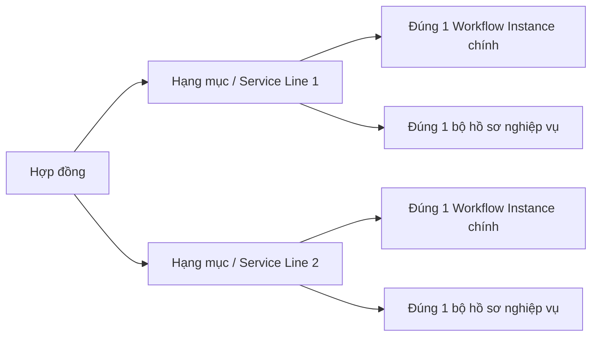

# Phase 02 — Danh mục thương mại và 22 Hạng mục

Ngày lập: 03/08/2026  
Ngày đồng bộ mô hình live: 07/08/2026  
Trạng thái: **Đã chốt danh mục; schema workflow live đã chuyển sang mô hình mới**  
Tài liệu cha: `WORKFLOW_HOSO_MASTER_PLAN.md`  
Tên cũ trong master plan: Phase A1

> Nguồn trạng thái hiện hành: [PHASE_STATUS_CURRENT_MODEL.md](./PHASE_STATUS_CURRENT_MODEL.md). Mỗi Hạng mục là một `service_line`; phần vận hành dùng `workflow_instance`, Revision và Node thực tế. `projects_tasks` đã được xóa khỏi database live.

## 1. Mục tiêu và ranh giới Phase 02

Phase 02 chốt **khách hàng mua gì**, không khóa cách Giám đốc thiết kế quy trình.

Đầu ra của phase này gồm:

- danh mục chính xác 3 Gói và 22 Hạng mục;
- đầu ra khách hàng mua của từng Hạng mục;
- phòng chủ trì và phạm vi hỗ trợ liên phòng;
- phân biệt Hạng mục, add-on và công việc/checklist nội bộ;
- quy tắc để UI/API chỉ cho chọn Hạng mục thuộc đúng Gói và đúng hợp đồng;
- các điểm dữ liệu cần bảo vệ trước khi sang Phase 03.

Phase này **không**:

- hard-code K01–K09 cho từng Hạng mục;
- giới hạn Workflow Designer của Giám đốc;
- chốt công thức lương cuối cùng;
- backfill ProjectTask legacy; quyết định cleanup sau đó đã xóa dữ liệu cũ/rác này;
- sửa schema, API hay giao diện production.

Phase 03 mới thiết kế ma trận Hạng mục × K01–K09, node, nhánh, checklist và workflow template mặc định. Giám đốc vẫn được sửa/xuất bản template theo quyền và version.

## 2. Nguồn đã đối chiếu

### 2.1 Supabase live

Project đã đọc qua Supabase MCP:

```text
project_ref: ejklrwydjplwzztfuygj
project_url: https://ejklrwydjplwzztfuygj.supabase.co
```

Kết quả cập nhật tại ngày 07/08/2026:

| Bảng | Số dòng | Ý nghĩa trong Phase 02 |
|---|---:|---|
| `service_packages` | 3 | Danh mục Gói |
| `task_types` | 22 | Danh mục Hạng mục |
| `service_lines` | 2 | Hai Hạng mục hợp đồng test đã chuẩn hóa |
| `workflow_instances` | 2 | Workflow thực tế của hai Hạng mục test |
| `workflow_instance_revisions` | 3 | Revision graph riêng của hai Hạng mục |
| `task_nodes` | 6 | Node chạy thật đã materialize |
| `work_items` | 15 | Danh mục công việc khoán/checklist chuyên môn |
| `work_item_rates` | 27 | Đơn giá MAIN/ASSISTANT/SUBMITTER theo mô hình mới |

### 2.2 Backend và frontend hiện tại

- Model `TaskType` có `service_package_id`.
- API `GET /api/tasks/task-types` join `task_types` với `service_packages`, chỉ trả Gói đang active.
- Frontend `HosoFormModal` lọc Hạng mục bằng:

```js
taskTypes.filter(tt => tt.service_package_id === formData.service_package_id)
```

- Backend `_resolve_task_package` đã từ chối cặp `task_type_id`/`service_package_id` không khớp.
- Hai hồ sơ test đang gắn đúng Hạng mục Đo Vẽ.

### 2.3 Tài liệu nghiệp vụ

- Mô tả cụ thể 22 Dạng hồ sơ/Hạng mục.
- Bảng gom công việc K01–K09 và nguyên tắc nghiệm thu.
- Bảng khoán do khách hàng cung cấp.
- Các quyết định D01–D14 của Phase 01.
- Quyết định mới hơn về “Hỗ trợ nộp” được ưu tiên hơn đề xuất cũ.

## 3. Mô hình thương mại chuẩn



Quy tắc:

1. Một Hợp đồng có nhiều `service_lines`.
2. Một `service_line` là một Hạng mục khách mua và thuộc đúng một Gói.
3. Một `service_line` có tối đa một workflow instance chính và một bộ hồ sơ nghiệp vụ.
4. Workflow có thể giao Node/checklist cho phòng khác nhưng không đổi Gói của Hạng mục.
5. Phòng thực hiện hiện tại không phải là căn cứ xác định Gói.
6. Workflow template chỉ là cấu hình vận hành mặc định; không phải danh mục thương mại.

## 4. Ma trận chính thức 3 Gói × 22 Hạng mục

### 4.1 Gói Đo Vẽ — `sp_001`

Phòng chủ trì: **Phòng Đo Vẽ**.  
Theo dõi sau khi cơ quan tiếp nhận: **Không**.  
Đầu ra chuẩn kết thúc ở sản phẩm kỹ thuật/bàn giao, kể cả khi công ty hỗ trợ mang đi nộp.

| ID | Hạng mục trong DB | Đầu ra khách hàng mua | Đo Vẽ | MAIN/ASSISTANT mặc định |
|---|---|---|---|---|
| `tt_001` | Đo hiện trạng | Số liệu hiện trường và bản vẽ được duyệt | Bắt buộc | `OPTIONAL_ASSISTANT` |
| `tt_002` | Cắm mốc | Tọa độ/mốc được xác định và biên bản/ảnh bàn giao | Bắt buộc | `OPTIONAL_ASSISTANT` |
| `tt_003` | Hoàn công – phần đo vẽ | Bản vẽ hoàn công được duyệt | Bắt buộc | `OPTIONAL_ASSISTANT` |
| `tt_004` | Cấp đổi – phần đo vẽ | Bản vẽ/trích đo phục vụ cấp đổi | Bắt buộc | `OPTIONAL_ASSISTANT` |
| `tt_005` | Hợp thửa – phần đo vẽ | Phương án/bản vẽ hợp thửa | Bắt buộc | `OPTIONAL_ASSISTANT` |
| `tt_006` | Tách thửa – phần đo vẽ | Phương án/bản vẽ tách thửa | Bắt buộc | `OPTIONAL_ASSISTANT` |
| `tt_007` | Cấp sổ lần đầu – phần đo vẽ | Bản vẽ/trích đo hiện trạng | Bắt buộc | `OPTIONAL_ASSISTANT` |
| `tt_008` | Chuyển mục đích – phần đo vẽ | Bản vẽ/phần diện tích xin chuyển khi cần | Tùy hồ sơ | `OPTIONAL_ASSISTANT` |
| `tt_009` | Xác định diện tích | Kết quả diện tích và bản vẽ/biên bản | Bắt buộc | `OPTIONAL_ASSISTANT` |

Giải thích chế độ nhân sự:

- `MAIN` luôn bắt buộc.
- `ASSISTANT` là mặc định tùy chọn, không phải cứ có rate `support` là phải phân người.
- Giám đốc có thể đổi Task cụ thể thành `MAIN_ONLY` hoặc `REQUIRED_ASSISTANT`, có lý do và audit.
- Không có assignment/phần đóng góp được nghiệm thu thì không có khoán phụ.

### 4.2 Gói Pháp Lý — `sp_002`

Phòng chủ trì: **Phòng Pháp Lý**.  
Theo dõi sau khi cơ quan tiếp nhận: **Có** — mã H29/biên nhận, ngày hẹn, tiến độ, bổ sung và kết quả.  
Đo Vẽ là cụm hỗ trợ tùy hồ sơ; không biến Task thành Gói Đo Vẽ.

| ID | Hạng mục trong DB | Đầu ra khách hàng mua | Phần Đo Vẽ | Phòng chủ trì |
|---|---|---|---|---|
| `tt_010` | Hoàn công | Hoàn tất thủ tục hoàn công/cập nhật theo phạm vi hợp đồng và bàn giao kết quả | Có thể bắt buộc | Pháp Lý |
| `tt_011` | Cấp đổi | Hồ sơ cấp đổi được xử lý và bàn giao kết quả | Tùy hồ sơ | Pháp Lý |
| `tt_012` | Hợp thửa | Hồ sơ hợp thửa và kết quả pháp lý | Thường có | Pháp Lý |
| `tt_013` | Tách thửa | Hồ sơ tách thửa, kết quả và dữ liệu các thửa mới | Thường có | Pháp Lý |
| `tt_014` | Cấp sổ lần đầu | Hồ sơ cấp lần đầu và kết quả pháp lý | Thường có | Pháp Lý |
| `tt_015` | Chuyển mục đích | Hồ sơ chuyển mục đích và kết quả pháp lý | Tùy hồ sơ | Pháp Lý |
| `tt_016` | Chuyển nhượng | Hoàn tất chuỗi công chứng/thuế/đăng ký biến động theo phạm vi | Có hoặc không | Pháp Lý |
| `tt_017` | Tặng cho | Hoàn tất thủ tục tặng cho và đăng ký biến động | Có hoặc không | Pháp Lý |
| `tt_018` | Thừa kế | Hoàn tất khai nhận/phân chia và đăng ký biến động | Có hoặc không | Pháp Lý |
| `tt_019` | Gia hạn đất nông nghiệp | Hồ sơ gia hạn và kết quả pháp lý | Có hoặc không | Pháp Lý |

Nhân sự Đo Vẽ trong Gói Pháp Lý được giao tại K02/K03 hoặc Support Request. Không dùng trường Task-level “Phụ đo” để thay cho assignment từng Step pháp lý.

### 4.3 Gói Xin Phép Xây Dựng — `sp_003`

Theo dõi sau khi cơ quan tiếp nhận: **Có**.  
Phòng chủ trì đề xuất: **Phòng Pháp Lý**, vì hệ thống hiện chưa có Phòng Xây Dựng; K02 giao Đo Vẽ và K04 giao người/chuyên gia phù hợp. Điểm này cần khách hàng duyệt.

| ID | Hạng mục trong DB | Đầu ra khách hàng mua | Phần kỹ thuật | Chủ trì đề xuất |
|---|---|---|---|---|
| `tt_020` | Xin phép xây dựng mới | Bộ hồ sơ và giấy phép xây dựng mới | Khảo sát, bản vẽ/thiết kế; kiểm định khi cần | Pháp Lý |
| `tt_021` | Sửa chữa, cải tạo | Bộ hồ sơ và giấy phép sửa chữa/cải tạo | Hiện trạng, phương án sửa chữa; kiểm định khi cần | Pháp Lý |
| `tt_022` | Gia hạn giấy phép xây dựng | Hồ sơ và kết quả gia hạn giấy phép | Chỉ phát sinh khi cần cập nhật bản vẽ | Pháp Lý |

## 5. Phân biệt Hạng mục, add-on và checklist

### 5.1 Hạng mục/Dạng hồ sơ

Toàn bộ 22 `task_types` hiện tại là Hạng mục có thể bán độc lập. Mỗi dòng khi được mua tạo `Service Line → Task → Dossier → Workflow`.

### 5.2 Add-on hợp lệ

Add-on là đầu ra bổ sung có phạm vi thương mại rõ, nhưng không tự biến thành một trong 22 Hạng mục chính.

| Add-on đề xuất | Khi dùng | Cách xử lý |
|---|---|---|
| Cắm mốc phát sinh trong Hạng mục khác | Khách yêu cầu thêm mốc ngoài đầu ra chuẩn | Service Change Request; nếu có thu phí phải được Giám đốc duyệt |
| Hỗ trợ vẽ theo yêu cầu | Có thêm phương án/định dạng/bộ bản vẽ ngoài đầu ra chuẩn | Gắn K03/K04; có báo giá/phụ thu nếu billable |
| Đo/bản vẽ phát sinh cho Gói Pháp Lý | Phạm vi ban đầu chưa gồm hoặc cơ quan yêu cầu thêm | Chọn `included` hoặc `billable`; billable phải duyệt thương mại |
| Kiểm định/chuyên môn đặc thù | Công trình cần đầu ra chuyên môn ngoài phạm vi chuẩn | Gắn K04 và người/chuyên gia chịu trách nhiệm |

Add-on không được tạo bằng cách đổi package/task type của Task đang chạy.

### 5.3 Công việc con/checklist, không phải TaskType

| Tên đang dùng | Phân loại chuẩn | Cụm dự kiến |
|---|---|---|
| Đo GPS | Công việc con | K02 |
| Khảo sát | Công việc con | K02 |
| Kiểm tra hiện trạng | Công việc con | K02 |
| Điều chỉnh bản vẽ trong phạm vi | Công việc con | K03 |
| Soạn đơn/tờ khai | Checklist/công việc con | K05 |
| Đi nộp | Công việc con có assignment `SUBMITTER` | K06 |
| Theo dõi hồ sơ | Công việc con của Gói Pháp Lý/XPXD | K06 |
| Bổ sung/nộp lại | Công việc con có lịch sử lượt nộp | K07 |
| Scan/lưu Drive | Checklist tài liệu | K08/K09 |

### 5.4 Quyết định cuối về “Hỗ trợ nộp”

Quyết định D04/D07 mới hơn thay thế đề xuất cũ:

- không tạo TaskType “Hỗ trợ nộp”;
- không ghi khách mua Gói Pháp Lý khi Task Đo Vẽ chỉ được hỗ trợ mang đi nộp;
- hỗ trợ thường miễn phí, chỉ ghi tối thiểu K05/K06, người thực hiện và minh chứng;
- nhân viên Pháp Lý là người đi nộp trong quy trình chuẩn;
- Task Đo Vẽ dừng theo dõi sau hành động nộp, không theo dõi tiến độ tại cơ quan;
- Task Pháp Lý/XPXD tiếp tục theo dõi H29, ngày hẹn, bổ sung và kết quả;
- mức 350.000 đ nếu được duyệt sau này là phụ cấp K06, không phải giá/TaskType độc lập.

## 6. Kết quả kiểm tra hai hồ sơ test và dữ liệu legacy

### 6.1 Hai hồ sơ test chuẩn

| Task | Hợp đồng | Service Line | Hạng mục | Gói | Kết quả đối chiếu |
|---|---|---|---|---|---|
| `BK-HS-TEST-01` | `HDDV-001` | `a111...111` | `tt_009` — Xác định diện tích | `sp_001` — Đo Vẽ | Khớp |
| `BK-HS-TEST-02` | `HDDV-002` | `a222...222` | `tt_004` — Cấp đổi – phần đo vẽ | `sp_001` — Đo Vẽ | Khớp |

Với code hiện tại, khi modal nhận đúng `Service Package ID = sp_001`, dropdown chỉ được hiển thị 9 Hạng mục Đo Vẽ. Ảnh trước đây hiển thị danh sách Pháp Lý có thể thuộc bản frontend/backend cũ, build chưa deploy hoặc cache; không phù hợp với dữ liệu live và source hiện tại.

### 6.2 Dữ liệu legacy

| Chỉ số | Số lượng |
|---|---:|
| Tổng Task | 1.684 |
| Có `task_type_id` | 2 |
| Thiếu `task_type_id` | 1.682 |
| Có `service_line_id` | 2 |
| Thiếu `service_line_id` | 1.682 |

Nguyên tắc xử lý:

- không suy đoán package/task type chỉ từ `task_name`, phòng ban hoặc ghi chú;
- đánh dấu `LEGACY_UNMAPPED` và lập hàng đợi mapping;
- cho người có quyền chọn Hợp đồng → Service Line → TaskType sau khi xem nguồn chứng minh;
- lưu người map, thời điểm, nguồn và audit;
- không cho dữ liệu legacy làm nguồn sinh lương/workflow tự động trước khi mapping.

## 7. Khoảng trống hiện tại của backend/frontend

### 7.1 Phần đang đúng

- `task_types.service_package_id` là nguồn quan hệ Gói–Hạng mục.
- API trả `service_package_id` và `service_package_name` cho từng TaskType.
- frontend lọc Hạng mục theo Gói đang chọn.
- backend kiểm tra Hạng mục thuộc Gói đang chọn.
- backend lấy `task_name` từ DB, không tin tên do frontend gửi.

### 7.2 Phần chưa đủ chặt

1. UI tạo/chỉnh sửa đang dựng danh sách Gói từ toàn bộ TaskType active, chưa giới hạn theo `service_package_ids` mà Hợp đồng đã mua.
2. Khi Hợp đồng có nhiều Gói, API trả `service_package_id = null`; UI cho chọn bất kỳ Gói active thay vì chỉ các Gói của Hợp đồng.
3. Backend kiểm tra Hạng mục thuộc Gói nhưng chưa bắt buộc Gói/Hạng mục đó phải có trên `service_lines` của Hợp đồng.
4. `_find_service_line_id` có thể fallback sang một Service Line cùng Gói dù khác TaskType, hoặc trả `null` mà vẫn tạo Task.
5. `service_lines.service_package_id`, `service_lines.task_type_id`, `projects_tasks.service_line_id` và `projects_tasks.task_type_id` đang nullable để chứa dữ liệu legacy.
6. Chưa có unique constraint bảo đảm một Service Line chỉ có một Task chính.
7. Modal chỉnh sửa vẫn cho đổi Gói/Hạng mục trực tiếp; về nghiệp vụ phải qua Service Change Request nếu thay đổi phạm vi thương mại.
8. Trường “Phụ đo” đang hiện cho mọi Gói; với Pháp Lý/XPXD nên dùng Step Assignment theo vai trò, không dùng nhãn Đo Vẽ.
9. Trạng thái trong modal là danh sách chung thiên về Đo Vẽ; Phase 03 phải chuyển sang trạng thái workflow/step theo template.

### 7.3 Guardrail cần áp dụng khi code

Luồng an toàn đề xuất:

```text
Frontend gửi service_line_id
    → Backend đọc Service Line
    → kiểm tra Service Line thuộc Hợp đồng
    → Backend tự suy ra package_id + task_type_id
    → kiểm tra package active + TaskType thuộc package
    → kiểm tra Service Line chưa có Task chính
    → tạo Task/Dossier/Workflow
```

Không dùng `service_package_id`, `task_type_id`, `task_name` do client gửi làm nguồn quyết định độc lập.

UI:

1. Chọn Hợp đồng.
2. Chỉ hiển thị Service Line/Hạng mục hợp đồng đã mua và chưa có Task.
3. Gói hiển thị dạng read-only từ Service Line.
4. Nếu cần mua thêm, tạo Service Change Request.
5. Chỉ sau khi Giám đốc kích hoạt request, Service Line mới xuất hiện để tạo Task.

Guardrail trên chỉ khóa phạm vi thương mại; không hạn chế Giám đốc cấu hình node/checklist/assignment trong workflow.

## 8. Bảng khoán live chưa phải chính sách lương được duyệt

Database có 44 rate active, tương ứng `main` và `support` cho cả 22 TaskType. Các mức này không khớp bảng khoán khách hàng vừa cung cấp.

Ví dụ:

| Hạng mục Đo Vẽ | Live MAIN/SUPPORT | Bảng khách cung cấp MAIN/PHỤ |
|---|---:|---:|
| Cắm mốc | 400.000 / 200.000 | 1.200.000 / 300.000 |
| Hoàn công | 500.000 / 300.000 | 1.100.000 / 200.000 |
| Cấp đổi | 350.000 / 180.000 | 1.100.000 / 200.000 |
| Hợp thửa | 450.000 / 250.000 | 1.200.000 / 200.000 |
| Tách thửa | 450.000 / 250.000 | 900.000 / 200.000 |
| Cấp sổ lần đầu | 300.000 / 150.000 | 1.100.000 / 200.000 |
| Chuyển mục đích | 400.000 / 200.000 | 1.100.000 / 200.000 |
| Xác định diện tích | 350.000 / 180.000 | 700.000 / 200.000 |

Ngoài ra, DB đang có rate `main/support` cho 10 Hạng mục Pháp Lý và 3 Hạng mục XPXD, trong khi quyết định nghiệp vụ là:

- Đo Vẽ: lương cơ bản + khoán theo đầu ra nghiệm thu;
- Pháp Lý: lương cơ bản + phụ cấp theo khâu viết/soạn và đi nộp;
- mọi phần biến đổi cần policy, ngày hiệu lực, snapshot, nghiệm thu và Giám đốc duyệt.

Kết luận Phase 02:

- giữ `task_type_rates` live ở trạng thái **dữ liệu seed/chưa duyệt**;
- không dùng để chốt bảng lương thật;
- không migration bảng khoán mới trong Phase 02;
- Phase lương sẽ thiết kế rate theo K/role/output, chống tính trùng và có version.

## 9. Metadata danh mục cần có trước khi code hoàn chỉnh

Phase 02 đề xuất mỗi Hạng mục có các thuộc tính cấu hình sau. Tên bảng/cột chính thức để Phase kỹ thuật quyết định.

| Thuộc tính | Ý nghĩa |
|---|---|
| `package_id` | Gói duy nhất của Hạng mục |
| `code` | Mã ổn định `tt_001`…`tt_022` |
| `display_name` | Tên hiển thị |
| `commercial_class` | `PRIMARY_SERVICE`/`ADD_ON`/`INTERNAL_ONLY` |
| `customer_output` | Đầu ra khách mua |
| `owner_department_key` | Phòng chủ trì |
| `measurement_requirement` | `REQUIRED`/`OPTIONAL`/`NONE` |
| `assistant_mode_default` | `MAIN_ONLY`/`OPTIONAL_ASSISTANT`/`REQUIRED_ASSISTANT` |
| `tracks_government_submission` | Có tiếp tục theo dõi sau nộp hay không |
| `default_workflow_template_id` | Template mặc định có version, Giám đốc được cấu hình |
| `is_active` | Cho phép bán/tạo mới |
| `effective_from/effective_to` | Hiệu lực danh mục nếu cần |

Không thêm các tên Đo GPS, Khảo sát, Kiểm tra hiện trạng hoặc Hỗ trợ nộp vào `task_types` chỉ vì chúng có mức khoán/phụ cấp.

## 10. Cảnh báo bảo mật Supabase ngoài phạm vi nghiệp vụ

Supabase MCP báo 39 bảng public đang tắt RLS, gồm dữ liệu người dùng, khách hàng, hợp đồng, Task và lương. Nếu frontend sử dụng anon/authenticated key trực tiếp, đây là rủi ro truy cập trái phép nghiêm trọng.

Không tự bật RLS trong Phase 02 vì bật mà chưa có policy có thể làm ứng dụng mất quyền truy cập. Cần một phase kỹ thuật riêng để:

1. xác định backend hiện dùng DB role nào;
2. lập ma trận role/quyền;
3. tạo policy SELECT/INSERT/UPDATE/DELETE đúng phạm vi;
4. test bằng từng vai trò;
5. mới bật RLS và rollout.

## 11. Các điểm cần khách hàng duyệt

| Mã | Đề xuất Phase 02 | Trạng thái |
|---|---|---|
| P02-01 | Giữ chính xác danh mục 3 Gói × 22 Hạng mục tại mục 4 | Chờ duyệt |
| P02-02 | Chấp nhận mô tả đầu ra khách mua tại mục 4 | Chờ duyệt |
| P02-03 | 9 Hạng mục Đo Vẽ mặc định `OPTIONAL_ASSISTANT`; Giám đốc override từng Task | Chờ duyệt |
| P02-04 | 10 Hạng mục Pháp Lý do Phòng Pháp Lý chủ trì; Đo Vẽ là Step/Support Request | Chờ duyệt |
| P02-05 | 3 Hạng mục XPXD tạm do Phòng Pháp Lý chủ trì, K02/K04 giao người phù hợp | Chờ duyệt |
| P02-06 | “Hỗ trợ nộp” không phải TaskType; Đo Vẽ không theo dõi tiến độ sau nộp | Đã chốt ở Phase 01 |
| P02-07 | Cắm mốc bán riêng là Hạng mục; phát sinh trong Task khác là add-on/K02 | Chờ duyệt |
| P02-08 | Các rate live chỉ là seed/chưa duyệt, không dùng tính lương thật | Chờ duyệt |
| P02-09 | Task mới phải tạo từ đúng Service Line; không cho chọn Gói ngoài Hợp đồng | Chờ duyệt |
| P02-10 | 1.682 Task legacy đưa vào hàng đợi mapping, không tự đoán | Đã chốt ở Phase 01 |

## 12. Tiêu chí đóng Phase 02

- [ ] Khách duyệt đúng 3 Gói và đủ 22 Hạng mục.
- [ ] Khách duyệt đầu ra của từng Hạng mục.
- [ ] Khách duyệt phòng chủ trì, đặc biệt Gói XPXD.
- [ ] Khách duyệt phân loại Hạng mục/add-on/checklist.
- [ ] Khách duyệt nguyên tắc MAIN/ASSISTANT của Đo Vẽ.
- [ ] Khách xác nhận rate live không phải bảng lương chính thức hoặc cung cấp căn cứ khác.
- [ ] Khách duyệt guardrail Task phải sinh từ đúng Service Line.
- [ ] Các điểm P02-01…P02-10 được ghi người duyệt và ngày duyệt.

## 13. Đầu vào chuyển sang Phase 03

Sau khi Phase 02 được duyệt, Phase 03 thực hiện:

- tạo ma trận 22 Hạng mục × K01–K09;
- xác định K bắt buộc/tùy chọn/không áp dụng;
- xác định node, nhánh, điều kiện, WAIT/DECISION;
- acceptance checklist và minh chứng từng K;
- assignment theo vai trò và người nghiệm thu;
- cơ chế tự chuyển `READY` có kiểm soát;
- 3–5 workflow template gốc để Giám đốc kéo–thả và tùy chỉnh;
- chạy thử năm case xuyên suốt mà không đổi sai package/Task.

Phase 03 không sửa lại danh mục thương mại đã duyệt; nếu phát hiện cần thêm/bớt Hạng mục phải quay lại Service Change/Decision Log.
