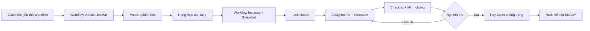
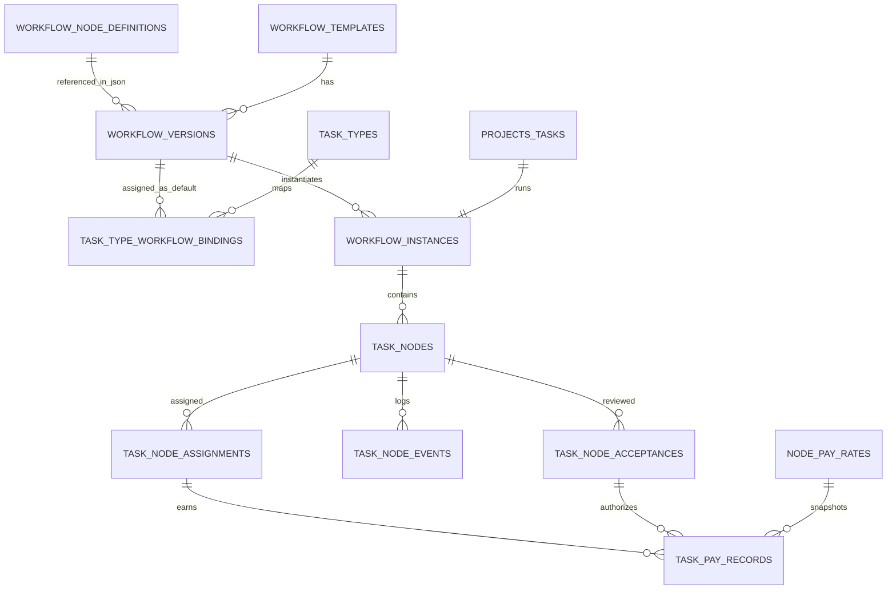
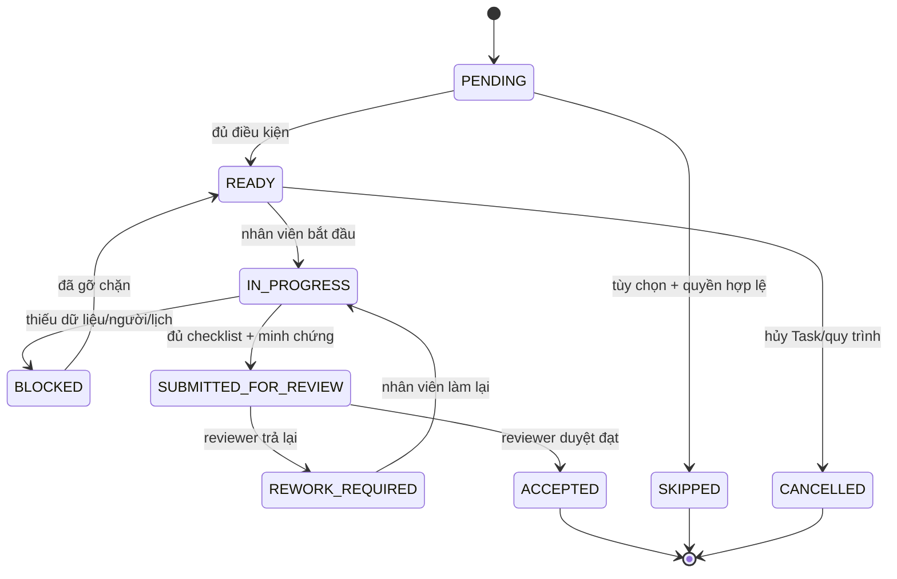
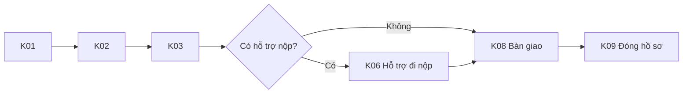
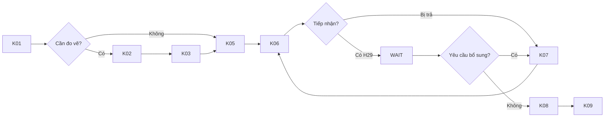

# Phase 03 — Thiết kế Dynamic Workflow và Khoán theo Node

Ngày lập: 03/08/2026  
Trạng thái: **Đã bị thay thế về kiến trúc thực thi — chỉ giữ để tham khảo lịch sử phân tích**  
Tài liệu cha: `WORKFLOW_HOSO_MASTER_PLAN.md`  
Tài liệu đầu vào: `PHASE_01_KHOA_PHAM_VI_VA_DECISION_LOG.md`, `PHASE_02_DANH_MUC_THUONG_MAI_VA_22_HANG_MUC.md`

> **Không dùng nội dung schema bên dưới để code.** `projects_tasks`, `task_pay_records`, `task_type_rates` và các bảng legacy liên quan đã bị xóa ngày 06/08/2026. Nguồn chuẩn hiện tại là [PHASE_STATUS_CURRENT_MODEL.md](./PHASE_STATUS_CURRENT_MODEL.md) và `PHASE_03A_HANG_MUC_WORKFLOW_CHECKLIST_SCHEMA.md`.

## 1. Kết luận thiết kế

Phương án phù hợp nhất là mô hình **hybrid relational + JSONB**:

- JSONB lưu sơ đồ kéo–thả, Node, Edge, vị trí, điều kiện, checklist và cấu hình linh hoạt.
- Bảng quan hệ lưu Task, workflow instance, Node đang thực thi, nhân viên, lịch, nghiệm thu và tiền.
- Workflow có version; Task đang chạy giữ snapshot phiên bản đã khởi tạo.
- Một Node có nhiều assignment theo vai trò, không chỉ một `assignee_id`.
- Nhân viên hoàn thành chỉ chuyển sang `SUBMITTED_FOR_REVIEW`; chỉ `ACCEPTED` mới phát sinh khoán.
- Pay Event có khóa chống trùng và snapshot đơn giá tại thời điểm nghiệm thu.



## 2. Hiện trạng Supabase được dùng làm căn cứ

Project live đã kiểm tra qua Supabase MCP:

```text
project_ref: ejklrwydjplwzztfuygj
```

Tại thời điểm lập tài liệu:

- chưa có `workflow_nodes`, `workflows`, `workflow_sequences`, `task_nodes`, `node_pay_rates`;
- `projects_tasks` chưa có `workflow_id` hoặc `current_node`;
- `task_pay_records` chưa có `task_node_id`;
- chưa có trigger/function tự sinh Pay Event;
- Alembic live vẫn ở revision `122f7a9c63e6`;
- database có 1.684 Task nhưng chỉ 2 Task test đã có `task_type_id` và `service_line_id`;
- 39 bảng public đang tắt RLS, nên các bảng mới phải được thiết kế policy trước khi mở cho Data API.

Tài liệu này là thiết kế đề xuất, không xác nhận rằng migration đã được chạy.

## 3. Điểm chưa hợp lý trong đề xuất ban đầu

| Mã | Đề xuất ban đầu | Vấn đề nghiệp vụ/kỹ thuật | Thiết kế sửa lại |
|---|---|---|---|
| I01 | `workflow_sequences.order_index` | Chỉ biểu diễn tuyến tính; không có rẽ nhánh, WAIT, DECISION, vòng K07 → K06 hoặc chạy song song | Lưu `nodes` và `edges` trong `workflow_versions.definition JSONB` |
| I02 | `workflows` không có version | Sửa template sẽ làm hồ sơ đang chạy đổi quy trình hoặc khó audit | Tách `workflow_templates` và `workflow_versions`; phiên bản đã publish là bất biến |
| I03 | `node_code` là danh tính Node | Một workflow có thể dùng K06/K07 nhiều vị trí hoặc nhiều lần; `K06` không đủ phân biệt | Mỗi Node có `node_key` riêng; `K06` chỉ là loại/cụm công việc |
| I04 | `projects_tasks.workflow_id` trỏ template đang sửa | Task không giữ được phiên bản đã chạy | Tạo `workflow_instances` trỏ đúng `workflow_version_id` và giữ `definition_snapshot` |
| I05 | `projects_tasks.current_node = K02` | Một Task có thể có nhiều Node READY/IN_PROGRESS; giá trị đơn không biểu diễn song song | Nguồn thật là `task_nodes.status`; current summary chỉ là cache/view |
| I06 | `task_nodes.assignee_id` | Không lưu được MAIN, ASSISTANT, WRITER, SUBMITTER và REVIEWER trên cùng Node | Tách `task_node_assignments` |
| I07 | Status chỉ Pending/In Progress/Completed/Blocked | Không phân biệt gửi duyệt, làm lại, nghiệm thu, bỏ qua và hủy | Dùng state machine đầy đủ ở mục 9 |
| I08 | `Completed` tự sinh lương | Người làm có thể tự hoàn thành và tự tạo tiền; chưa kiểm tra checklist/minh chứng | Chỉ sự kiện `ACCEPTED` bởi người có quyền mới tạo Pay Event |
| I09 | Không có checklist/minh chứng/lịch sử duyệt | Không chứng minh đầu ra, không biết ai trả làm lại hoặc đã duyệt phiên bản nào | Checklist trong JSON snapshot; sự kiện và acceptance lưu riêng |
| I10 | `node_pay_rates.service_type VARCHAR` | Dễ sai chính tả, không bảo đảm thuộc đúng Gói/Hạng mục | FK `task_type_id`/`service_package_id`; điều kiện nâng cao lưu JSONB |
| I11 | Role chỉ Main/Support | Không đủ nghiệp vụ Pháp Lý và nghiệm thu | Role code mở rộng: MAIN, ASSISTANT, WRITER, SUBMITTER, REVIEWER, SPECIALIST |
| I12 | Thay `task_id` bằng `task_node_id` trong pay record | Mất đường truy vết trực tiếp về Task/Hợp đồng và khó tương thích dữ liệu cũ | Giữ cả `task_id`, `task_node_id`, `assignment_id`, `acceptance_id` |
| I13 | Cuối tháng chỉ SUM pay record là ra lương | Chỉ ra phần biến đổi; thiếu lương cơ bản, phụ cấp, điều chỉnh, kỳ lương và duyệt khóa | Pay record là nguồn khoán/phụ cấp; payroll tổng hợp công thức đầy đủ |
| I14 | Không chống sinh tiền hai lần | Retry API hoặc duyệt lặp có thể tạo hai khoản giống nhau | Unique idempotency key theo acceptance + assignment + component |
| I15 | Dùng `TIMESTAMP` | Dễ sai múi giờ khi backend/server khác timezone | Dùng `TIMESTAMPTZ` cho mọi thời điểm |
| I16 | Không nêu index FK | Postgres không tự tạo index cho FK; timetable, join Node và payroll có thể scan toàn bảng | Tạo index cho mọi FK và composite/partial index theo truy vấn |
| I17 | Không có RLS/audit | Nhân viên có thể thấy/sửa Node hoặc lương ngoài phạm vi nếu Data API mở | RLS từ đầu, policy theo vai trò và event audit không ghi đè |

## 4. Ba lớp dữ liệu cần tách biệt

```text
Lớp 1 — Danh mục K
    K01…K09 có ý nghĩa chuẩn toàn công ty

Lớp 2 — Workflow Template có version
    Giám đốc kéo-thả Node/Edge và xuất bản

Lớp 3 — Workflow Instance của Task
    Snapshot, trạng thái, phân công, nghiệm thu và Pay Event thực tế
```

Không lưu toàn bộ ba lớp vào một JSON lớn. JSONB dùng cho cấu hình linh hoạt; dữ liệu cần lọc, phân quyền, khóa và tính tiền phải có cột/FK.

## 5. Sơ đồ bảng đề xuất



## 6. Lớp cấu hình Workflow

### 6.1 `workflow_node_definitions`

Danh mục K01–K09 dùng chung. Không chứa vị trí cụ thể trong từng sơ đồ.

| Cột | Kiểu đề xuất | Quy tắc |
|---|---|---|
| `id` | UUID PK | `gen_random_uuid()` |
| `code` | TEXT UNIQUE NOT NULL | K01…K09 |
| `name` | TEXT NOT NULL | Tên cụm |
| `description` | TEXT | Đầu ra nghiệm thu chuẩn |
| `is_active` | BOOLEAN NOT NULL DEFAULT TRUE | Không xóa cứng định nghĩa đã dùng |
| `created_at` | TIMESTAMPTZ NOT NULL | `now()` |
| `updated_at` | TIMESTAMPTZ NOT NULL | Audit thay đổi |

`code` là mã nghiệp vụ, không phải ID của một Node trên canvas.

### 6.2 `workflow_templates`

Danh tính ổn định của một loại quy trình.

| Cột | Kiểu đề xuất | Quy tắc |
|---|---|---|
| `id` | UUID PK | |
| `code` | TEXT UNIQUE NOT NULL | Ví dụ `PL_CAP_DOI` |
| `name` | TEXT NOT NULL | Tên hiển thị |
| `description` | TEXT | |
| `is_active` | BOOLEAN NOT NULL DEFAULT TRUE | |
| `created_by` | TEXT FK → `users.id` | Khớp kiểu ID hiện tại |
| `created_at` | TIMESTAMPTZ NOT NULL | |
| `updated_at` | TIMESTAMPTZ NOT NULL | |

### 6.3 `workflow_versions`

Mỗi lần Giám đốc xuất bản tạo một version bất biến.

| Cột | Kiểu đề xuất | Quy tắc |
|---|---|---|
| `id` | UUID PK | |
| `workflow_template_id` | UUID FK NOT NULL | → `workflow_templates.id` |
| `version_no` | INTEGER NOT NULL | `> 0` |
| `status` | TEXT NOT NULL | DRAFT/PUBLISHED/ARCHIVED |
| `schema_version` | INTEGER NOT NULL DEFAULT 1 | Version cấu trúc JSON |
| `definition` | JSONB NOT NULL | Node, Edge, vị trí, điều kiện, checklist |
| `definition_hash` | TEXT | Phát hiện thay đổi/snapshot |
| `created_by` | TEXT FK → `users.id` | |
| `published_by` | TEXT FK → `users.id` | Nullable khi draft |
| `created_at` | TIMESTAMPTZ NOT NULL | |
| `published_at` | TIMESTAMPTZ | |

Constraint/index:

```text
UNIQUE(workflow_template_id, version_no)
CHECK(status IN ('DRAFT','PUBLISHED','ARCHIVED'))
INDEX(workflow_template_id, status, version_no DESC)
```

Chỉ thêm GIN index trên `definition` nếu có truy vấn containment `@>` thực tế. Không tạo GIN chỉ vì cột là JSONB.

### 6.4 Cấu trúc `definition JSONB`

```json
{
  "schema_version": 1,
  "start_node": "n_start",
  "nodes": [
    {
      "key": "n_k01",
      "type": "K_NODE",
      "definition_code": "K01",
      "name": "Tiếp nhận và kiểm tra đầu vào",
      "position": { "x": 120, "y": 240 },
      "required": true,
      "activation_mode": "AUTO_AFTER_ACCEPTANCE",
      "default_assignments": [
        { "role": "MAIN", "department_key": "LEGAL", "required": true },
        { "role": "REVIEWER", "department_key": "DIRECTOR", "required": true }
      ],
      "schedule": { "estimated_minutes": 60 },
      "acceptance": {
        "criteria": [
          {
            "key": "c_customer",
            "label": "Đúng khách hàng, hợp đồng và hạng mục",
            "required": true,
            "evidence_types": []
          },
          {
            "key": "c_docs",
            "label": "Đủ giấy tờ đầu vào tối thiểu",
            "required": true,
            "evidence_types": ["FILE", "DRIVE_LINK"]
          }
        ]
      },
      "pay_policy": { "enabled": false }
    },
    {
      "key": "n_need_measurement",
      "type": "DECISION",
      "name": "Có cần đo vẽ không?",
      "position": { "x": 430, "y": 240 }
    },
    {
      "key": "n_k02",
      "type": "K_NODE",
      "definition_code": "K02",
      "name": "Khảo sát và đo hiện trường",
      "position": { "x": 740, "y": 100 },
      "required": false,
      "activation_mode": "CONDITIONAL",
      "default_assignments": [
        { "role": "MAIN", "department_key": "MEASUREMENT", "required": true },
        { "role": "ASSISTANT", "department_key": "MEASUREMENT", "required": false },
        { "role": "REVIEWER", "department_key": "DIRECTOR", "required": true }
      ],
      "acceptance": {
        "criteria": [
          {
            "key": "c_field_data",
            "label": "Đủ số liệu hiện trường",
            "required": true,
            "evidence_types": ["FILE"]
          },
          {
            "key": "c_field_photo",
            "label": "Có ảnh và nhật ký đo",
            "required": true,
            "evidence_types": ["IMAGE", "DRIVE_LINK"]
          }
        ]
      },
      "pay_policy": { "enabled": true, "pay_code": "K02_MEASUREMENT" }
    }
  ],
  "edges": [
    {
      "key": "e_01",
      "source": "n_k01",
      "target": "n_need_measurement",
      "condition": { "type": "ALWAYS" }
    },
    {
      "key": "e_02",
      "source": "n_need_measurement",
      "target": "n_k02",
      "label": "Có",
      "condition": {
        "type": "FIELD_COMPARE",
        "field": "task.requires_measurement",
        "operator": "EQUALS",
        "value": true
      }
    },
    {
      "key": "e_03",
      "source": "n_need_measurement",
      "target": "n_k05",
      "label": "Không",
      "condition": {
        "type": "FIELD_COMPARE",
        "field": "task.requires_measurement",
        "operator": "EQUALS",
        "value": false
      }
    }
  ],
  "viewport": { "x": 0, "y": 0, "zoom": 0.8 }
}
```

Không cho nhập script/code tùy ý trong `condition`. MVP chỉ hỗ trợ danh sách operator an toàn do backend định nghĩa.

### 6.5 `task_type_workflow_bindings`

Gắn workflow mặc định với từng Hạng mục nhưng vẫn cho Giám đốc chọn template hợp lệ trước khi Task bắt đầu.

| Cột | Kiểu đề xuất |
|---|---|
| `id` | UUID PK |
| `task_type_id` | TEXT FK → `task_types.id` |
| `workflow_version_id` | UUID FK → `workflow_versions.id` |
| `is_default` | BOOLEAN NOT NULL |
| `effective_from` | DATE NOT NULL |
| `effective_to` | DATE |
| `created_by` | TEXT FK → `users.id` |

Chỉ một binding mặc định có hiệu lực tại một thời điểm cho một TaskType.

## 7. Lớp thực thi Workflow

### 7.1 Không thêm `projects_tasks.current_node` làm nguồn dữ liệu

Giữ `projects_tasks` là Task/Hạng mục tổng thể. Quan hệ workflow nằm ở bảng instance:

### 7.2 `workflow_instances`

| Cột | Kiểu đề xuất | Quy tắc |
|---|---|---|
| `id` | UUID PK | |
| `task_id` | TEXT FK UNIQUE NOT NULL | → `projects_tasks.id`; một Task một instance chính |
| `workflow_version_id` | UUID FK NOT NULL | Phiên bản đã dùng |
| `definition_snapshot` | JSONB NOT NULL | Bản chụp không đổi |
| `status` | TEXT NOT NULL | NOT_STARTED/RUNNING/PAUSED/COMPLETED/CANCELLED |
| `started_at` | TIMESTAMPTZ | |
| `completed_at` | TIMESTAMPTZ | |
| `created_by` | TEXT FK → `users.id` | |
| `created_at` | TIMESTAMPTZ NOT NULL | |

Constraint/index:

```text
UNIQUE(task_id)
INDEX(workflow_version_id)
INDEX(status, created_at)
```

Nếu UI cần “Node hiện tại”, API tính từ các `task_nodes` đang READY/IN_PROGRESS/BLOCKED. Có thể tạo view/cache nhưng không xem `current_node` là nguồn thật.

### 7.3 `task_nodes`

Mỗi Node trong snapshot sinh một record thực thi. `node_key` phân biệt vị trí; `node_code` cho biết K01–K09.

| Cột | Kiểu đề xuất | Quy tắc |
|---|---|---|
| `id` | UUID PK | |
| `workflow_instance_id` | UUID FK NOT NULL | |
| `template_node_key` | TEXT NOT NULL | Ví dụ `n_k06_first_submit` |
| `node_type` | TEXT NOT NULL | START/END/K_NODE/DECISION/WAIT |
| `node_code` | TEXT | K01–K09; nullable với Node hệ thống |
| `occurrence_no` | INTEGER NOT NULL DEFAULT 1 | Cho vòng lặp/lần bổ sung |
| `status` | TEXT NOT NULL | State machine mục 9 |
| `is_required` | BOOLEAN NOT NULL | Snapshot |
| `config_snapshot` | JSONB NOT NULL | Checklist, role, pay policy, schedule |
| `planned_start` | TIMESTAMPTZ | Timetable |
| `planned_end` | TIMESTAMPTZ | Timetable |
| `started_at` | TIMESTAMPTZ | |
| `submitted_at` | TIMESTAMPTZ | |
| `accepted_at` | TIMESTAMPTZ | |
| `completed_at` | TIMESTAMPTZ | Chỉ set khi ACCEPTED/SKIPPED hợp lệ |
| `blocked_reason` | TEXT | |
| `created_at` | TIMESTAMPTZ NOT NULL | |
| `updated_at` | TIMESTAMPTZ NOT NULL | |

Constraint/index:

```text
UNIQUE(workflow_instance_id, template_node_key, occurrence_no)
CHECK(occurrence_no > 0)
INDEX(workflow_instance_id, status)
INDEX(status, planned_start)
PARTIAL INDEX(planned_start) WHERE status IN ('READY','IN_PROGRESS','BLOCKED')
```

### 7.4 `task_node_assignments`

| Cột | Kiểu đề xuất | Quy tắc |
|---|---|---|
| `id` | UUID PK | |
| `task_node_id` | UUID FK NOT NULL | |
| `employee_id` | TEXT FK NOT NULL | → `employees.id`, thống nhất nguồn payroll |
| `role_code` | TEXT NOT NULL | MAIN/ASSISTANT/WRITER/SUBMITTER/REVIEWER/SPECIALIST |
| `assignment_status` | TEXT NOT NULL | PROPOSED/ASSIGNED/ACCEPTED/DECLINED/COMPLETED/REPLACED |
| `is_primary` | BOOLEAN NOT NULL DEFAULT FALSE | |
| `planned_start` | TIMESTAMPTZ | |
| `planned_end` | TIMESTAMPTZ | |
| `assigned_by` | TEXT FK → `users.id` | |
| `assigned_at` | TIMESTAMPTZ NOT NULL | |
| `ended_at` | TIMESTAMPTZ | Khi đổi người |
| `replacement_reason` | TEXT | Audit |

Index quan trọng:

```text
INDEX(task_node_id, assignment_status)
INDEX(employee_id, assignment_status, planned_start)
```

MAIN và ASSISTANT không được cùng một nhân viên trong cùng Node khi chính sách Hạng mục yêu cầu tách người. Ràng buộc này kiểm tra trong domain service hoặc constraint phù hợp sau khi chốt policy.

### 7.5 `task_node_events`

Event append-only để không ghi đè lịch sử.

| Cột | Kiểu đề xuất |
|---|---|
| `id` | UUID PK |
| `task_node_id` | UUID FK NOT NULL |
| `event_type` | TEXT NOT NULL |
| `actor_user_id` | TEXT FK → `users.id` |
| `payload` | JSONB NOT NULL DEFAULT `{}` |
| `created_at` | TIMESTAMPTZ NOT NULL |

Event ví dụ:

```text
NODE_READY
NODE_STARTED
ASSIGNMENT_CHANGED
SUBMITTED_FOR_REVIEW
REWORK_REQUIRED
ACCEPTED
BLOCKED
UNBLOCKED
SKIPPED
NODE_CANCELLED
```

Index:

```text
INDEX(task_node_id, created_at DESC)
INDEX(event_type, created_at DESC)
```

### 7.6 `task_node_acceptances`

Tách acceptance thành bảng có FK vì đây là căn cứ mở Node tiếp theo và tạo tiền.

| Cột | Kiểu đề xuất | Quy tắc |
|---|---|---|
| `id` | UUID PK | |
| `task_node_id` | UUID FK NOT NULL | |
| `attempt_no` | INTEGER NOT NULL | Mỗi lần gửi duyệt |
| `decision` | TEXT NOT NULL | ACCEPTED/REWORK_REQUIRED/REJECTED |
| `reviewer_user_id` | TEXT FK NOT NULL | Người có quyền nghiệm thu |
| `submission_payload` | JSONB NOT NULL | Checklist và minh chứng snapshot |
| `review_payload` | JSONB NOT NULL DEFAULT `{}` | Điểm, ghi chú, tiêu chí trả lại |
| `decided_at` | TIMESTAMPTZ NOT NULL | |

Constraint:

```text
UNIQUE(task_node_id, attempt_no)
CHECK(attempt_no > 0)
CHECK(decision IN ('ACCEPTED','REWORK_REQUIRED','REJECTED'))
```

Chỉ acceptance `ACCEPTED` mới được tham chiếu bởi Pay Event.

## 8. Lớp khoán và payroll

### 8.1 `node_pay_rates`

Đơn giá là dữ liệu tài chính nên các khóa, số tiền và ngày hiệu lực là cột; điều kiện hiếm/linh hoạt lưu JSONB.

| Cột | Kiểu đề xuất | Quy tắc |
|---|---|---|
| `id` | UUID PK | |
| `node_definition_id` | UUID FK NOT NULL | → K01–K09 |
| `service_package_id` | TEXT FK | Nullable nếu áp dụng mọi Gói |
| `task_type_id` | TEXT FK | Nullable nếu áp dụng mọi Hạng mục trong scope |
| `role_code` | TEXT NOT NULL | MAIN/ASSISTANT/WRITER/SUBMITTER/SPECIALIST… |
| `pay_component_code` | TEXT NOT NULL | Ví dụ `K02_MAIN_BASE` |
| `base_amount` | NUMERIC(14,2) NOT NULL | `>= 0` |
| `currency` | CHAR(3) NOT NULL DEFAULT `VND` | |
| `conditions` | JSONB NOT NULL DEFAULT `{}` | Diện tích, số thửa, khoảng cách, nguyên nhân |
| `effective_from` | DATE NOT NULL | |
| `effective_to` | DATE | Exclusive end hoặc quy ước thống nhất |
| `is_active` | BOOLEAN NOT NULL DEFAULT TRUE | |
| `created_by` | TEXT FK → `users.id` | |
| `created_at` | TIMESTAMPTZ NOT NULL | |

Constraint/index:

```text
CHECK(base_amount >= 0)
CHECK(effective_to IS NULL OR effective_to > effective_from)
INDEX(node_definition_id, role_code, effective_from DESC)
INDEX(task_type_id, role_code, effective_from DESC)
```

Không cho hai rate cùng scope/role/component chồng thời gian hiệu lực. Migration có thể dùng exclusion constraint với `daterange` sau khi thống nhất quy tắc `effective_to`.

Ví dụ `conditions`:

```json
{
  "area": { "min": 0, "max": 1000 },
  "distance_zone": ["NORMAL"],
  "extras": [
    { "code": "EXTRA_STAKE", "amount_per_unit": 50000 }
  ],
  "acceptance_requirement": "ACCEPTED"
}
```

### 8.2 Điều chỉnh `task_pay_records`

Không thay thế `task_id`; bổ sung đường dẫn Node và dữ liệu snapshot.

| Cột cần giữ/thêm | Ý nghĩa |
|---|---|
| `id` | PK hiện có |
| `task_id` | Giữ để truy vết Hợp đồng/Task và tương thích legacy |
| `task_node_id` | Node tạo khoản tiền |
| `assignment_id` | Người + vai trò đã thực hiện |
| `employee_id` | Người nhận |
| `acceptance_id` | Nghiệm thu cho phép trả |
| `node_pay_rate_id` | Rate được dùng |
| `pay_component_code` | Loại khoản |
| `amount` | Số tiền snapshot |
| `calculation_snapshot` | JSONB ghi rate, điều kiện, hệ số và phép tính |
| `idempotency_key` | Khóa chống tạo trùng |
| `payroll_period_id` | Kỳ lương |
| `payment_status` | ELIGIBLE/APPROVED/LOCKED/PAID/VOID |
| `created_at` | TIMESTAMPTZ |

Constraint/index:

```text
UNIQUE(idempotency_key)
UNIQUE(acceptance_id, assignment_id, pay_component_code)
CHECK(amount >= 0)
INDEX(employee_id, payment_status, payroll_period_id)
INDEX(task_id)
INDEX(task_node_id)
```

Ví dụ `calculation_snapshot`:

```json
{
  "rate_id": "rate-k02-main-capdoi-v1",
  "base_amount": 400000,
  "role": "MAIN",
  "task_type_id": "tt_011",
  "node_code": "K02",
  "extras": [],
  "penalties": [],
  "final_amount": 400000,
  "accepted_at": "2026-08-05T16:30:00+07:00"
}
```

### 8.3 Không dùng trigger đơn giản `Completed → Pay`

Luồng đúng:

```text
Nhân viên SUBMITTED_FOR_REVIEW
    → Reviewer ACCEPTED
    → transaction/outbox tạo Pay Event idempotent
    → Node kế tiếp READY
```

Có thể triển khai bằng domain service trong backend trong cùng transaction. Nếu sau này dùng DB function/trigger thì function phải kiểm tra quyền/nghiệm thu và unique idempotency; không dùng trigger chỉ nhìn chuỗi trạng thái `Completed`.

### 8.4 Công thức lương tháng

```text
Lương tháng
= Lương cơ bản
+ Khoán/Phụ cấp Node đã ACCEPTED và được duyệt kỳ
+ Điều chỉnh hợp lệ
- Khấu trừ hợp lệ
```

`SUM(task_pay_records)` chỉ là tổng phần khoán/phụ cấp biến đổi, không phải toàn bộ lương.

## 9. State machine chuẩn của Node



Quy tắc:

- `ACCEPTED`, không phải `COMPLETED`, là trạng thái mở Node kế tiếp và tạo Pay Event.
- `SKIPPED` chỉ cho Node tùy chọn hoặc Giám đốc override có lý do.
- Node bắt buộc không được bỏ qua bởi người thực hiện.
- mọi chuyển trạng thái tạo `task_node_events`.

## 10. Mô phỏng dữ liệu xuyên suốt

### 10.1 Hợp đồng có hai Hạng mục

#### `service_lines`

| id | contract_id | package | task_type |
|---|---|---|---|
| `SL-001` | `HD-001` | Đo Vẽ | `tt_004` — Cấp đổi phần đo vẽ |
| `SL-002` | `HD-001` | Pháp Lý | `tt_011` — Cấp đổi |

#### `projects_tasks`

| id | service_line_id | package | task_type |
|---|---|---|---|
| `TASK-DV-001` | `SL-001` | Đo Vẽ | `tt_004` |
| `TASK-PL-001` | `SL-002` | Pháp Lý | `tt_011` |

Mỗi Task có workflow instance riêng; phối hợp phòng không đổi package.

### 10.2 Template Pháp Lý được version hóa

#### `workflow_templates`

| id | code | name |
|---|---|---|
| `WF-PL-02` | `PL_CAP_DOI` | Cấp đổi Pháp Lý |

#### `workflow_versions`

| id | template | version | status |
|---|---|---:|---|
| `WF-PL-02-V4` | `WF-PL-02` | 4 | ARCHIVED |
| `WF-PL-02-V5` | `WF-PL-02` | 5 | PUBLISHED |
| `WF-PL-02-V6` | `WF-PL-02` | 6 | DRAFT |

Giám đốc chỉnh V6; `TASK-PL-001` đang chạy V5 không bị đổi.

### 10.3 Workflow Instance

#### `workflow_instances`

| id | task_id | workflow_version | status |
|---|---|---|---|
| `WFI-001` | `TASK-PL-001` | `WF-PL-02-V5` | RUNNING |

#### `task_nodes` khi khởi tạo

| id | node_key | code/type | occurrence | status |
|---|---|---|---:|---|
| `RUN-01` | `n_k01` | K01 | 1 | READY |
| `RUN-02` | `n_need_measurement` | DECISION | 1 | PENDING |
| `RUN-03` | `n_k02` | K02 | 1 | PENDING |
| `RUN-04` | `n_k03` | K03 | 1 | PENDING |
| `RUN-05` | `n_k05` | K05 | 1 | PENDING |
| `RUN-06` | `n_k06` | K06 | 1 | PENDING |
| `RUN-07` | `n_wait_agency` | WAIT | 1 | PENDING |
| `RUN-08` | `n_k07` | K07 | 1 | PENDING |
| `RUN-09` | `n_k08` | K08 | 1 | PENDING |
| `RUN-10` | `n_k09` | K09 | 1 | PENDING |

### 10.4 Phân công K02

Sau khi K01 được nghiệm thu và Decision xác định cần đo, `RUN-03` chuyển READY.

#### `task_node_assignments`

| id | task_node_id | employee | role | status |
|---|---|---|---|---|
| `ASN-01` | `RUN-03` | `EMP-DV-A` | MAIN | ACCEPTED |
| `ASN-02` | `RUN-03` | `EMP-DV-B` | ASSISTANT | ACCEPTED |
| `ASN-03` | `RUN-03` | `EMP-DIRECTOR` | REVIEWER | ACCEPTED |

Ba assignment xuất hiện trên timetable tương ứng; một `assignee_id` không biểu diễn được dữ liệu này.

### 10.5 Nhân viên gửi duyệt nhưng bị trả lại

`RUN-03.status = SUBMITTED_FOR_REVIEW`.

#### Acceptance attempt 1

```json
{
  "task_node_id": "RUN-03",
  "attempt_no": 1,
  "decision": "REWORK_REQUIRED",
  "submission_payload": {
    "criteria": [
      {
        "key": "c_field_data",
        "result": "PASS",
        "evidence": [{ "type": "FILE", "url": "drive://field-data-v1" }]
      },
      {
        "key": "c_field_photo",
        "result": "PASS",
        "evidence": [{ "type": "IMAGE", "url": "drive://field-photo-v1" }]
      }
    ]
  },
  "review_payload": {
    "note": "Thiếu mốc phía Tây",
    "failed_criteria": ["c_field_data"]
  }
}
```

Không tạo Pay Event.

### 10.6 Nghiệm thu đạt và sinh khoán

#### Acceptance attempt 2

| id | task_node | attempt | decision | reviewer |
|---|---|---:|---|---|
| `ACC-02` | `RUN-03` | 2 | ACCEPTED | `DIRECTOR-01` |

#### `node_pay_rates`

| id | K | task_type | role | amount |
|---|---|---|---|---:|
| `RATE-01` | K02 | `tt_011` | MAIN | 400.000 |
| `RATE-02` | K02 | `tt_011` | ASSISTANT | 200.000 |

#### `task_pay_records`

| id | task | node | assignment | acceptance | amount | status |
|---|---|---|---|---|---:|---|
| `PAY-01` | `TASK-PL-001` | `RUN-03` | `ASN-01` | `ACC-02` | 400.000 | ELIGIBLE |
| `PAY-02` | `TASK-PL-001` | `RUN-03` | `ASN-02` | `ACC-02` | 200.000 | ELIGIBLE |

Retry sự kiện `ACC-02` không tạo thêm tiền vì unique:

```text
(ACC-02, ASN-01, K02_MAIN_BASE)
(ACC-02, ASN-02, K02_ASSISTANT_BASE)
```

### 10.7 Bị từ chối tại quầy rồi nộp lại

Lần K06 đầu tiên:

| submission | task | kết quả | H29 | lý do |
|---|---|---|---|---|
| `SUB-01` | `TASK-PL-001` | REJECTED_AT_COUNTER | null | Thiếu bản chính giấy chứng nhận |

Workflow:

```text
K06 → K07 occurrence 1 → K06 occurrence 2
```

Lần nộp thứ hai:

| submission | task | kết quả | H29 |
|---|---|---|---|
| `SUB-02` | `TASK-PL-001` | ACCEPTED | `H29.146-260505-13382` |

Workflow chuyển sang WAIT. Nếu cơ quan yêu cầu bổ sung sau khi đã có H29, vẫn giữ mã/lịch sử và tạo K07 occurrence tiếp theo; không tạo Task mới.

## 11. Hai workflow mẫu thể hiện ranh giới nghiệp vụ

### 11.1 Đo Vẽ có hỗ trợ nộp



Sau K06, Task Đo Vẽ không chạy WAIT/theo dõi H29. Hỗ trợ nộp không làm khách được ghi nhận là mua Gói Pháp Lý.

### 11.2 Gói Pháp Lý



Task Pháp Lý giữ package Pháp Lý dù K02/K03 giao nhân viên Đo Vẽ.

## 12. API/domain service tối thiểu

Không để frontend tự cập nhật trực tiếp các bảng trạng thái/lương.

| Hành động | Domain rule chính |
|---|---|
| Tạo draft workflow | Giám đốc/người được cấp quyền |
| Publish workflow version | Validate schema JSON, Node key, Edge, đường START→END, checklist và role |
| Khởi tạo instance | Snapshot version + tạo Node trong một transaction |
| Phân công Node | Kiểm tra role/phòng/năng lực; ghi event và timetable |
| Start Node | Chỉ assignment hợp lệ; READY → IN_PROGRESS |
| Submit for review | Đủ tiêu chí/minh chứng bắt buộc |
| Review Node | Reviewer được cấu hình; không tự duyệt việc của mình trừ ngoại lệ Giám đốc có audit |
| Accept Node | Tạo acceptance + Pay Event idempotent + kích hoạt Edge kế tiếp trong transaction |
| Override/skip | Quyền Giám đốc + lý do + event audit |

## 13. Index, constraint và hiệu năng

Nguyên tắc Postgres áp dụng:

1. Dùng `TIMESTAMPTZ`, `BOOLEAN`, `NUMERIC(14,2)` và `TEXT` có CHECK thay vì VARCHAR tùy ý.
2. Index mọi FK vì Postgres không tự index FK.
3. Composite index theo pattern truy vấn; cột equality đứng trước, thời gian/range đứng sau.
4. Partial index cho work queue đang mở thay vì index toàn bộ lịch sử.
5. JSONB chỉ có GIN/expression index khi query thực tế cần.
6. Constraint nghiệp vụ và idempotency phải ở database, không chỉ frontend.
7. Không dùng `ADD CONSTRAINT IF NOT EXISTS`; migration cần kiểm tra `pg_constraint` hoặc chạy đúng một lần qua Alembic.

Các truy vấn trọng tâm cần index:

```text
Việc đang mở của nhân viên:
    assignments(employee_id, assignment_status, planned_start)

Node đang chạy của Task:
    task_nodes(workflow_instance_id, status)

Lịch sử Node:
    task_node_events(task_node_id, created_at DESC)

Khoán chờ kỳ lương:
    task_pay_records(employee_id, payment_status, payroll_period_id)
```

## 14. RLS và phân quyền

Các bảng mới trong `public` phải bật RLS và có policy trước khi cấp quyền Data API.

Nguyên tắc:

- Giám đốc: toàn quyền workflow, instance, assignment, acceptance và payroll.
- Kế toán: xem Pay Event toàn công ty, lập kỳ lương; không tự nghiệm thu chuyên môn nếu không được ủy quyền.
- Nhân viên: chỉ xem Node/assignment liên quan và lương cá nhân.
- Sales: xem hợp đồng/Hạng mục và tiến độ tổng quan, không xem số khoán cá nhân.
- Reviewer được ủy quyền: xem hồ sơ/minh chứng cần cho Node và tạo decision.
- Không dùng `user_metadata` làm căn cứ phân quyền; role/quyền phải ở dữ liệu quản trị đáng tin cậy.
- UPDATE policy phải có cả `USING` và `WITH CHECK`.
- Không dùng `TO authenticated` đơn độc làm authorization.

Không bật hàng loạt RLS trên 39 bảng cũ khi chưa có policy và test, vì có thể làm ứng dụng ngừng hoạt động. Các bảng mới không được lặp lại nợ bảo mật này.

## 15. Kế hoạch migration/rollout đề xuất

### Bước 1 — Chốt thiết kế

- duyệt danh sách bảng/cột;
- duyệt state machine;
- duyệt role Node;
- duyệt điều kiện `ACCEPTED → Pay`;
- duyệt hai workflow mẫu Đo Vẽ/Pháp Lý.

### Bước 2 — Migration additive

- tạo bảng mới, FK, CHECK, unique và index;
- chưa xóa/đổi cột lương cũ;
- seed K01–K09;
- tạo RLS/policy cho bảng mới;
- không backfill Task legacy tự động.

### Bước 3 — Backend domain service

- publish/validate workflow JSON;
- instantiate snapshot;
- state transition có audit;
- acceptance và Pay Event idempotent;
- transaction ngắn, không gọi API ngoài khi đang giữ transaction.

### Bước 4 — Hai Task test

- gắn workflow vào `BK-HS-TEST-01` và `BK-HS-TEST-02` hoặc tạo Task test mới;
- chạy K01 → K02 → nghiệm thu/làm lại → Pay Event;
- kiểm tra timetable và phân quyền;
- không tác động 1.682 Task legacy.

### Bước 5 — Dual-read/dual-write có kiểm soát

- payroll mới đọc Pay Event Node cho Task mới;
- dữ liệu cũ vẫn dùng luồng legacy trong thời gian chuyển tiếp;
- đối chiếu tổng tiền bằng report trước khi khóa kỳ.

### Bước 6 — Backfill có xác minh

- chỉ backfill Task đã map đúng Contract → Service Line → TaskType;
- chọn workflow version và người duyệt;
- không tự sinh Pay Event ngược lịch sử nếu thiếu nghiệm thu đáng tin cậy.

## 16. Các quyết định cần duyệt trước khi viết migration

| Mã | Quyết định | Đề xuất |
|---|---|---|
| W01 | Lưu graph workflow | `workflow_versions.definition JSONB` |
| W02 | Task đang chạy khi template đổi | Giữ `workflow_version_id` + snapshot cũ |
| W03 | Nguồn Node hiện tại | Query `task_nodes`; không dùng một `current_node` làm nguồn thật |
| W04 | Một Node nhiều người | `task_node_assignments` với role |
| W05 | Điều kiện phát sinh khoán | Chỉ acceptance `ACCEPTED` |
| W06 | Người nghiệm thu | Giám đốc hoặc người được ủy quyền; người làm không tự duyệt mặc định |
| W07 | Lương Pháp Lý | Khoán/phụ cấp theo Node/role, không mặc định main/support theo TaskType |
| W08 | Xử lý Task cũ | Hàng đợi mapping; không tự suy luận |
| W09 | Workflow Designer MVP | Operator điều kiện an toàn, không cho script tùy ý |
| W10 | RLS bảng mới | Thiết kế và test policy ngay từ migration đầu |

## 17. Tiêu chí nghiệm thu thiết kế

- [ ] Workflow biểu diễn được nhánh, WAIT, vòng K07 → K06 và Node tùy chọn.
- [ ] Giám đốc sửa draft không ảnh hưởng Task đang chạy.
- [ ] Một Node phân được nhiều người/vai trò và hiện đúng timetable.
- [ ] Checklist/minh chứng thiếu thì không gửi nghiệm thu được.
- [ ] Reviewer trả làm lại không phát sinh tiền.
- [ ] Acceptance đạt tạo đúng một Pay Event cho mỗi assignment/pay component.
- [ ] Retry API không tạo tiền trùng.
- [ ] Đo Vẽ hỗ trợ nộp dừng sau bàn giao; Pháp Lý tiếp tục theo dõi H29.
- [ ] Task đổi người vẫn giữ lịch sử assignment cũ.
- [ ] Rate mới không thay đổi Pay Event đã snapshot/kỳ lương đã khóa.
- [ ] RLS bảo đảm nhân viên không xem workflow/lương ngoài phạm vi.
- [ ] Hai Task test chạy xuyên suốt trước khi rollout dữ liệu thật.

## 18. Nội dung không làm trong tài liệu này

- Không chạy DDL/migration trên Supabase.
- Không quyết định mức tiền khoán chính thức.
- Không viết toàn bộ API request/response.
- Không thiết kế chi tiết Dossier, submission attempt và Google Drive; các phần đó tiếp tục ở phase chuyên môn.
- Không backfill hoặc sửa Task live.

Sau khi W01–W10 được duyệt mới chuyển tài liệu này thành migration SQL, SQLAlchemy model, backend service và UI Workflow Designer.
