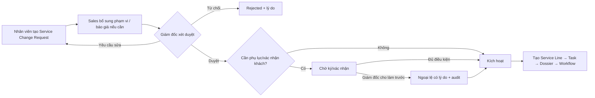
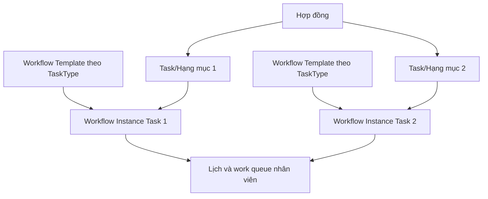
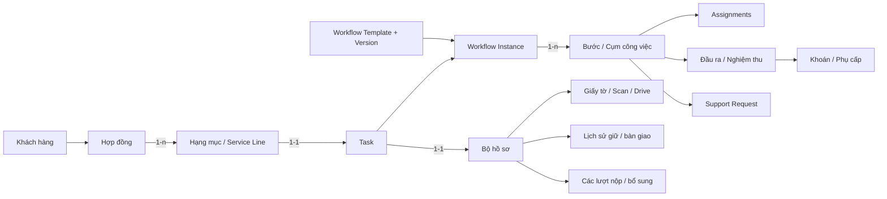
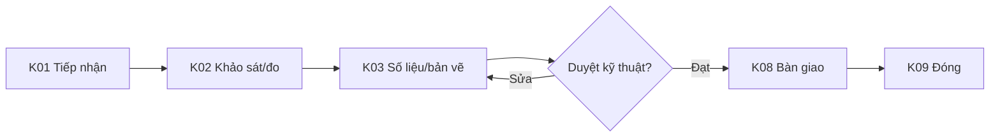
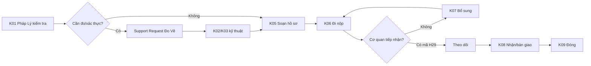
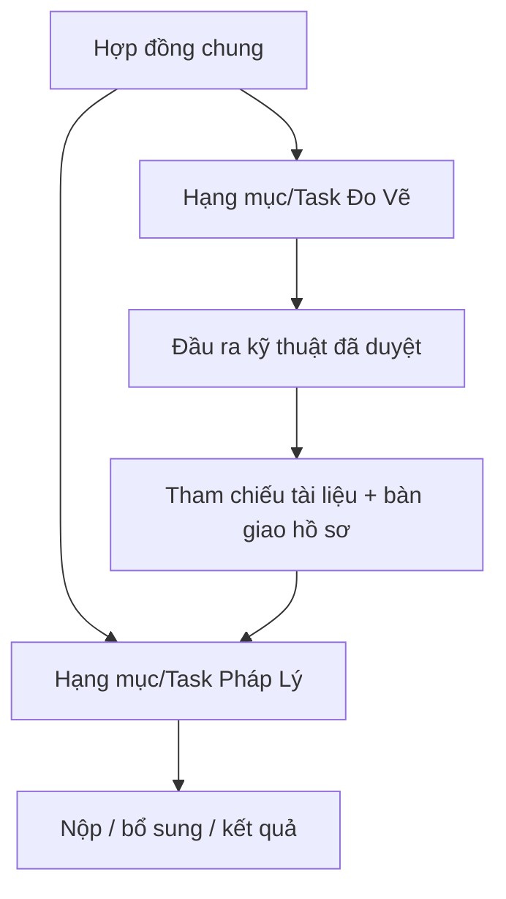
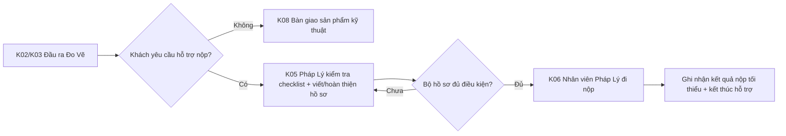
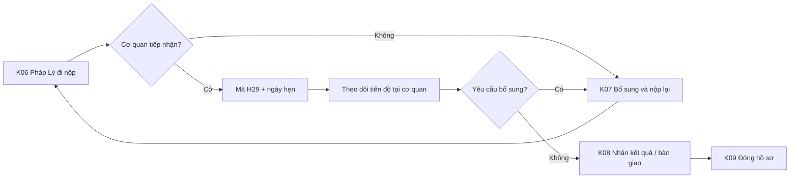
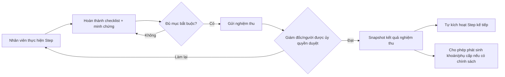

# Workflow hồ sơ — Bản tổng kết và kế hoạch phân tích chuẩn

Ngày cập nhật: 07/08/2026  
Trạng thái: **Nghiệp vụ đã chốt; schema mới đã live; backend/frontend đang cutover theo phase**

> Đồng bộ live 07/08/2026: mô hình Instance/Revision/Node/Checklist/Assignment/Acceptance/Entitlement đã được tạo; seed 15 công việc, 27 mức khoán và 3 mức lương cơ bản. Migration `20260806162743` đã xóa 1.683 `projects_tasks` cùng các bảng payroll/task legacy theo quyết định dữ liệu cũ/rác của chủ hệ thống.

> Quyết định kiến trúc cập nhật ngày 05/08/2026: trong tài liệu này, “Task/Hạng mục” là khái niệm nghiệp vụ trên UI. Database đích không dùng bảng `projects_tasks`; Hạng mục được biểu diễn bởi `service_lines`, còn vận hành được biểu diễn bởi `workflow_instances`, `workflow_instance_revisions` và `task_nodes`. Các đoạn cũ nói “tạo Task” không được hiểu là tạo record `projects_tasks`.

Bản tóm tắt bảng dữ liệu Phase 3: [TOM_TAT_BANG_DYNAMIC_WORKFLOW.md](./TOM_TAT_BANG_DYNAMIC_WORKFLOW.md).

Trạng thái phase/schema live: [PHASE_STATUS_CURRENT_MODEL.md](./PHASE_STATUS_CURRENT_MODEL.md).

Bản nháp nghiệp vụ mới lấy Hạng mục làm trung tâm, không dùng `projects_tasks` cho luồng mới: [PHASE_03A_HANG_MUC_WORKFLOW_CHECKLIST_SCHEMA.md](./PHASE_03A_HANG_MUC_WORKFLOW_CHECKLIST_SCHEMA.md).

Kế hoạch chuẩn hóa và migration database theo từng cổng phê duyệt: [DB_MIGRATION_MASTER_PLAN.md](./DB_MIGRATION_MASTER_PLAN.md).

## 1. Mục đích và phạm vi

Tài liệu này hợp nhất toàn bộ phân tích hiện có về:

- hợp đồng, gói dịch vụ và hạng mục;
- Task, bộ hồ sơ và workflow liên phòng;
- hồ sơ Đo Vẽ, Pháp Lý và Xây Dựng;
- nộp hồ sơ, bổ sung và mã H29;
- nghiệm thu, lương khoán và phụ cấp;
- định hướng giao diện tham khảo FastDo;
- hiện trạng database, backend và frontend;
- các khúc mắc phải chốt trước khi thiết kế/code.

Các tài liệu phân tích cũ đã được hợp nhất vào đây và không còn là nguồn quyết định riêng.

Nguồn nghiệp vụ:

- Google Doc “Câu hỏi lấy thông tin yêu cầu”, đọc ngày 02/08/2026.
- Các file dữ liệu khách hàng, mô tả công việc và bảng khoán đã được cung cấp.
- Database Supabase, backend FastAPI và frontend React đã được kiểm tra trong các phiên phân tích trước.
- Ý kiến khách hàng: thích cách FastDo thiết kế quy trình nhưng cần tích hợp đầy đủ khách hàng, hợp đồng và nghiệp vụ ERP.

## 2. Kết luận nghiệp vụ đã thống nhất

### 2.1 Lớp thương mại

1. Một Hợp đồng có thể có nhiều Hạng mục dịch vụ.
2. Công ty có ba Gói chính: Đo Vẽ, Pháp Lý và Xây Dựng.
3. Mỗi gói chỉ được chọn các Hạng mục thuộc gói đó trong `task_types`.
4. `service_lines` là dòng Hạng mục/Contract Item của hợp đồng.
5. Khi khách mua thêm một đầu ra có thu phí, thêm Hạng mục hoặc add-on vào cùng hợp đồng; không đổi gói của Hạng mục cũ.
6. Nếu phát sinh làm thay đổi giá trị/phạm vi hợp đồng, phải có luồng duyệt thương mại và phụ lục theo chính sách được chốt sau.

### 2.1.1 Yêu cầu mua thêm dịch vụ

Quyết định đã chốt:

- Bất kỳ nhân viên đang làm việc với khách/hồ sơ đều có thể tạo `Service Change Request` từ Task, hợp đồng hoặc khách hàng.
- Request chỉ ghi nhận nhu cầu; nhân viên không được tự sửa giá trị hợp đồng hoặc tự tạo/kích hoạt Hạng mục chính thức.
- Sales có thể bổ sung phạm vi, báo giá và bằng chứng khách hàng xác nhận.
- Giám đốc là người duyệt giá, yêu cầu phụ lục, điều kiện thương mại và quyền kích hoạt.
- Kế toán được xem/kiểm tra dữ liệu tài chính; quyền duyệt cuối vẫn thuộc Giám đốc.



Kiểm soát bắt buộc:

- Request có trạng thái `DRAFT`, `SUBMITTED`, `NEEDS_REVISION`, `APPROVED`, `WAITING_CUSTOMER`, `ACTIVATED`, `REJECTED`, `CANCELLED`.
- Phải lưu gói/Hạng mục đề xuất, phạm vi, lý do, giá đề xuất, người yêu cầu, bằng chứng khách đồng ý và mức ưu tiên.
- Thay đổi giá hoặc phạm vi hợp đồng đã ký mặc định cần phụ lục/xác nhận khách hàng theo chính sách; Giám đốc quyết định loại chứng từ áp dụng.
- Chỉ `ACTIVATED` mới được tạo Service Line/Task/Dossier/Workflow; thao tác phải atomic và chống tạo trùng.
- Giám đốc được cho phép làm trước khi đủ chứng từ, nhưng bắt buộc ghi lý do, người chịu trách nhiệm, hạn hoàn tất chứng từ và audit log.
- Request đã duyệt không xóa cứng; thay đổi tiếp theo tạo phiên bản hoặc request mới.
- Hỗ trợ nội bộ miễn phí không làm thay đổi phạm vi thương mại thì dùng Step/Support Request, không dùng Service Change Request để tạo Hạng mục giả.

### 2.2 Lớp vận hành

1. Mỗi Hạng mục tạo đúng **một Task chính**.
2. Mỗi Task có đúng **một bộ hồ sơ** của Hạng mục đó.
3. Một Task có một phòng chủ trì nhưng có thể có nhiều phòng và nhiều nhân viên tham gia.
4. K01–K09 là các cụm công việc con trong Task, không phải Task ngang cấp.
5. Chuyển việc sang phòng khác chỉ chuyển bước/assignment; không đổi package, Hạng mục hoặc Task.
6. Support Request là yêu cầu phối hợp trên Task hiện tại; không tạo Hạng mục thương mại nếu không có phát sinh bán thêm.
7. Khi khách thực sự mua thêm Gói Pháp Lý, tạo Hạng mục Pháp Lý và Task Pháp Lý riêng trong cùng hợp đồng.
8. Hai Task trong cùng hợp đồng được tham chiếu tài liệu của nhau; không upload lại file nếu có thể dùng liên kết.

### 2.3 Bộ hồ sơ và giấy tờ

1. Bộ hồ sơ chứa checklist, giấy tờ, bản scan, link Drive, phiên bản và lịch sử xác minh.
2. Hồ sơ giấy phải có lịch sử người giữ, địa điểm, người giao/nhận và thời gian bàn giao.
3. Trạng thái như “Đang chi nhánh” là vị trí hiện tại được suy ra từ lịch sử custody, không thay thế lịch sử.
4. Task Pháp Lý có thể tham chiếu đầu ra kỹ thuật đã nghiệm thu từ Task Đo Vẽ trong cùng hợp đồng.
5. Tài liệu không xóa cứng; nên dùng phiên bản và trạng thái thay thế/hủy hiệu lực.
6. Nếu Task Đo Vẽ có hỗ trợ nộp, bộ hồ sơ phải đủ giấy tờ để nhân viên Pháp Lý thực hiện K05/K06; sau khi nộp, hệ thống không mở vòng đời theo dõi tiến độ cơ quan như Gói Pháp Lý.

### 2.4 Nộp hồ sơ pháp lý

1. Mỗi lần mang hồ sơ đi nộp/nộp bổ sung là một Submission Attempt riêng.
2. Nếu cơ quan chưa tiếp nhận tại quầy: không có mã H29, bắt buộc lưu lý do và tạo việc bổ sung.
3. Nếu cơ quan tiếp nhận: lưu mã H29, biên nhận, ngày hẹn và chuyển sang theo dõi xử lý.
4. Nếu đã có mã nhưng cơ quan yêu cầu bổ sung: giữ lịch sử mã cũ và tạo yêu cầu/lượt bổ sung mới.
5. Không tạo Task hoặc bộ hồ sơ mới chỉ vì hồ sơ bị trả hoặc phải nộp lại.

### 2.5 Mô hình lương

1. Cả nhân viên Đo Vẽ và nhân viên Pháp Lý đều có lương cơ bản.
2. Nhân viên Pháp Lý có thêm phụ cấp biến đổi cho các khâu như viết/soạn hồ sơ và đi nộp.
3. Nhân viên Đo Vẽ có thêm khoán biến đổi theo bảng khoán Đo Vẽ và vai trò thực tế.
4. Thu nhập kỳ lương được tách: `Lương cơ bản + Khoán/Phụ cấp đã duyệt + Điều chỉnh hợp lệ`.
5. Doanh nghiệp yêu cầu xây dựng lại toàn bộ bảng lương, không chỉ vá bảng rate hiện có.
6. **Phần khoán/phụ cấp biến đổi bắt buộc tính theo cụm công việc có đầu ra được nghiệm thu.**
7. Công việc nhỏ nằm trong checklist; không trả trùng nếu đã thuộc phạm vi cụm chính.
8. Một khoản khoán/phụ cấp phải gắn với Task, cụm, assignment, người thực hiện, đầu ra và người nghiệm thu.
9. Mức và hệ số phải được snapshot khi duyệt để thay đổi rate sau này không làm sai lịch sử.
10. Trạng thái thực hiện, nghiệm thu, đủ điều kiện trả lương và công nợ là các trạng thái riêng.
11. Task mang trạng thái Hoàn thành không tự động làm phát sinh khoản khoán/phụ cấp.
12. Cuối tháng hệ thống tổng hợp ai đã hoàn thành và được nghiệm thu ở khâu nào; đây là dữ liệu đầu vào tính phụ cấp/khoán của kỳ lương.

### 2.5.1 Quyền kiểm soát chính sách lương

- Kế toán lập bảng tính/preview kỳ lương; Giám đốc kiểm tra, duyệt và khóa kỳ.
- Giám đốc được cấu hình chính sách lương cơ bản, mức khoán/phụ cấp, vai trò áp dụng, điều kiện nghiệm thu và ngày hiệu lực.
- Giám đốc được duyệt ngoại lệ cho một Task/assignment cụ thể: thêm/bỏ người phụ, thay mức, phụ cấp đặc biệt hoặc không tính khoản biến đổi.
- Mọi ngoại lệ bắt buộc có lý do, người thao tác, người duyệt, thời điểm và minh chứng nếu cần.
- Chính sách phải có phiên bản và khoảng hiệu lực; thay đổi mới không sửa số tiền đã snapshot.
- Không được sửa ngược kỳ lương đã khóa. Nếu cần điều chỉnh, tạo khoản điều chỉnh ở kỳ sau hoặc mở lại kỳ bằng quyền đặc biệt và audit.
- Nhân viên chỉ xem bảng lương cá nhân; Giám đốc và Kế toán xem dữ liệu toàn công ty.

### 2.5.2 Phân công và khoán của Hạng mục Đo Vẽ

- Mỗi Task thuộc Gói Đo Vẽ luôn có một `MAIN` — Phụ trách chính.
- `ASSISTANT` — Phụ đo/phụ trách phụ là vai trò tùy trường hợp; một số Task chỉ cần một người.
- Mỗi Hạng mục được cấu hình một trong ba chế độ: `MAIN_ONLY`, `OPTIONAL_ASSISTANT`, `REQUIRED_ASSISTANT`.
- Nếu có `ASSISTANT`, người chính và người phụ phải là hai nhân viên khác nhau.
- Giám đốc được thêm/bỏ người phụ ở Task cụ thể khi nghiệp vụ cho phép; thay đổi phải có lý do và audit.
- Chỉ người thực sự có assignment và phần đóng góp được nghiệm thu mới nhận mức khoán theo Hạng mục + vai trò.
- Khoản khoán không phát sinh ngay khi phân công; chỉ phát sinh sau khi Acceptance Checklist/đầu ra cụm tương ứng được nghiệm thu đạt.
- Một assignment + một đầu ra + một loại khoán chỉ được tạo một Pay Event để chống tính trùng.
- Dòng có mức Phụ đo bằng 0/để trống không tự động bắt buộc tạo `ASSISTANT`; vẫn có thể phân người hỗ trợ vận hành nhưng không phát sinh khoán nếu chính sách không có mức.

### 2.6 Phân loại “Hỗ trợ nộp” và ranh giới theo dõi

Theo phản hồi trực tiếp của khách hàng:

> Hủy mục “Hỗ trợ nộp” và chuyển thành một công việc con phải làm trong quy trình, sau đó tính phụ cấp.

Những điểm đã chốt:

1. “Hỗ trợ nộp” không còn là Gói, Hạng mục hoặc TaskType độc lập.
2. Hỗ trợ nộp của Gói Đo Vẽ không đồng nghĩa khách đã mua Gói Pháp Lý.
3. Hỗ trợ này thường miễn phí; không được tự ghi doanh thu/Gói Pháp Lý cho khách.
4. Bộ hồ sơ được giao cho **nhân viên Pháp Lý** đi nộp; Đo Vẽ không phải đơn vị đi nộp trong quy trình chuẩn.
5. Không tạo Task Pháp Lý chính chỉ để ghi nhận hỗ trợ nộp.
6. K05/K06 có thể được ghi nhận tối thiểu như công việc con để giao người và thống kê phụ cấp.
7. Với Task Đo Vẽ, việc theo dõi kết thúc sau hành động nộp; không tiếp tục quản lý tiến độ xử lý tại cơ quan, bổ sung sau tiếp nhận, ngày hẹn và kết quả như một hồ sơ Pháp Lý trọn gói.
8. Chỉ Task thuộc Gói Pháp Lý mới chạy vòng đời sau nộp: mã H29 → theo dõi tiến độ → yêu cầu bổ sung → nhận kết quả → bàn giao/đóng hồ sơ.
9. Trách nhiệm chuyên môn của Đo Vẽ kết thúc tại mốc bàn giao sản phẩm kỹ thuật; K05/K06 hỗ trợ do Pháp Lý phụ trách.

## 3. Ý nghĩa đúng của yêu cầu “tham khảo FastDo”

Yêu cầu sản phẩm được diễn giải như sau:

> Xây workflow engine có trải nghiệm cấu hình trực quan tương tự FastDo, nhưng workflow là lớp vận hành nằm trong ERP và bắt buộc liên kết với dữ liệu nghiệp vụ.

### Nên tham khảo

- Kéo–thả bước và nối luồng.
- Mỗi bước có vai trò/người phụ trách.
- Tự mở và giao bước kế tiếp.
- Form, checklist, deadline và đầu ra riêng cho từng bước.
- Theo dõi tiến độ, quá hạn và điểm nghẽn.
- Cho phép cập nhật workflow template mà không sửa code cho từng Hạng mục.

### ERP phải làm sâu hơn

Mỗi workflow instance phải biết:

- hợp đồng và khách hàng;
- gói, Hạng mục và Task;
- bộ hồ sơ, giấy tờ và vị trí hồ sơ giấy;
- phòng chủ trì, phòng hỗ trợ và assignments;
- lịch sử nộp, mã H29 và bổ sung;
- đầu ra nghiệm thu và sự kiện tính lương.

### Hai giao diện phải tách riêng

1. **Workflow Designer:** dành cho admin/quản lý cấu hình template, node, điều kiện, vai trò, form và đầu ra.
2. **Work Execution:** dành cho nhân viên xử lý hàng ngày qua work queue và chi tiết Task; không bắt nhân viên thao tác trên sơ đồ kéo–thả.

### 3.1 Phương án giao diện workflow của Bách Khoa

Phương án được chọn là tham khảo bố cục FastDo nhưng xây lại theo nghiệp vụ nhà đất Bách Khoa.

Điều chỉnh kiến trúc bắt buộc:

- Không gắn một workflow instance duy nhất trực tiếp cho toàn Hợp đồng.
- Một Hợp đồng có nhiều Hạng mục/Task; mỗi Task có một workflow instance riêng.
- Màn hình Hợp đồng hiển thị bảng/tổng quan tất cả workflow instance của các Hạng mục trong hợp đồng.
- Giám đốc tạo workflow template theo TaskType/Hạng mục, sau đó hệ thống sao chép thành instance khi Task được kích hoạt.
- Giám đốc được chỉnh instance của một Task cụ thể nếu cần, nhưng thay đổi phải có audit và không làm đổi template gốc.



#### Thành phần màn hình Workflow Designer

- Cột trái: danh sách template theo Gói/Hạng mục và trạng thái nháp/đã xuất bản.
- Vùng giữa: canvas kéo–thả node và nối nhánh.
- Cột phải: thư viện node, điều kiện, lý do thất bại và thuộc tính node đang chọn.
- Thanh trên: phiên bản, lưu nháp, xem trước, kiểm tra lỗi và xuất bản.
- Chỉ Giám đốc hoặc người được cấp quyền cấu hình mới sửa/xuất bản workflow.

#### Loại node

- `K_NODE`: node công việc K01–K09; một node tương ứng một cụm K.
- `DECISION`: rẽ nhánh theo điều kiện, ví dụ cơ quan tiếp nhận hay từ chối.
- `WAIT`: chờ khách, chờ cơ quan hoặc chờ ngày hẹn.
- `START`/`END`: bắt đầu/kết thúc.
- Node hệ thống không phát sinh khoán; chỉ K_NODE có thể gắn assignment, checklist nghiệm thu và chính sách lương.

Không nhất thiết workflow nào cũng có đủ K01–K09, và có thể lặp K06–K07 khi nộp/bổ sung.

#### Thuộc tính của một K_NODE

- mã K và tên công việc;
- bắt buộc/tùy chọn;
- phòng/vai trò/người mặc định;
- cho phép Giám đốc trực tiếp thực hiện hoặc phân việc;
- Acceptance Checklist và minh chứng bắt buộc;
- người duyệt hoặc cơ chế Giám đốc ủy quyền;
- chế độ kích hoạt có kiểm soát;
- thời lượng dự kiến, deadline, lịch và địa điểm;
- quyền xem dữ liệu/tài liệu;
- điều kiện pass/fail và nhánh tiếp theo;
- chính sách khoán/phụ cấp biến đổi nếu có.

#### Trải nghiệm thực thi

1. Giám đốc nhập thông tin phân việc tại node hoặc chấp nhận người hệ thống đề xuất.
2. Hệ thống tạo assignment, thông báo cho nhân viên và đưa Step lên timetable cá nhân.
3. Nhân viên mở Task/Step, bấm bắt đầu, làm checklist và nộp minh chứng.
4. Giám đốc/người được ủy quyền kiểm tra từng tiêu chí và chọn pass/yêu cầu làm lại.
5. Khi tất cả tiêu chí bắt buộc pass, Step được nghiệm thu; node tiếp theo chuyển `READY`.
6. Pay Event chỉ được tạo nếu node có chính sách biến đổi và acceptance đạt.

#### Timetable và profile

- Giám đốc có timetable tổng hợp toàn bộ nhân viên, lọc theo Đo Vẽ, Pháp Lý, Sales và Kế toán.
- Mỗi nhân viên có profile và timetable riêng.
- Assignment mới, đổi người, đổi lịch, yêu cầu làm lại hoặc sắp đến hạn đều tạo notification.
- Nhân viên chỉ thấy lịch/công việc theo quyền; Giám đốc thấy và điều phối toàn bộ.
- Hệ thống đề xuất lịch, Giám đốc kiểm soát và xác nhận trước khi chốt.

#### Version và an toàn vận hành

- Template có `DRAFT` và `PUBLISHED` cùng số phiên bản.
- Không sửa trực tiếp phiên bản đã xuất bản đang được Task sử dụng; tạo phiên bản mới.
- Task đang chạy giữ workflow version đã khởi tạo.
- Override một instance phải lưu người sửa, lý do, khác biệt và thời điểm.
- Trước khi xuất bản phải kiểm tra node mồ côi, thiếu điểm kết thúc, vòng lặp không kiểm soát, K_NODE thiếu checklist/người duyệt và nhánh không có điều kiện.

## 4. Mô hình nghiệp vụ mục tiêu



Ba lớp không được trộn:

```text
Thương mại: Hợp đồng → Gói → Hạng mục/Add-on → Giá bán
Vận hành:   Hạng mục → Task → Workflow → Cụm/Bước → Đầu ra
Nhân sự:    Cụm/Bước → Assignment → Nghiệm thu → Khoán/Phụ cấp
```

## 5. Khung cụm công việc K01–K09

| Cụm | Nội dung tổng quát |
|---|---|
| K01 | Tiếp nhận và kiểm tra đầu vào |
| K02 | Khảo sát và đo |
| K03 | Xử lý số liệu và bản vẽ |
| K04 | Thiết kế/kiểm định chuyên môn |
| K05 | Soạn và kiểm tra hồ sơ pháp lý |
| K06 | Đi nộp và ghi nhận kết quả tại cơ quan; không theo dõi vòng đời |
| K07 | Bổ sung và nộp lại |
| K08 | Nhận kết quả và bàn giao |
| K09 | Lưu trữ và đóng hồ sơ |

Không phải Hạng mục nào cũng có đủ K01–K09. Cần lập ma trận 22 Hạng mục để xác định cụm bắt buộc, tùy chọn, điều kiện kích hoạt, phòng phụ trách, đầu ra và người nghiệm thu.

## 6. Các workflow mẫu cần dùng để phân tích

### 6.1 Đo Vẽ thuần



### 6.2 Pháp Lý thuần, có thể yêu cầu Đo Vẽ



### 6.3 Hợp đồng có cả Đo Vẽ và Pháp Lý



Hai Hạng mục tạo hai Task; đây không phải Support Request cho phần dịch vụ đã được khách mua. Support Request chỉ dùng cho phần hỗ trợ phát sinh trong quá trình chạy một Task.

### 6.4 Gói Đo Vẽ có hỗ trợ nộp

Task vẫn thuộc Gói Đo Vẽ và khách không được ghi nhận là đã mua Gói Pháp Lý. Workflow có thể chuyển tiếp sang K05/K06 để Pháp Lý hoàn thiện đủ bộ hồ sơ và đi nộp, nhưng dừng theo dõi sau hành động nộp.



Quy tắc:

- Không tạo Hạng mục/TaskType “Hỗ trợ nộp”.
- Không đổi Task sang Gói Pháp Lý.
- Không ghi nhận khách đã mua Gói Pháp Lý và mặc định không phát sinh doanh thu Pháp Lý.
- K05 và K06 là các bước có người Pháp Lý phụ trách trong cùng workflow.
- Người hoàn thành K05 và K06 được thống kê riêng để tính phụ cấp cuối tháng.
- Không theo dõi tiến độ xử lý tại cơ quan sau khi nộp cho Task Đo Vẽ.
- Nếu khách mua dịch vụ pháp lý trọn gói thay vì chỉ yêu cầu bước hỗ trợ, phải thêm Hạng mục Pháp Lý riêng.

### 6.5 Gói Pháp Lý sau khi nộp

Task Pháp Lý tiếp tục được theo dõi sau K06:



## 7. Quy tắc quyết định Hạng mục, add-on hay Support Request

| Tình huống | Xử lý |
|---|---|
| Khách mua thêm đầu ra/dịch vụ độc lập | Thêm Hạng mục vào cùng hợp đồng |
| Khách mua thêm phạm vi nhỏ có giá riêng | Thêm add-on và kích hoạt cụm tương ứng |
| Phòng khác hỗ trợ hoàn thành Hạng mục hiện tại | Support Request gắn với cụm/bước |
| Bước liên phòng đã có sẵn trong template | Tự mở bước và giao phòng kế tiếp |
| Giao hồ sơ đi nộp | Kích hoạt K06 và giao nhân viên Pháp Lý vai trò `SUBMITTER`; không tạo TaskType “Hỗ trợ nộp” |
| Phát sinh có thu phí nhưng chưa duyệt | Dừng ở chờ duyệt thương mại, không âm thầm thực hiện |

### 7.1 Tự kích hoạt có kiểm soát

Quyết định đã chốt:

- Khi bước trước được nghiệm thu `Đạt`, hệ thống tự kích hoạt bước kế tiếp theo workflow template.
- “Kích hoạt” chỉ đưa bước sang trạng thái `READY`/sẵn sàng, tạo assignment dự kiến và đưa vào hàng đợi; không tự coi nhân viên đã bắt đầu làm.
- Nhân viên được giao vẫn bấm `Bắt đầu` để chuyển sang `IN_PROGRESS`.
- Nếu chưa có người phù hợp, thiếu dữ liệu bắt buộc hoặc vượt năng lực lịch, bước ở trạng thái `WAITING_ASSIGNMENT`/`BLOCKED`, không tự chạy tiếp.
- Giám đốc có quyền tạm dừng, đổi người, đổi lịch, kích hoạt thủ công, mở lại bước hoặc bỏ qua bước tùy chọn.
- Bước bắt buộc chỉ được bỏ qua bằng quyền Giám đốc, có lý do và audit log.
- Mọi lần hệ thống tự chuyển bước phải lưu bước nguồn, người nghiệm thu, điều kiện đã đạt, bước đích và thời điểm.
- Workflow template cho phép cấu hình từng node là `AUTO_AFTER_ACCEPTANCE`, `MANUAL_RELEASE`, `CONDITIONAL` hoặc `SCHEDULED`.
- K07 và các bước phụ thuộc phản hồi cơ quan chỉ kích hoạt khi có đúng sự kiện nghiệp vụ, không tự mở theo tuyến thời gian thông thường.

### 7.2 Danh sách nghiệm thu của từng công việc

Mỗi Step/cụm K01–K09 phải có `Acceptance Checklist` để xác định đầu ra có thực sự đạt hay chưa.

Phân biệt:

| Loại checklist | Mục đích | Ví dụ |
|---|---|---|
| Checklist giấy tờ | Kiểm tra bộ hồ sơ đã có đủ tài liệu chưa | CCCD, giấy chứng nhận, bản vẽ, biên nhận |
| Acceptance Checklist | Kiểm tra chất lượng đầu ra của Step | đủ điểm đo, bản vẽ đúng mẫu, hồ sơ đúng biểu mẫu, có biên nhận nộp |
| Điều kiện đóng Task | Tổng hợp các Step bắt buộc đã nghiệm thu | K02/K03 đạt, bàn giao xong, không còn hỗ trợ bắt buộc mở |

Mỗi tiêu chí nghiệm thu cần có:

- mã và nội dung tiêu chí;
- bắt buộc/tùy chọn;
- kiểu kết quả: checkbox, số, text, lựa chọn hoặc chữ ký;
- loại minh chứng: file, ảnh, Drive link, tọa độ, biên nhận hoặc ghi chú;
- quy tắc kiểm tra tự động nếu có;
- vai trò thực hiện và người có quyền duyệt;
- kết quả `PASS`, `FAIL`, `NOT_APPLICABLE`;
- ghi chú, người thao tác và thời điểm.

Luồng nghiệm thu:



Quy tắc kiểm soát:

- Không cho gửi nghiệm thu nếu thiếu tiêu chí/minh chứng bắt buộc.
- `NOT_APPLICABLE` chỉ dùng cho tiêu chí được phép và bắt buộc có lý do.
- Người thực hiện không tự duyệt đầu ra của mình.
- Mọi vòng gửi duyệt/làm lại/đạt phải giữ lịch sử.
- Checklist template có version; workflow instance giữ snapshot để mẫu mới không thay đổi hồ sơ đang chạy hoặc đã đóng.
- Task chỉ hoàn thành khi mọi Step bắt buộc đã có acceptance đạt và các điều kiện đóng Task được thỏa mãn.

## 8. Cách hiển thị công việc theo phòng ban

Mỗi khu vực Đo Vẽ, Pháp Lý và Xây Dựng cần hai work queue:

1. **Công việc chủ trì:** Task có phòng chủ trì là phòng hiện tại.
2. **Công việc phối hợp/được giao:** bước, assignment hoặc Support Request của Task phòng khác.

Hệ thống hiện không có vai trò Trưởng phòng. Cơ cấu quyền đã xác định gồm Giám đốc, Kế toán, Sales, nhân viên Pháp Lý và nhân viên Đo Vẽ.

| Vai trò | Phạm vi xem | Phạm vi thao tác |
|---|---|---|
| Giám đốc | Toàn bộ khách hàng, hợp đồng, Task, hồ sơ, lịch nhân viên và lương | Toàn quyền cấu hình, phân công, duyệt và chốt lương |
| Kế toán | Công nợ, dữ liệu tính lương và thông tin cần cho bàn giao/tài chính | Tính lương cùng Giám đốc, xử lý tài chính; không mặc định sửa hồ sơ chuyên môn |
| Sales | Lead pipeline, khách hàng tiềm năng, khách hàng, hợp đồng và tiến độ tổng quan | Chăm sóc lead, cập nhật CRM và nghiệp vụ thương mại được phép |
| Nhân viên Pháp Lý | Việc/Step được giao, hồ sơ cần xử lý và lịch cá nhân | Cập nhật phần việc, giấy tờ và lượt nộp thuộc quyền |
| Nhân viên Đo Vẽ | Việc/Step được giao, dữ liệu kỹ thuật cần xử lý và lịch cá nhân | Cập nhật phần việc, khảo sát và đầu ra kỹ thuật thuộc quyền |

Quy tắc:

- Mỗi nhân viên có profile riêng và chỉ xem chi tiết lương/khoán của chính mình.
- Giám đốc và Kế toán là hai vai trò được tính/xem lương toàn công ty; quyền duyệt và khóa kỳ cuối cùng thuộc Giám đốc nếu chưa có quyết định khác.
- Không hard-code vai trò Trưởng phòng trong workflow hiện tại.
- Dòng phối hợp phải có nhãn `Hỗ trợ`, Hạng mục gốc, phòng chủ trì, cụm được giao và trạng thái hỗ trợ.
- Phòng hỗ trợ có thấy toàn bộ hồ sơ hay chỉ dữ liệu của Step do Giám đốc cấu hình; mặc định chỉ cấp dữ liệu tối thiểu cần làm việc.
- Data scope phải được bảo vệ tại backend/API, không chỉ lọc ở frontend.
- Lead từ Zalo OA được đưa vào lead pipeline hiện có; Sales là vai trò xử lý chính.

### 8.1 Lịch năng lực nhân sự Thứ 2–Chủ nhật

Đề xuất bổ sung giao diện lịch tuần:

- cột hoặc hàng theo từng nhân viên;
- ô thời gian theo ngày/giờ từ Thứ 2 đến Chủ nhật;
- hiển thị Task/Step, địa điểm, thời lượng dự kiến, deadline và trạng thái;
- thể hiện giờ làm, ngày nghỉ, thời gian bận và phần công suất còn trống;
- Giám đốc xem và điều phối toàn bộ lịch;
- nhân viên xem lịch chi tiết của mình; quyền xem lịch chi tiết người khác do Giám đốc cấu hình;
- hệ thống đề xuất lịch/phân công dựa trên vai trò, thời gian rảnh, deadline, ưu tiên, địa điểm và thời gian di chuyển;
- phiên bản đầu chỉ đề xuất, không tự chốt; Giám đốc xác nhận hoặc khóa lịch thủ công.

Muốn tự động sắp lịch có chất lượng, mỗi loại Step cần có thời lượng dự kiến, kỹ năng/vai trò yêu cầu, vị trí thực hiện, cửa sổ thời gian và khả năng chia nhỏ công việc.

## 9. Hiện trạng hệ thống đã ghi nhận

### 9.1 Điểm đã triển khai đúng

- Database có ba gói và 22 TaskType: Đo Vẽ 9, Pháp Lý 10, Xây Dựng 3.
- `task_types.service_package_id` là nguồn chuẩn để xác định Hạng mục thuộc gói.
- `service_lines` đã có cấu trúc để một hợp đồng có nhiều Hạng mục.
- `workflow_instances` đã thay vai trò vận hành cũ của `projects_tasks`; graph riêng được version bằng `workflow_instance_revisions`.
- Đã có Node, checklist result, phân công Node/checklist, event, acceptance và entitlement theo schema mới.
- Backend tạo/cập nhật hồ sơ đã được bổ sung kiểm tra TaskType thuộc đúng package.
- UI hồ sơ đã được sửa để chọn gói trước và lọc Hạng mục theo `service_package_id`.
- Hai Service Line test đã có Workflow Instance/Revision/Node runtime để tiếp tục đối soát.

### 9.2 Điểm còn thiếu hoặc chưa đạt

- Luồng tạo hợp đồng nhiều Hạng mục và module Dossier riêng chưa hoàn thiện xuyên suốt.
- Chưa có Dossier tách khỏi Task với checklist, document version và custody.
- Schema phân công nhiều vai trò đã có; Work Execution/timetable cho nhân viên còn cần hoàn thiện UI/API.
- Chưa có Support Request hai chiều với vòng đời và đầu ra độc lập.
- Chưa chạy xuyên suốt đủ test `checklist → submitted → accepted/rework → transition → entitlement`.
- Tab phòng ban còn phụ thuộc lọc frontend; backend data scope chưa hoàn chỉnh.
- Bảng nộp hồ sơ chưa có dữ liệu vận hành thực tế để kiểm chứng luồng.
- Schema lương mới đã tách lương cơ bản, work item/rate, entitlement và adjustment; màn hình/kỳ lương vẫn cần hoàn thiện.
- 33 bảng public hiện còn tắt RLS; phải thiết kế policy và test role trước khi bật.

## 10. Các khúc mắc cần khách hàng chốt

### P0 — Đã giải quyết

Không còn quyết định P0 đang chặn thiết kế nghiệp vụ/UI của Phase 01.

Đã chốt và đưa ra khỏi danh sách P0:

- Hủy “Hỗ trợ nộp” khỏi danh mục Hạng mục/TaskType độc lập.
- Hỗ trợ nộp của Task Đo Vẽ không đồng nghĩa khách mua Gói Pháp Lý và thường không phát sinh giá bán.
- K06 do nhân viên Pháp Lý đi nộp; Đo Vẽ không phải người đi nộp trong quy trình chuẩn.
- Task Đo Vẽ dừng theo dõi sau hỗ trợ nộp; Task Pháp Lý mới theo dõi tiến độ cơ quan sau khi nộp.
- Không có Trưởng phòng; Giám đốc toàn quyền, Kế toán cùng tính lương, nhân viên xem việc/lịch/lương của mình, Sales phụ trách lead pipeline.
- Phạm vi dữ liệu của phòng hỗ trợ do Giám đốc cấu hình, mặc định cấp tối thiểu.
- Bước kế tiếp tự kích hoạt sau nghiệm thu nhưng chỉ sang trạng thái sẵn sàng; Giám đốc giữ quyền kiểm soát, can thiệp và audit.
- Mọi nhân viên được tạo request mua thêm dịch vụ; Giám đốc duyệt giá/phụ lục và chỉ sau khi đủ điều kiện mới kích hoạt Hạng mục/Task, trừ ngoại lệ có audit.

### P1 — Chặn thiết kế hồ sơ Pháp Lý và dữ liệu

| Mã | Khúc mắc | Mặc định đề xuất |
|---|---|---|
| P1-01 | Hai link Drive trong sheet đại diện tài liệu gì? | Tách thư mục hồ sơ, biên nhận và kết quả; cần xác nhận từng cột |
| P1-02 | Số điện thoại lặp trong sheet là khách hàng hay nhân viên/công ty? | Không import trước khi định danh |
| P1-03 | “Đang chi nhánh” là vị trí giấy hay trạng thái xử lý? | Dùng vị trí custody; trạng thái xử lý lưu riêng |
| P1-04 | Tên nhân viên trong sheet là người chủ trì hay người đi nộp? | Lưu hai assignment riêng dù có thể cùng người |
| P1-05 | “Đã thanh toán” thuộc toàn hợp đồng hay riêng Hạng mục? | Ánh xạ vào đúng cấp sau khi xác nhận, không lưu tại submission |
| P1-06 | Checklist giấy tờ và quyền xem/sửa/xóa theo loại tài liệu? | Template bắt buộc + mục phát sinh; thay phiên bản thay vì xóa cứng |
| P1-07 | Link Drive tự tạo theo cấu trúc chuẩn hay nhân viên dán link? | Ưu tiên thư mục chuẩn, nhưng cần đánh giá tích hợp hiện có |

### P2 — Chặn cấu hình lương

| Mã | Khúc mắc | Mặc định đề xuất |
|---|---|---|
| P2-01 | K06 trả theo chuyến đi hay chỉ khi có biên nhận hợp lệ? | Biên nhận hợp lệ mới đạt K06; chuyến bị trả có phụ cấp riêng nếu không do lỗi nội bộ |
| P2-02 | Nhiều người trong một cụm chia tiền thế nào? | Mức theo vai trò cố định; chưa cho nhập tỷ lệ tùy ý ở phiên bản đầu |
| P2-03 | Ai nghiệm thu từng cụm khi không có Trưởng phòng? | Giám đốc hoặc người được Giám đốc cấu hình ủy quyền theo loại Step; người làm không tự nghiệm thu đầu ra của mình |
| P2-04 | K01/K08/K09 có trả khoán không? | Nằm trong lương cố định nếu chưa có chính sách riêng |
| P2-05 | Công thức diện tích, số thửa, số mốc, khoảng cách và độ khó? | Chưa được tự suy luận; khách phải cung cấp bảng chính thức |
| P2-06 | Support Đo Vẽ trong Gói Pháp Lý đã nằm trong giá hay tính thêm? | Mỗi request chọn `included` hoặc `billable`; billable phải duyệt thương mại |
| P2-07 | Mức và điều kiện phần biến đổi của Đo Vẽ/Pháp Lý? | Đã chốt cả hai có lương cơ bản; Đo Vẽ thêm khoán, Pháp Lý thêm phụ cấp; còn thiếu mức/điều kiện chi tiết |
| P2-08 | Ngày hiệu lực và quy tắc cộng/trừ của bảng khoán? | Không migration rate trước khi chốt |

### P3 — Chặn migration/cutover

| Mã | Khúc mắc | Mặc định đề xuất |
|---|---|---|
| P3-01 | Xử lý Task cũ thiếu package/task type/department thế nào? | Không đoán; đánh dấu legacy và lập hàng đợi mapping |
| P3-02 | Task hoàn thành thiếu ngày dùng ngày nào? | Chỉ backfill từ nguồn đáng tin cậy; không lấy ngày tạo |
| P3-03 | Hai cột phân công cũ giữ bao lâu? | Dual-write trong giai đoạn chuyển tiếp rồi mới ngừng dùng |
| P3-04 | Workflow đang chạy khi template thay đổi dùng phiên bản nào? | Instance giữ nguyên version đã khởi tạo; thay đổi chỉ áp dụng instance mới trừ migration được duyệt |
| P3-05 | Gói Xây Dựng cần work queue riêng và template nào? | Có work queue riêng; chi tiết cần phân tích ba Hạng mục |

## 11. Bảng khoán hiện được cung cấp

| Phân loại hồ sơ/công việc | Phụ trách chính | Phụ đo |
|---|---:|---:|
| Cắm mốc | 1.200.000 đ | 300.000 đ |
| Hoàn công | 1.100.000 đ | 200.000 đ |
| Cấp đổi | 1.100.000 đ | 200.000 đ |
| Hợp thửa | 1.200.000 đ | 200.000 đ |
| Tách thửa | 900.000 đ | 200.000 đ |
| Cấp sổ lần đầu | 1.100.000 đ | 200.000 đ |
| Chuyển mục đích | 1.100.000 đ | 200.000 đ |
| Đo GPS | 1.200.000 đ | 0 đ |
| Kiểm tra hiện trạng | 300.000 đ | 150.000 đ |
| Điều chỉnh bản vẽ | 500.000 đ | 0 đ |
| Xin phép xây dựng | 1.500.000 đ | 0 đ |
| Xác định diện tích | 700.000 đ | 200.000 đ |
| Hỗ trợ vẽ theo yêu cầu | 350.000 đ | Chưa xác nhận |
| Khảo sát | 400.000 đ | Chưa xác nhận |
| Đi nộp hồ sơ | 350.000 đ | Đã xác nhận; role SUBMITTER |

Dòng “Đi nộp hồ sơ” là **công việc khoán K06 trị giá 350.000đ**, không phải TaskType/Hạng mục. Phạm vi chỉ gồm mang bộ hồ sơ tới cơ quan và nộp minh chứng kết quả lần đi nộp; không bao gồm K07 theo dõi vòng đời hồ sơ, xử lý bổ sung hoặc nhận kết quả.

## 12. Kế hoạch chia phase phân tích

Không làm đồng thời tất cả database, backend và frontend. Mỗi phase phải có đầu ra và cổng duyệt rõ ràng.

Tài liệu triển khai chi tiết theo phase:

- [PHASE_01_KHOA_PHAM_VI_VA_DECISION_LOG.md](PHASE_01_KHOA_PHAM_VI_VA_DECISION_LOG.md) — tương ứng Phase A0 bên dưới.
- [PHASE_02_DANH_MUC_THUONG_MAI_VA_22_HANG_MUC.md](PHASE_02_DANH_MUC_THUONG_MAI_VA_22_HANG_MUC.md) — tương ứng Phase A1; danh mục đã chốt.
- [PHASE_03_THIET_KE_DYNAMIC_WORKFLOW_VA_KHOAN_NODE.md](PHASE_03_THIET_KE_DYNAMIC_WORKFLOW_VA_KHOAN_NODE.md) — bản lịch sử, không dùng để code.
- [PHASE_03A_HANG_MUC_WORKFLOW_CHECKLIST_SCHEMA.md](PHASE_03A_HANG_MUC_WORKFLOW_CHECKLIST_SCHEMA.md) — schema đích đã triển khai và đang dùng.

### Phase A0 — Khóa phạm vi và Decision Log

Mục tiêu:

- thống nhất thuật ngữ;
- tổng hợp và xác nhận các quyết định P0 đã chốt;
- ghi rõ nội dung nào đã xác nhận và ai xác nhận.

Đầu ra:

- Glossary một trang;
- Decision Log có ngày/người duyệt;
- sơ đồ Domain Map bản 1;
- phạm vi MVP và danh sách ngoài phạm vi.

Cổng duyệt: không còn khúc mắc P0; danh mục không còn TaskType “Hỗ trợ nộp”.

### Phase A1 — Danh mục thương mại và 22 Hạng mục

Mục tiêu:

- đối chiếu chính xác ba gói và toàn bộ TaskType;
- xác định Hạng mục, add-on và công việc checklist;
- chốt phòng chủ trì và đầu ra khách mua.

Đầu ra:

- ma trận Gói × Hạng mục;
- quy tắc thêm Hạng mục/phụ lục;
- danh sách add-on hợp lệ;
- loại bỏ TaskType “Hỗ trợ nộp” theo quyết định đã chốt và chuyển rate liên quan thành chính sách phụ cấp K06.

Cổng duyệt: mỗi TaskType thuộc đúng một package và có định nghĩa đầu ra rõ.

### Phase A2 — Workflow template và phối hợp liên phòng

Mục tiêu:

- lập ma trận 22 Hạng mục × K01–K09;
- chốt bước bắt buộc/tùy chọn, điều kiện và người nghiệm thu;
- phân biệt auto-handoff, assignment và Support Request.

Đầu ra:

- 3–5 workflow template gốc, không vẽ 22 sơ đồ rời;
- ma trận cấu hình từng Hạng mục;
- state machine Task/Step/Support Request;
- danh mục node cho Workflow Designer.

Cổng duyệt: năm ca mẫu có thể chạy từ đầu đến cuối mà không đổi Task/package sai.

### Phase A3 — Dossier, giấy tờ và nghiệp vụ nộp

Mục tiêu:

- chốt cấu trúc bộ hồ sơ, document, Drive và custody;
- chốt Submission Attempt, H29 và Supplement Request;
- giải quyết P1-01 đến P1-07 bằng dữ liệu sheet thật.

Đầu ra:

- data dictionary hồ sơ;
- checklist mẫu cho các Hạng mục ưu tiên;
- state machine nộp/bổ sung;
- mapping từng cột sheet → thực thể/trường dữ liệu;
- quy tắc dùng chung tài liệu giữa hai Task.

Cổng duyệt: import thử một số dòng sheet không làm sai khách hàng, thanh toán, người phụ trách hoặc link Drive.

### Phase A4 — Assignment, nghiệm thu và lương

Mục tiêu:

- chốt vai trò theo cụm;
- chốt đầu ra/người nghiệm thu;
- giải quyết P2-01 đến P2-08;
- chống tính trùng.
- thiết kế lại toàn bộ bảng lương: cả hai phòng có lương cơ bản; Pháp Lý thêm phụ cấp theo khâu, Đo Vẽ thêm khoán theo Hạng mục/vai trò.

Đầu ra:

- role matrix;
- acceptance matrix;
- rate matrix có ngày hiệu lực;
- công thức/hệ số và quy tắc stacking;
- bộ ví dụ tính lương kỳ mẫu.

Cổng duyệt: tính tay và hệ thống mô phỏng cho cùng kết quả trên các ca mẫu.

### Phase A5 — Phân quyền và kiến trúc giao diện

Mục tiêu:

- chốt ai thấy gì và sửa gì;
- tách Workflow Designer khỏi Work Execution;
- xác định information architecture trước wireframe chi tiết.

Đầu ra:

- role × action × data-scope matrix;
- sitemap;
- work queue Đo Vẽ/Pháp Lý/Xây Dựng;
- bố cục chi tiết Task dùng chung;
- wireframe low-fidelity theo vai trò.

Cổng duyệt: không lộ Task/phần lương ngoài quyền và không nhầm việc hỗ trợ thành Task chủ trì.

### Phase A6 — Đối chiếu kỹ thuật và migration

Mục tiêu:

- kiểm tra lại database/backend/frontend theo mô hình đã duyệt;
- không dựa vào các giả định kỹ thuật cũ chưa được xác minh;
- xử lý P3-01 đến P3-05.

Đầu ra:

- gap analysis chính thức;
- target data model và API contract;
- kế hoạch migration additive, backfill, dual-write, cutover và rollback;
- chiến lược audit, security, RLS/data scope và kiểm thử.

Cổng duyệt: có thể triển khai mà không đoán dữ liệu cũ và có đường rollback.

### Phase A7 — Prototype xác nhận với khách hàng

Chạy tối thiểu năm kịch bản:

1. Đo Vẽ thuần.
2. Đo Vẽ có hỗ trợ nộp.
3. Pháp Lý thuần không cần đo.
4. Pháp Lý cần Support Request Đo Vẽ.
5. Hồ sơ được tiếp nhận có H29 rồi bị yêu cầu bổ sung.

Với mỗi kịch bản phải xác nhận:

- ai nhìn thấy việc;
- ai được thao tác;
- đầu vào/đầu ra;
- trạng thái trước/sau;
- hồ sơ giấy đang ở đâu;
- có phát sinh giá bán hoặc lương không;
- audit lưu lại sự kiện nào.

Cổng duyệt: khách hàng ký xác nhận prototype và nghiệp vụ.

### Phase A8 — Đóng phân tích và lập kế hoạch triển khai

Chỉ sau A0–A7 mới chia phase code cụ thể cho database, backend, frontend, migration và rollout.

Đầu ra cuối phân tích:

- BRD/Decision Log đã ký;
- workflow và state machine đã duyệt;
- data dictionary và API contract;
- wireframe/prototype;
- acceptance criteria và test scenarios;
- implementation backlog có dependency và mức ưu tiên.

## 13. Nguyên tắc làm việc từ thời điểm này

1. Tài liệu này là nguồn chuẩn duy nhất cho workflow hồ sơ.
2. Quyết định mới phải cập nhật vào Decision Log trong tài liệu này.
3. Không chuyển mặc định đề xuất thành “đã chốt” nếu chưa có xác nhận của khách.
4. Không sửa schema/workflow/lương thật trước khi phase tương ứng qua cổng duyệt.
5. Có thể tiếp tục review hoặc hoàn tất bug fix độc lập về lọc Gói → Hạng mục, nhưng không dùng bug fix đó để suy luận rằng workflow tổng thể đã hoàn thành.
6. Phase 02 về danh mục thương mại/22 Hạng mục đã có bản nháp đối chiếu Supabase live; bước tiếp theo là khách hàng duyệt các quyết định P02-01–P02-10 trước khi mở Phase 03.
