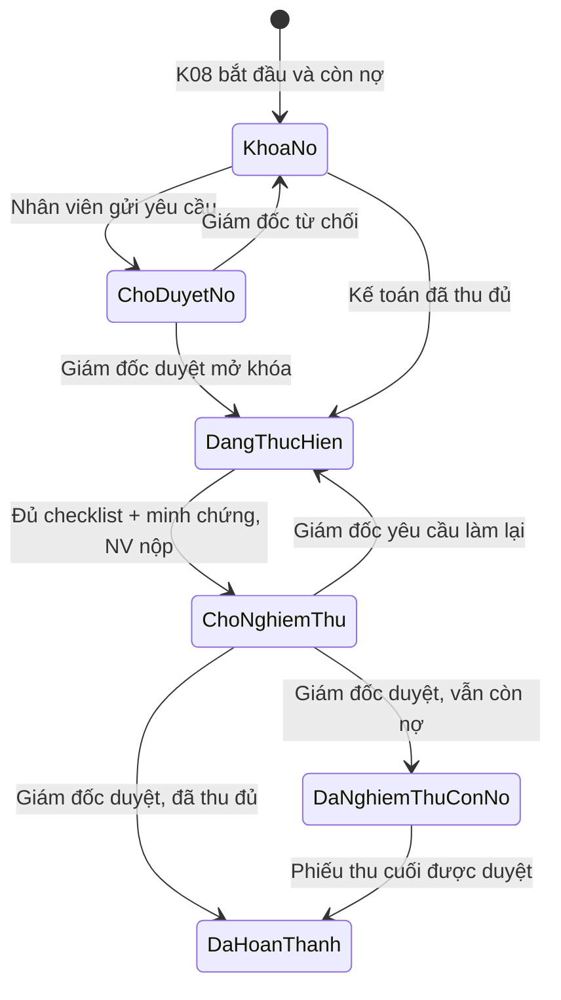

# K08 — Bàn giao hồ sơ và cổng công nợ

> Cập nhật theo quyết định nghiệp vụ ngày 21/08/2026. Tài liệu này thay thế
> luồng cũ dùng `contracts.completion_override` để đóng thẳng bước bàn giao.

## 1. Nguyên tắc bất biến

1. K08 được nhận diện bằng `node_def.is_handover`, không suy luận cứng từ mã `K08`.
2. Phê duyệt nợ chỉ mở khóa thao tác chuyên môn cho đúng `task_node_id`. Nó không
   xóa nợ, không làm hợp đồng hoàn thành và không tự nghiệm thu Node.
3. Chỉ phiếu thu đã được duyệt mới làm giảm công nợ.
4. Nhân viên chỉ được nộp nghiệm thu khi đã nộp đủ checklist và minh chứng bắt buộc.
5. Giám đốc là người duyệt nghiệm thu. Sau khi duyệt, công việc chuyên môn được
   nghiệm thu và đủ điều kiện tạo tiền công/khoán.
6. Workflow/Hạng mục/Hợp đồng chỉ hoàn thành về tài chính khi số dư thật
   `remaining <= 0.009`.
7. UI không dùng từ “Làn”. Hai khối hiển thị là `Giao hồ sơ cho khách` và
   `Thu đủ tiền hợp đồng`.
8. Tái sử dụng `Modal`, `SensitiveActionModal`, `ReceiptFileInput` và hệ thống
   button hiện có; không tạo component button mới.

## 2. Mô hình dữ liệu

### 2.1. Bảng mới `handover_debt_requests`

| Cột | Ý nghĩa |
|---|---|
| `id` | ID yêu cầu |
| `task_node_id` | Node K08 xin mở khóa; phạm vi phê duyệt nằm ở đây |
| `contract_id` | Hợp đồng để truy vấn công nợ và báo cáo |
| `requester_user_id` | Nhân viên phụ trách hồ sơ gửi yêu cầu |
| `remaining_amount_snapshot` | Số dư tại thời điểm gửi; chỉ là audit snapshot |
| `reason` | Lý do đề nghị giao khi còn nợ |
| `promised_payment_date` | Ngày khách hẹn thanh toán |
| `commitment_file` | Metadata file cam kết trên MinIO, nếu có |
| `status` | `pending`, `approved`, `rejected`, `cancelled` |
| `reviewed_by`, `reviewed_at`, `review_note` | Audit phê duyệt của Giám đốc |

Ràng buộc:

- Một Node chỉ có tối đa một yêu cầu `pending`.
- Một Node chỉ có tối đa một phê duyệt `approved` đang có hiệu lực.
- Bảng bật RLS và chỉ backend `service_role` thao tác trực tiếp.

### 2.2. Nguồn sự thật

| Dữ liệu | Bảng/field chuẩn |
|---|---|
| Số tiền thực thu | `cashflow_transactions` loại Thu, trạng thái đã duyệt |
| Checklist K08 | `task_node_checklist_results` |
| Phân công | `task_node_assignments`, `task_node_checklist_assignments` |
| Nộp/chấp nhận nghiệm thu | `task_node_acceptances` |
| Audit Node | `task_node_events` |
| Trạng thái Hạng mục | `workflow_instances.status` |
| Trạng thái Hợp đồng | `contracts.status` |

`contracts.completion_override` chỉ còn được đọc để tương thích dữ liệu cũ. Yêu
cầu mới không được ghi phê duyệt vào cờ cấp hợp đồng này.

## 3. State machine nghiệp vụ

| Badge UI | Điều kiện |
|---|---|
| Khóa nợ | Còn nợ, chưa có yêu cầu được duyệt |
| Chờ Giám đốc duyệt nợ | Có yêu cầu `pending` |
| Đang thực hiện | Đã thu đủ hoặc yêu cầu nợ đã được duyệt; Node đang làm |
| Chờ nghiệm thu | Nhân viên đã nộp toàn bộ K08 |
| Đã nghiệm thu — còn công nợ | Node `accepted` nhưng `remaining > 0.009` |
| Đã hoàn thành | Node đã nghiệm thu và `remaining <= 0.009` |

## 4. Luồng theo vai trò

### 4.1. Nhân viên Đo vẽ/Pháp lý phụ trách K08

1. Mở Node từ Timetable.
2. Nếu còn nợ và chưa được duyệt, checklist, upload và nút `Nộp nghiệm thu` bị
   khóa; chỉ hiện `Xin duyệt nợ`.
3. Nhập lý do, ngày hẹn, file cam kết tùy chọn và gửi.
4. Khi được duyệt, checklist và upload được mở.
5. Nộp từng checklist. Nếu trễ hạn, dùng deadline chung của Node và bắt buộc lý do trễ.
6. Khi server xác nhận đủ checklist/minh chứng, nút `Nộp nghiệm thu` sáng.
7. Sau khi nộp, Node chuyển `submitted`, chỉ xem và chờ Giám đốc.

### 4.2. Giám đốc

1. Xem đúng yêu cầu nợ của `task_node_id`.
2. Duyệt hoặc từ chối bằng `SensitiveActionModal`, bắt buộc ghi chú.
3. Duyệt nợ chỉ mở khóa công việc K08.
4. Sau khi nhân viên nộp, Giám đốc duyệt nghiệm thu qua acceptance flow chung.
5. Khi duyệt đạt, Node chuyển `accepted`, checklist được duyệt tương ứng và phát
   sinh điều kiện tiền công theo checklist đã duyệt. Nếu còn nợ, workflow/hợp
   đồng chưa hoàn thành.

### 4.3. Kế toán

1. Ghi nhận phiếu thu kèm bill/biên lai.
2. Phiếu mới ở trạng thái chờ duyệt và chưa làm giảm công nợ.
3. Sau khi phiếu được duyệt, hệ thống tính lại số dư.
4. Nếu số dư về 0 và toàn bộ Node của workflow đã kết thúc:
   - `workflow_instances.status = completed`;
   - khi mọi Hạng mục đã hoàn thành/hủy, `contracts.status = completed`.

## 5. API chuẩn

| API | Vai trò |
|---|---|
| `GET /api/handover/{task_node_id}` | Lấy trạng thái tổng hợp K08 |
| `POST /api/handover/{task_node_id}/debt-requests` | Nhân viên gửi xin duyệt nợ |
| `POST /api/handover/debt-requests/{request_id}/review` | Giám đốc duyệt/từ chối |
| `GET /api/handover/debt-requests/{request_id}/commitment` | Người gửi/Giám đốc xem file cam kết riêng qua MinIO |
| `POST /api/employee-portal/tasks/{task_node_id}/checklist/{id}/submit` | Nộp checklist; K08 có server-side debt gate |
| `POST /api/handover/{task_node_id}/submit-acceptance` | Nhân viên nộp toàn bộ K08 để nghiệm thu |
| `POST /api/handover/{task_node_id}/deliver` | Endpoint tương thích cũ, không tự đóng |
| `GET /api/handover/outstanding` | Dữ liệu màn Thu công nợ |

## 6. Server-side gates bắt buộc

- Upload checklist K08 bị HTTP 423 nếu còn nợ và chưa có phê duyệt cho Node.
- Tạo yêu cầu chỉ dành cho người phụ trách hồ sơ của K08.
- Duyệt yêu cầu chỉ dành cho Giám đốc.
- API trạng thái không trả `object_key`/`sha256` của file cam kết; endpoint tải
  kiểm tra người gửi hoặc quyền duyệt Node trước khi đọc MinIO.
- Nộp nghiệm thu bị chặn nếu còn nợ chưa được duyệt, chưa đủ checklist/minh
  chứng hoặc Node không ở trạng thái hợp lệ.
- Giám đốc duyệt nghiệm thu K08 vẫn kiểm tra cổng nợ lần nữa.
- Endpoint nộp Node dùng chung từ chối Node `is_handover`; K08 bắt buộc đi qua
  `POST /api/handover/{task_node_id}/submit-acceptance`.
- Không API nào được tin `disabled` hoặc boolean do frontend gửi lên.

## 7. Màn Thu công nợ

- Có phê duyệt giao trước và còn nợ: card dùng
  `.debt__card.is-override-alert`, viền đỏ `#ef4444` và cảnh báo lý do.
- Sau khi phiếu thu cuối được duyệt và số dư bằng 0: card giữ lại làm lịch sử,
  chuyển sang `.debt__card.is-settled-after-override` màu xanh.
- Viền xanh không suy ra từ việc Node đã nghiệm thu; chỉ suy ra từ tiền thực thu.
- Thay đổi phiếu thu xóa cache `bachkhoa:handover:*` và phát realtime event để
  card cập nhật ngay; polling 30 giây là lớp dự phòng.

## 8. File triển khai

- `supabase/migrations/20260821150000_handover_debt_requests.sql`
- `dev/backend/src/dossiers/handover.py`
- `dev/backend/src/routes/routes_handover.py`
- `dev/backend/src/employee_portal/service.py`
- `dev/backend/src/contracts/workflow_runtime.py`
- `dev/backend/src/finance/services.py`
- `dev/backend/src/core/redis_utils.py`
- `dev/frontend/src/features/handover/HandoverPanel.jsx`
- `dev/frontend/src/features/handover/handover.css`
- `dev/frontend/src/features/employee-portal/EmployeeWorkspaceCalendar.jsx`
- `dev/frontend/src/components/contracts/ContractWorkflowDesigner.jsx`
- `dev/frontend/src/pages/DebtCollection.jsx`
- `dev/frontend/src/pages/debtCollection.css`

## 9. Checklist nghiệm thu

- [x] Migration `handover_debt_requests` đã áp dụng live.
- [x] Phê duyệt nợ tách khỏi trạng thái thu đủ.
- [x] Server chặn upload checklist và nộp nghiệm thu khi cổng nợ đóng.
- [x] K08 không tự submit/auto-accept khi checklist vừa đủ.
- [x] Nhân viên gửi yêu cầu; Giám đốc duyệt đúng request.
- [x] Nút `Nộp nghiệm thu` chỉ sáng khi server xác nhận đủ checklist.
- [x] Card kế toán đỏ khi giao trước còn nợ.
- [x] Card chuyển xanh chỉ khi số dư thật về 0.
- [x] Cache Công nợ được xóa khi dữ liệu tiền thay đổi.
- [x] Frontend có realtime refresh và polling dự phòng.
- [x] 11 regression test backend K08 và 11 test frontend liên quan đều qua.
- [x] Frontend production build và kiểm tra đăng ký đủ 4 route mới đều qua.
- [ ] Kiểm thử E2E thủ công bằng một hợp đồng test mới từ đầu đến cuối.

## 10. Dữ liệu cũ cần lưu ý

Ngày 21/08/2026, DB live có các Node K08 được tạo trước migration, gồm Node
`accepted` không có `handover_debt_requests`. Không tự xóa hoặc sửa lịch sử này.
Nếu cần chuẩn hóa, phải lập migration dữ liệu riêng có danh sách ID, snapshot và
phê duyệt của người phụ trách trước khi chạy.
