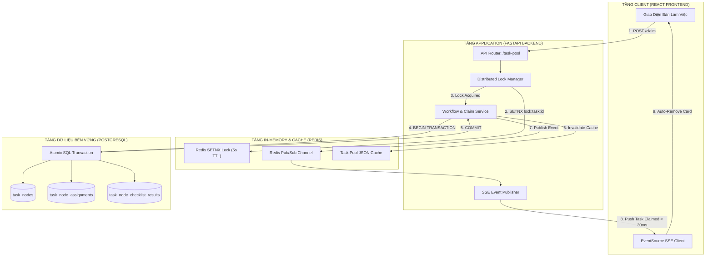

# 📚 TÀI LIỆU KIẾN TRÚC NGHIỆP VỤ & LÝ THUYẾT KỸ THUẬT PHÂN HỆ BỂ VIỆC (TASK POOL)
## DỰ ÁN: BÁCH KHOA ERP — ĐO ĐẠC ĐỊA CHÍNH, BIÊN TẬP CAD & PHÁP LÝ NHÀ ĐẤT

---

# PHẦN I: TỔNG QUAN NGỮ CẢNH & PHÂN ĐỊNH TRÁCH NHIỆM

### 1. Bối Cảnh Doanh Nghiệp (Business Context)
Bách Khoa ERP là hệ thống điều hành đặc thù cho doanh nghiệp hoạt động trong lĩnh vực Trắc địa bản đồ, Đo đạc địa chính và Dịch vụ Pháp lý nhà đất. Đặc thù của ngành này gồm:
- **Môi trường tác nghiệp hỗn hợp:** Nhân viên vừa làm việc thực địa ngoài trời (đo RTK, cắm mốc ranh, đi Một Cửa VPĐK) vừa làm việc nội nghiệp tại văn phòng (vẽ CAD, biên tập trích đo, soạn hồ sơ).
- **Tính liên hoàn khép kín:** Một hồ sơ kỹ thuật bắt buộc phải qua nhiều công đoạn nối tiếp nhau (Khảo sát hiện trường ➔ Vẽ CAD ➔ Thẩm tra nội bộ ➔ Nộp Một Cửa ➔ Bàn giao).
- **Mô hình trả lương 3P (Lương khoán theo đầu việc hoàn thành):** Nhân viên nhận tiền công khoán dựa trên từng hạng mục/bước công việc thực tế nghiệm thu đạt chuẩn.

### 2. Sự Chuyển Đổi Mô Hình: Từ Phân Công Thủ Công Sang Bể Việc Tự Nhận (Hybrid Task Pool Claim)
- **Mô hình cũ (Push Model - Gán cứng):** Người quản lý/Giám đốc phải ngồi chọn từng nhân viên gán vào từng hợp đồng. Nhược điểm: Tạo nút thắt cổ chai quản lý, không phản ánh đúng năng lực và tính sẵn sàng của thợ, thợ làm việc bị động.
- **Mô hình mới (Pull Model - Bể việc săn khoán):** 
  - Quản lý chỉ làm nhiệm vụ thiết lập quy trình chuẩn, kích hoạt checklist nghiệm thu đầu ra và phê duyệt khung khoán.
  - Các công việc đủ điều kiện (`READY`) sẽ tự động xuất hiện trên **Bể việc chung của phòng ban**.
  - Nhân viên chủ động lựa chọn và bấm **Nhận việc (Claim Task)** theo đúng chuyên môn, địa bàn phụ trách và hạn mức tải cho phép.

### 3. Phân Định Trách Nhiệm Chuẩn Doanh Nghiệp (Separation of Concerns)
1. **👑 Giám Đốc / Quản Lý:** Thiết lập cấu hình quy trình, duyệt các trường hợp ngoại lệ (bảo lãnh giao sổ khi khách còn nợ, duyệt thời gian bắt đầu hồi tố, duyệt nghiệm thu đầu ra).
2. **📐 Thợ Đo Đạc / Kỹ Thuật CAD:** Nhận trọn gói chuỗi công việc đo vẽ, thực hiện đo thực địa ngoài hiện trường, nộp đủ minh chứng checklist (ảnh GPS, file tọa độ, file CAD .dwg) để nhận lương khoán.
3. **🏛️ Chuyên Viên Pháp Lý:** Nhận hồ sơ đi nộp tại Chi nhánh VPĐKĐĐ (Một Cửa), cập nhật mã biên nhận, ngày hẹn trả và thực hiện bàn giao giấy tờ gốc/sổ đỏ cho khách hàng.
4. **💰 Phòng Kế Toán:** Chịu trách nhiệm độc lập và xuyên suốt về toàn bộ công nợ, tiền cọc, xuất hóa đơn và đối soát ngân hàng. **Tuyệt đối không để nhân viên kỹ thuật hoặc nhân viên bàn giao kiêm nhiệm việc thu nợ.**

---

# PHẦN II: ĐẶC TẢ CHI TIẾT CÁC QUY TẮC NGHIỆP VỤ (BUSINESS RULES)

### 📌 QUY TẮC 1: ĐƠN VỊ BỂ VIỆC LÀ CHUỖI K ĐO VẼ CỦA HẠNG MỤC
- Trên Bể việc, mỗi thẻ công việc đại diện cho **Chuỗi các bước kỹ thuật đo vẽ** của một Hạng mục Hợp đồng cụ thể (ví dụ: `[K02 Đo đạc hiện trường] ➔ [K03 Biên tập CAD]`).
- Thẻ thể hiện đầy đủ:
  - Tên Hạng mục dịch vụ chuẩn (ví dụ: *Đo vẽ hiện trạng vị trí thửa đất*, *Đo đạc cắm mốc ranh giới*).
  - Thông tin nhận diện thực địa (Mã HĐ, Tên khách hàng, Địa chỉ, Số Tờ, Số Thửa).
  - Danh sách các mã bước kỹ thuật trong CSDL (`node_code`).
  - Danh sách các mục Checklist đầu ra bắt buộc nghiệm thu của từng bước.
  - Mức lương khoán dự kiến của từng bước và Tổng khoán của cả chuỗi.

### 📌 QUY TẮC 2: TRÁCH NHIỆM TRỌN GÓI (BUNDLE OWNERSHIP)
- Khi nhân viên đo vẽ bấm nhận một Hạng mục Đo vẽ, hệ thống tự động gán nhân viên đó làm **Thợ chính cho toàn bộ chuỗi Node kỹ thuật** (`K02` và `K03`).
- **Mục đích:** Nghiêm cấm tình trạng "ăn ốc bỏ vỏ" — thợ chỉ đi đo ngoài hiện trường lấy tiền khoán K02 rồi bỏ mặc bản vẽ CAD K03 cho người khác gánh.
- Sau khi thợ đo hoàn thành K02 (nộp đủ 4 ảnh mốc GPS và file tọa độ), hệ thống tự động kích hoạt và chuyển tiếp Node K03 sang bàn làm việc của chính người thợ đó để tiếp tục vẽ CAD. Không ai khác được lấy và thợ không cần phải lên Bể việc săn lại.

### 📌 QUY TẮC 3: PHÂN BIỆT RẠCH RÒI: THỢ PHỤ (ASSISTANT) KHÁC VỚI CỨU VIỆN (HELP)

```
┌────────────────────────────────────────────────────────┬────────────────────────────────────────────────────────┐
│ 🤝 THỢ PHỤ (ASSISTANT - ĐI CÙNG THỢ CHÍNH)             │ 🆘 CỨU VIỆN / HỖ TRỢ (HELP - LÀM THAY 1 NODE)          │
├────────────────────────────────────────────────────────┼────────────────────────────────────────────────────────┤
│ • Bản chất: Đi phụ cùng Thợ chính A trong cùng 1 bước  │ • Bản chất: Làm thay hoàn toàn 1 Node khi Thợ chính bận│
│   (Ví dụ: Cầm gương, cọc mốc trong lúc đo K02).        │   đột xuất/ốm đau (Ví dụ: Thợ bận K4 gửi cứu viện K4). │
│ • Vòng đời thẻ: Thẻ thợ phụ chỉ nằm trên Bể việc KHI   │ • Vòng đời thẻ: Thẻ cứu viện chỉ xuất hiện khi Thợ     │
│   THỢ CHÍNH CHƯA BẤM START.                            │   chính chủ động bấm nút "Gửi xin hỗ trợ".             │
│ • Cơ chế tự hủy: Ngay khi Thợ chính bấm START xuất phát│ • Cơ chế kế thừa: Người cứu viện làm xong K4 ➔ Hệ thống│
│   ➔ Thẻ thợ phụ TỰ ĐỘNG BIẾN MẤT, người khác KHÔNG     │   TỰ ĐỘNG TRẢ K5 VỀ CHO THỢ CHÍNH LÀM TIẾP (trừ khi    │
│   được bấm vào nữa (Công ty không tốn 100k khoán phụ). │   thợ chính cũng gửi nốt K5 lên xin hỗ trợ).           │
└────────────────────────────────────────────────────────┴────────────────────────────────────────────────────────┘
```

### 📌 QUY TẮC 4: QUY TRÌNH XIN HỖ TRỢ TỪNG NODE TRONG CHUỖI (K1 ➔ K5)
- **Hành trình Chuỗi Node:** Nhân viên A nhận Hạng mục gồm chuỗi các bước `K1 ➔ K2 ➔ K3 ➔ K4 ➔ K5`.
- Nhân viên A làm xong `K1, K2, K3`. Đến `K4` nhân viên A bận việc đột xuất ➔ Bấm **`[ 🆘 Gửi K4 lên Bể việc xin hỗ trợ ]`**.
- **Xử lý 2 nhánh:**
  1. **Nhánh 1: Không có ai nhận cứu viện K4:** Nhân viên A **buộc phải tự mình hoàn thành K4** thì mới được chuyển sang làm tiếp `K5`.
  2. **Nhánh 2: Có đồng đội B nhận và làm xong K4:** 
     - Đồng đội B nhận trọn tiền khoán của bước K4.
     - Ngay khi K4 hoàn thành và được nghiệm thu ➔ **Hệ thống tự động chuyển tiếp bước K5 về lại cho Nhân viên A làm tiếp** (vì Nhân viên A là chủ sở hữu ban đầu của chuỗi Hạng mục này).
     - Nhân viên A tiếp tục làm K5 để hoàn thành hợp đồng (trừ khi Nhân viên A lại chủ động bấm gửi nốt K5 lên Bể việc xin hỗ trợ).

### 📌 QUY TẮC 5: KHÓA CỨNG HẠN MỨC TẢI DỞ DANG (HARD WIP LIMIT = 3)
- Mỗi nhân viên kỹ thuật chỉ được phép giữ tối đa **03 Hạng mục Đo vẽ dở dang** cùng lúc.
- **Cơ chế chặn:** Nếu nhân viên đang tồn đọng 3 hạng mục đã đi đo nhưng chưa nộp nghiệm thu bản vẽ CAD K03 ➔ Hệ thống lập tức khóa cứng quyền nhận việc trên Bể việc. Nhân viên bắt buộc phải nộp nghiệm thu ít nhất 1 bản vẽ CAD để mở khóa.

### 📌 QUY TẮC 6: BÀN GIAO KẾT QUẢ K08 TÁCH BIỆT KHỎI THU HỒI CÔNG NỢ
- Tại bước bàn giao (K08), chuyên viên pháp lý chỉ làm nhiệm vụ: Kiểm đếm đầy đủ giấy chứng nhận gốc + 04 bản vẽ kỹ thuật ➔ Trao cho khách hàng ➔ Chụp ảnh Biên bản bàn giao có chữ ký của khách để nộp nghiệm thu.
- **Cổng kiểm soát tài chính:** Nút bấm bàn giao K08 chỉ được hệ thống mở khóa khi **Phòng Kế toán đã xác nhận hoàn tất 100% nghĩa vụ tài chính** trên hệ thống (hoặc có Đơn xin bảo lãnh nợ được Giám đốc ký duyệt).

---

# PHẦN III: LÝ THUYẾT KỸ THUẬT & KIẾN TRÚC HỆ THỐNG CHUYÊN SÂU



---

## 1. Lý Thuyết Tranh Chấp Đồng Thời (Concurrency Control & Race Conditions)

### 1.1. Bài toán Thực tế
Vào đầu ca làm việc (07:30 sáng), 10 nhân viên đo vẽ cùng mở Bể việc. Một Hạng mục đo đạc béo bở (HĐ 014, khoán 450k tại Quận 7) xuất hiện. Cả 10 người cùng bấm nút `[ Nhận việc ]` tại cùng một thời điểm $t_0$ (chênh lệch nhau dưới 1 mili-giây).

### 1.2. Giải pháp CSDL Nguyên tử (Atomic Compare-And-Swap / Optimistic Locking)
- Không bao giờ sử dụng mô hình tuần tự lỏng lẻo: `SELECT -> Check if None -> UPDATE` (vì tại thời điểm đọc, cả 10 request đều thấy công việc đang rảnh).
- Sử dụng **Atomic SQL Statement** với điều kiện tiền định tại tầng CSDL:
  ```sql
  -- Kiểm tra và chèn đồng thời trong 1 thao tác nguyên tử duy nhất
  INSERT INTO task_node_assignments (
      id, task_node_id, employee_id, role_code, is_primary, assignment_status, started_at
  )
  SELECT 
      gen_random_uuid(), 'node_k02_014', 'emp_nguyen_van_a', 'MAIN', TRUE, 'in_progress', NOW()
  WHERE NOT EXISTS (
      -- Khóa điều kiện: Đảm bảo chưa có ai giữ role MAIN đang chạy
      SELECT 1 FROM task_node_assignments 
      WHERE task_node_id = 'node_k02_014' 
        AND role_code = 'MAIN' 
        AND assignment_status = 'in_progress'
        AND ended_at IS NULL
  )
  RETURNING id;
  ```
- **Nguyên lý hoạt động:** Bộ quản lý khóa dòng (Row-Level Locking Engine) của PostgreSQL sẽ tuần tự hóa (serialize) 10 giao dịch này theo mức micro-giây. Request đến trước $0.0001$ mili-giây sẽ thực thi thành công (`RETURNING id`), 9 request đến sau sẽ nhận kết quả rỗng (`0 rows affected`), từ đó Backend ném mã `HTTP 409 Conflict`.

### 1.3. Khóa Phân Tán Bằng Redis (Redis Distributed Lock / SETNX Algorithm)
- Để ngăn chặn 100 request đồng loạt truy vấn gây nghẽn PostgreSQL, hệ thống đặt một lớp phòng thủ **Redis In-Memory Distributed Lock** phía trước:
  $$\text{Redis Key: } \texttt{lock:claim:}\{\text{task\_node\_id}\}:\{\text{role\_code}\}$$
- Sử dụng lệnh nguyên tử `SET key value NX EX 5`:
  - `NX` (Not eXists): Chỉ gán giá trị nếu key chưa tồn tại.
  - `EX 5` (Expire 5 seconds): Tự động giải phóng khóa sau 5 giây để chống hiện tượng Deadlock nếu Server bị sập nguồn giữa chừng.
- Vì Redis xử lý đơn luồng (Single-Threaded Event Loop), chỉ duy nhất 1 request chiếm được khóa trong $0.2$ mili-giây. 99 request còn lại bị từ chối ngay lập tức tại tầng RAM mà không cần chạm vào CSDL.

---

## 2. Lý Thuyết Máy Trạng Thái Hữu Hạn (Finite State Machine - FSM)

Toàn bộ vòng đời của một Task Node trong Bách Khoa ERP tuân theo mô hình FSM toán học chặt chẽ:
$$M = (S, \Sigma, \delta, s_0, F)$$
Trong đó:
- $S$: Tập hợp các trạng thái hợp lệ = $\{\texttt{PENDING}, \texttt{READY}, \texttt{IN\_PROGRESS}, \texttt{SUBMITTED}, \texttt{ACCEPTED}, \texttt{REWORK}\}$.
- $\Sigma$: Tập hợp các sự kiện kích hoạt = $\{\texttt{PREV\_NODE\_ACCEPTED}, \texttt{CLAIM\_TASK}, \texttt{SUBMIT\_CHECKLIST}, \texttt{REVIEW\_ACCEPT}, \texttt{REVIEW\_REJECT}, \texttt{YIELD\_HELP}\}$.
- $\delta$: Hàm chuyển trạng thái có điều kiện kiểm tra (Guards).

```
                      [ PENDING ]
                           │ (Sự kiện: Bước trước hoàn thành / Giám đốc kích hoạt)
                           ▼
                       [ READY ] ◄─────────────────────────┐
                           │                               │
                ┌──────────┴──────────┐                    │
  (Claim Trọn gói) │                   │ (Bắn Cứu viện)     │ (Review Từ chối /
                ▼                   ▼                      │  VPĐK Trả hồ sơ)
        [ IN_PROGRESS ]     [ YIELD_HELP ]                 │
                │                   │                      │
                │ (Bấm Nộp)         │ (Đồng đội nhận)      │
                ▼                   ▼                      │
        [ SUBMITTED ] ──────> [ IN_PROGRESS ]              │
                │                                          │
                ├──────────────────────────────────────────┘
                │ (Review Thành công & Kế toán duyệt)
                ▼
          [ ACCEPTED ] ➔ [ Kế thừa sang Node tiếp theo ]
```

- **Bất biến trạng thái (State Invariants):**
  - Một Node chỉ có thể chuyển từ `PENDING` sang `READY` khi tất cả các Node phụ thuộc trước nó đã ở trạng thái `ACCEPTED` (hoặc diện Fast-Track nhảy cóc).
  - Một Node chỉ chuyển sang `ACCEPTED` khi **100% mục trong `task_node_checklist_results` được đánh dấu đạt chuẩn**.

---

## 3. Lý Thuyết Đồng Bộ Thời Gian Thực (Real-Time Pub/Sub & Server-Sent Events)

### 3.1. Phân Tích Lý Do Lựa Chọn SSE Thay Vì WebSocket
1. **Mô hình Giao tiếp Đơn Hướng (Unidirectional Push):** Bể việc là bài toán Server phát sóng trạng thái thay đổi xuống các Client. Các thao tác ghi của người dùng (Nhận việc, Nộp nghiệm thu) vốn dĩ là các lệnh HTTP RESTful có cấu trúc (`POST`, `PATCH`), hoàn toàn không cần đường truyền 2 chiều liên tục của WebSocket.
2. **Khả Năng Phục Hồi Kết Nối Ngoại Cảnh (Resilience over Cellular Networks):**
   - Trình duyệt tích hợp sẵn đối tượng `EventSource` chuẩn W3C.
   - Khi thợ đo di chuyển ngoài thực địa gặp vùng sóng yếu/mất sóng 4G, trình duyệt sẽ **tự động kết nối lại (Auto-Reconnect)** ngay khi có mạng trở lại.
   - Sử dụng Header `Last-Event-ID`, Client tự động yêu cầu Server bù đắp các sự kiện đã bị bỏ lỡ trong thời gian mất kết nối.
3. **Tiết Kiệm Tài Nguyên & Tương Thích Hạ Tầng (Infrastructure Efficiency):**
   - SSE chạy hoàn toàn trên giao thức HTTP/1.1 và HTTP/2 tiêu chuẩn.
   - Không đòi hỏi nâng cấp giao thức phức tạp (Protocol Upgrade), không bị các hệ thống tường lửa (Firewall), proxy của cơ quan nhà nước hay Nginx chặn kết nối.

### 3.2. Kiến Trúc Phát Sóng Sự Kiện (Event Broadcast Pipeline)
1. Khi có thay đổi (ví dụ: Thợ A nhận việc thành công), Backend gọi:
   $$\text{Redis Channel: } \texttt{bachkhoa:events:timeline}$$
2. Redis Pub/Sub lập tức đẩy thông điệp JSON tới tất cả các tiến trình Worker đang duy trì kết nối SSE với Client.
3. Client nhận sự kiện `TASK_CLAIMED` trong vòng **dưới 30 mili-giây** và tự động gỡ bỏ thẻ việc khỏi giao diện mà không cần người dùng phải bấm F5 (Tải lại trang).

---

## 4. Lý Thuyết Quản Lý Hàng Đợi & Giới Hạn Tải (Little's Law & WIP Queuing Theory)

Theo **Định luật Little (Little's Law)** trong lý thuyết hàng đợi:
$$L = \lambda \times W$$
Trong đó:
- $L$: Số lượng công việc dở dang trong hệ thống (Work In Progress - WIP).
- $\lambda$: Tốc độ hoàn thành công việc trung bình (Throughput).
- $W$: Thời gian trung bình một hồ sơ nằm trong quy trình (Lead Time).

- **Ứng dụng thực tiễn:**
  - Nếu không giới hạn $L$, thợ đo sẽ có xu hướng "ôm việc" nhận 10 hồ sơ đo đạc một lúc. Khi $L$ tăng cao trong khi năng lực vẽ $\lambda$ không đổi, thời gian nằm chờ $W$ của hồ sơ khách hàng sẽ bị kéo dài gấp 5 lần (gây trễ hẹn hợp đồng).
  - Bằng cách áp đặt **Hard WIP Limit = 3**, hệ thống ép buộc thời gian lưu chuyển $W$ đạt mức tối ưu nhất: Thợ đo xong 1-2 căn buộc phải về văn phòng vẽ CAD hoàn tất thì mới được nhận tiếp, triệt tiêu hoàn toàn hiện tượng ngâm hồ sơ của khách.

---

## 5. Lý Thuyết Lương Khoán Theo Quyền Thụ Hưởng (Entitlement-Based Compensation)

Trong Bách Khoa ERP, hệ thống tài chính phân biệt rạch ròi giữa 2 khái niệm:
1. **Khoán Dự Kiến (Speculative Compensation):**
   - Là con số định mức được cấu hình trong `work_item_rates` theo vai trò (`MAIN` / `ASSISTANT`).
   - Con số này **chỉ mang tính chất hiển thị trên thẻ Bể việc** để thợ nắm được giá trị công việc trước khi nhận.
2. **Quyền Thụ Hưởng Khoán Thực Tế (Realized Pay Entitlement):**
   - Bấm "Nhận việc" **TUYỆT ĐỐI KHÔNG SINH TIỀN LƯƠNG TRONG CSDL**.
   - Bản ghi `work_pay_entitlements` chỉ được khởi tạo khi và chỉ khi:
     $$\text{Checklist Evidence Submitted} \land \text{Reviewer Approved} \implies \text{Insert } \texttt{work\_pay\_entitlements}$$
   - Điều này đảm bảo tính toàn vẹn tài chính 100%: Nếu thợ nhận việc nhưng gặp sự cố bất khả kháng phải nhường lại việc (Yield Node) ➔ Người cứu viện hoàn thành công việc sẽ là người duy nhất được hệ thống cấp quyền thụ hưởng tiền khoán đó.

---

### 📋 BẢNG TỔNG KẾT BỘ KHUNG KIẾN TRÚC HOÀN CHỈNH:

| Thành Phần Hệ Thống | Công Nghệ Áp Dụng | Cơ Chế Bảo Vệ & Tối Ưu Hóa |
| :--- | :--- | :--- |
| **Bể Việc (Task Pool)** | Redis JSON Cache + PostgreSQL | Tải dữ liệu siêu tốc (< 5ms), tự động phân nhóm theo phòng ban kỹ thuật. |
| **Nhận Việc (Claiming)** | Atomic SQL + Redis SETNX Lock | Chống tranh chấp 100%, bảo đảm nguyên tắc "đến trước được trước" ở mức micro-giây. |
| **Điều Hành Chuỗi K** | Bundle Ownership Engine | Ràng buộc trọn gói K02 ➔ K03, tự động chuyển giao dữ liệu kế thừa (`inherited_files`). |
| **Cứu Viện (Yielding)** | State Machine Transition + Audit Log | Nhường việc khi bất khả kháng, chuyển quyền thụ hưởng khoán và giải phóng tải thông minh. |
| **Đồng Bộ Dữ Liệu** | Server-Sent Events (SSE) | Cập nhật tức thời (< 30ms), tiết kiệm băng thông, tự động kết nối lại trên sóng 4G. |
| **Kiểm Soát Tải** | Little's Law WIP Limit Guard | Giới hạn tối đa 3 hạng mục dở dang, triệt tiêu nút thắt cổ chai và chống ngâm hồ sơ. |
