# 📑 TÀI LIỆU PHÂN TÍCH NGHIỆP VỤ (BUSINESS REQUIREMENT DOCUMENT - BRD)
## DỰ ÁN: BACH KHOA ERP — PHÂN HỆ QUẢN LÝ TIẾN ĐỘ HỢP ĐỒNG & THEO DÕI THỜI GIAN THỰC (GIAI ĐOẠN 1 TINH GỌN)

**Người lập:** Senior Business Analyst (BA)  
**Khách hàng:** Công ty TNHH Đo đạc Xây dựng & Bất động sản Bách Khoa  
**Phiên bản:** v1.0 — Phân hệ Tinh Gọn (Lean Operations Phase)  
**Ngày lập:** 21/08/2026  

---

# 📌 MỤC LỤC
1. [BỐI CẢNH DOANH NGHIỆP & BÀI TOÁN CẦN GIẢI QUYẾT](#1-bối-cảnh-doanh-nghiệp--bài-toán-cần-giải-quyết)
2. [MỤC TIÊU DỰ ÁN (PROJECT OBJECTIVES)](#2-mục-tiêu-dự-án-project-objectives)
3. [PHÂN TÍCH CÁC BÊN LIÊN QUAN (STAKEHOLDER & PERSONA ANALYSIS)](#3-phân-tích-các-bên-liên-quan-stakeholder--persona-analysis)
4. [QUY TRÌNH NGHIỆP VỤ 7 NODE CHUẨN (BUSINESS WORKFLOW)](#4-quy-trình-nghiệp-vụ-7-node-chuẩn-business-workflow)
5. [QUY TẮC NGHIỆP VỤ CHI TIẾT (DETAILED BUSINESS RULES)](#5-quy-tắc-nghiệp-vụ-chi-tiết-detailed-business-rules)
6. [MÔ HÌNH DỮ LIỆU & CÔNG THỨC ĐO LƯỜNG (DATA MODEL & METRICS)](#6-mô-hình-dữ-liệu--công-thức-đo-lường-data-model--metrics)
7. [XỬ LÝ KỊCH BẢN NGOẠI LỆ (EDGE CASES & EXCEPTION HANDLING)](#7-xử-lý-kịch-bản-ngoại-lệ-edge-cases--exception-handling)
8. [MÔ PHỎNG TRẢI NGHIỆM GIAO DIỆN (UI/UX WIREFRAMES)](#8-mô-phỏng-trải-nghiệm-giao-diện-uiux-wireframes)

---

# 1. BỐI CẢNH DOANH NGHIỆP & BÀI TOÁN CẦN GIẢI QUYẾT

### 1.1. Đặc thù ngành Trắc địa & Dịch vụ Pháp lý Nhà đất:
- **Tính biến động cao:** Công việc thực địa không thể lên lịch cố định từng khung giờ 8h–10h (do thời tiết, chủ đất trễ hẹn, phụ thuộc lịch hẹn của cơ quan Một Cửa VPĐK/UBND).
- **Tính liên phòng ban (Cross-functional):** Một hồ sơ đi qua nhiều bộ phận: Tiếp nhận (`Kế toán/CSKH`) ➔ Khảo sát hiện trường (`Kỹ thuật Đo vẽ`) ➔ Vẽ Autocad (`Kỹ thuật Nội nghiệp`) ➔ Soạn hồ sơ (`Pháp lý`) ➔ Nộp Một Cửa (`Pháp lý`) ➔ Thu tiền & Bàn giao (`Kế toán + Pháp lý`).

### 1.2. Nỗi đau thực tế (Pain Points):
1. **Lên lịch chi li gây tê liệt (Over-scheduling):** Việc ép quản lý phải kéo thả xếp slot giờ từng nhân viên khiến phần mềm trở thành gánh nặng thủ tục.
2. **Thiếu dữ liệu thời gian thực:** Sếp không nắm được nhân viên bắt đầu làm ngày nào, kết thúc ngày nào, một hạng mục đo vẽ hay cấp đổi sổ trung bình mất bao nhiêu ngày.
3. **Nút thắt cổ chai vô hình:** Khi khách hàng phàn nàn chậm tiến độ, Sếp không biết lỗi do khâu Đo đạc chậm, khâu Pháp lý ngâm hồ sơ, hay do cơ quan Nhà nước giải quyết lâu.

---

# 2. MỤC TIÊU DỰ ÁN (PROJECT OBJECTIVES)

| STT | Mục Tiêu Nghiệp Vụ | Tiêu Chí Đo Lường Thành Công (Success Metric) |
|:---:|---|---|
| **OBJ-1** | **Zero Setup Overhead (Không áp lực xếp lịch)** | Quản lý chỉ cần gán tên nhân sự vào bước quy trình, không cần nhập lịch giờ phức tạp. Thao tác < 10 giây/hợp đồng. |
| **OBJ-2** | **Event-Driven Timestamping (Ghi nhận tự động)** | Tự động chốt `Ngày & Giờ Bắt đầu` khi nhân viên bấm START và `Ngày & Giờ Kết thúc` khi nhân viên bấm HOÀN THÀNH. |
| **OBJ-3** | **Turnaround Time & Velocity (Đo lường tiến độ)** | Tự động tính toán số ngày thực tế của từng bước, % tiến độ hợp đồng và thời gian trung bình của từng Hạng mục dịch vụ. |
| **OBJ-4** | **Seamless UI Integration (Phối hợp tự nhiên)** | Tích hợp trực tiếp vào màn hình Timeline của Sếp và Portal của nhân viên, không làm gián đoạn thói quen sử dụng. |

---

# 3. PHÂN TÍCH CÁC BÊN LIÊN QUAN (STAKEHOLDER & PERSONA ANALYSIS)

```
┌─────────────────────────┬──────────────────────────────────────────┬────────────────────────────────────────────────────────┐
│ VAI TRÒ (STAKEHOLDER)   │ NHU CẦU CỐT LÕI (CORE NEEDS)             │ HÀNH ĐỘNG TRÊN HỆ THỐNG                                │
├─────────────────────────┼──────────────────────────────────────────┼────────────────────────────────────────────────────────┤
│ 👑 Giám Đốc / Quản Lý    │ • Xem tổng quan tiến độ HĐ (% và số ngày)│ • Gán nhân sự vào Node quy trình (Setup 1 chạm).       │
│                         │ • Biết trung bình 1 Hạng mục mất mấy ngày│ • Duyệt nghiệm thu bước làm của nhân viên.             │
│                         │ • Phát hiện khâu nào đang bị nghẽn       │ • Duyệt cho nợ / bảo lãnh tại cổng K08.                │
├─────────────────────────┼──────────────────────────────────────────┼────────────────────────────────────────────────────────┤
│ 📐 Nhân Viên Đo Vẽ      │ • Biết rõ hôm nay cần đi đo hồ sơ nào    │ • Bấm [▶️ Bắt đầu] khi ra thực địa / mở Cad vẽ.        │
│    (Field & CAD Tech)   │ • Nộp minh chứng nhanh (ảnh mốc, tọa độ) │ • Bấm [⏹️ Hoàn thành] kèm file bản vẽ/ảnh tọa độ.       │
│                         │ • Lương khoán tự động tích lũy khi xong  │                                                        │
├─────────────────────────┼──────────────────────────────────────────┼────────────────────────────────────────────────────────┤
│ ⚖️ Chuyên Viên Pháp Lý  │ • Theo dõi danh sách hồ sơ cần nộp       │ • Bấm [▶️ Bắt đầu] khi soạn hồ sơ / đi Một Cửa.        │
│    (Legal Officer)      │ • Lưu trữ biên nhận, hẹn trả Một Cửa     │ • Bấm [⏹️ Hoàn thành] kèm ảnh Biên nhận Một Cửa.       │
│                         │ • Bàn giao sổ đỏ an toàn cho khách       │ • Bấm [⏹️ Hoàn thành K08] khi khách nhận sổ.           │
├─────────────────────────┼──────────────────────────────────────────┼────────────────────────────────────────────────────────┤
│ 💰 Kế Toán (Accountant) │ • Thu đủ tiền trước khi xuất sổ đỏ       │ • Duyệt xác nhận cọc K01.                              │
│                         │ • Kiểm soát công nợ chặt chẽ             │ • Xác nhận đã thu đủ tiền tại cổng K08.                │
└─────────────────────────┴──────────────────────────────────────────┴────────────────────────────────────────────────────────┘
```

---

# 4. QUY TRÌNH NGHIỆP VỤ 7 NODE CHUẨN (BUSINESS WORKFLOW)

```mermaid
graph LR
    K01[K01: Tiếp Nhận & Kiểm Tra Đầu Vào] -->|Kế toán duyệt cọc| K02[K02: Khảo Sát & Đo Hiện Trường]
    K02 -->|Nộp ảnh mốc + tọa độ| K03[K03: Chuẩn Hoá Tài Liệu Kỹ Thuật]
    K03 -->|Bàn giao bản vẽ kỹ thuật| K05[K05: Soạn Bộ Hồ Sơ Pháp Lý]
    K05 -->|Đóng tập hồ sơ| K06[K06: Nộp & Theo Dõi Một Cửa]
    K06 -->|Có sổ đỏ gốc| K08[K08: Nhận Kết Quả & Bàn Giao]
    K08 -->|Thu đủ tiền / Duyệt nợ| K09[K09: Lưu Trữ & Đóng Hồ Sơ]
    
    style K01 fill:#e0f2fe,stroke:#0369a1
    style K02 fill:#fef3c7,stroke:#b45309
    style K03 fill:#fef3c7,stroke:#b45309
    style K05 fill:#f3e8ff,stroke:#7e22ce
    style K06 fill:#f3e8ff,stroke:#7e22ce
    style K08 fill:#fee2e2,stroke:#b91c1c
    style K09 fill:#dcfce7,stroke:#15803d
```



---

# 5. QUY TẮC NGHIỆP VỤ CHI TIẾT (DETAILED BUSINESS RULES)

### 📌 BR-01: Quy tắc Thiết lập Quy trình 1 Chạm (Director Setup Rule)
- Khi tạo Hợp đồng, Giám đốc chọn Gói dịch vụ ➔ Hệ thống tự sinh 7 Node chuẩn kèm định mức khoán mặc định.
- Giám đốc chọn nhanh nhân sự từ Dropdown và có quyền Bật/Tắt các Node không dùng ➔ Bấm **`[ 🚀 KÍCH HOẠT QUY TRÌNH ]`** ➔ Node K01 tự động chuyển `READY`.

### 📌 BR-02: Quy tắc Kích hoạt Node (Node Readiness Rule)
- Một Node chỉ chuyển sang trạng thái `READY` (Sẵn sàng làm) khi **toàn bộ Node tiền nhiệm đã được duyệt nghiệm thu (`status = 'accepted'`)**.

### 📌 BR-03: Quy tắc Bắt đầu Công việc (Start Task Rule)
- Khi nhân viên được phân công bấm **`[ ▶️ BẮT ĐẦU LÀM ]`**:
  1. Chuyển `status = 'in_progress'`.
  2. Ghi nhận thời gian bắt đầu chính xác: `started_at = CURRENT_TIMESTAMP`.

### 📌 BR-04: Quy tắc Nộp Nghiệm thu (Submit Task Rule)
- Khi nhân viên hoàn thành công việc bấm **`[ ⏹️ HOÀN THÀNH & NỘP ]`**:
  1. Kiểm tra điều kiện tiên quyết: Đính kèm ảnh mốc (K02), file CAD (K03), Biên nhận (K06).
  2. Chuyển `status = 'submitted'`.
  3. Ghi nhận thời gian kết thúc: `submitted_at = CURRENT_TIMESTAMP`.

### 📌 BR-05: Quy tắc Nghiệm thu & Kích hoạt Dây chuyền (Acceptance & Cascade Rule)
- Khi Quản lý bấm **`[ ✅ DUYỆT NGHIỆM THU ]`**:
  1. Chuyển `status = 'accepted'`, ghi nhận `accepted_at = CURRENT_TIMESTAMP`.
  2. Tự động chuyển tiền lương khoán vào Ví nhân viên (`MyPayroll`).
  3. Tự động tìm các Node phụ thuộc kế tiếp và đổi sang `READY`.

---

# 6. MÔ HÌNH DỮ LIỆU & CÔNG THỨC ĐO LƯỜNG (DATA MODEL & METRICS)

### 6.1. Cấu trúc bảng CSDL trọng tâm (`task_nodes` & `contracts`):

```sql
-- Dữ liệu lưu vết thời gian của từng bước công việc
ALTER TABLE task_nodes ADD COLUMN IF NOT EXISTS started_at TIMESTAMPTZ;
ALTER TABLE task_nodes ADD COLUMN IF NOT EXISTS submitted_at TIMESTAMPTZ;
ALTER TABLE task_nodes ADD COLUMN IF NOT EXISTS accepted_at TIMESTAMPTZ;
ALTER TABLE task_nodes ADD COLUMN IF NOT EXISTS actual_duration_seconds BIGINT;
```

---

### 6.2. Các công thức đo lường cốt lõi:

#### 1. Thời gian thực làm từng Node (Actual Working Duration):
$$\text{Duration}_{\text{Node}} = \text{Epoch}(\text{submitted\_at}) - \text{Epoch}(\text{started\_at})$$

#### 2. Tiến độ tổng thể của Hợp đồng (% Contract Progress):
$$\% \text{ Tiến Độ HĐ} = \frac{\text{Số Node đã ACCEPTED}}{\text{Tổng số Node trong Quy trình HĐ}} \times 100\%$$

#### 3. Tổng số ngày hoàn thành 1 Hợp đồng (Contract Lead Time):
$$T_{\text{Contract}} = \text{Date}(\text{accepted\_at}_{\text{K08}}) - \text{Date}(\text{started\_at}_{\text{K01}})$$

#### 4. Thời gian hoàn thành trung bình của 1 Hạng mục dịch vụ (Average Turnaround Time):
$$\overline{T}_{\text{ServiceLine}} = \frac{\sum_{i=1}^N T_{\text{Contract}_i}}{N}$$

---

# 7. XỬ LÝ KỊCH BẢN NGOẠI LỆ (EDGE CASES & EXCEPTION HANDLING)

| Kịch Bản Ngoại Lệ (Edge Case) | Hướng Xử Lý Chuẩn Nghiệp Vụ (BA Solution) |
|---|---|
| **1. Nhân viên quên bấm Bắt đầu khi ra thực địa** | Cho phép nhân viên bấm **"Bắt đầu hồi tố"** (ghi nhận thời gian thực tế đã xuất phát kèm lý do). Hệ thống đánh dấu cờ `Manual_Adjustment` để Quản lý kiểm tra khi duyệt. |
| **2. Công việc kéo dài qua nhiều ngày (Multi-day Task)** | Hệ thống lưu `started_at = 21/08/2026 08:30` và `submitted_at = 23/08/2026 15:45`. Timeline hiển thị: `Thời gian thực tế: 2.3 ngày`. |
| **3. Hồ sơ bị Cơ quan Một Cửa trả về yêu cầu sửa đổi (Rework)** | Quản lý chuyển trạng thái Node sang `REWORK_REQUIRED` kèm ghi chú lý do. Nhân viên bấm `[▶️ Bắt đầu sửa đổi]` ➔ Hệ thống cộng dồn thời gian khắc phục vào tổng thời lượng. |
| **4. Thay đổi nhân sự giữa chừng (Re-assignment)** | Quản lý bấm `[👤 Đổi người làm]` trên Timeline. Người mới tiếp quản công việc từ trạng thái hiện tại, lịch sử thực hiện của người cũ được lưu vết đầy đủ trong Audit Log. |

---

# 8. MÔ PHỎNG TRẢI NGHIỆM GIAO DIỆN (UI/UX WIREFRAMES)

---

### ⚙️ 8.1. MÀN HÌNH GIÁM ĐỐC: THIẾT LẬP QUY TRÌNH & PHÂN CÔNG 1 CHẠM (`Workflow Setup Modal`)

```
┌────────────────────────────────────────────────────────────────────────────────────────────────────────────────────────┐
│ ⚙️ THIẾT LẬP QUY TRÌNH 7 BƯỚC & PHÂN CÔNG NHÂN SỰ — HĐ 004/BK-2026 (HOÀNG NAM)          [ ❌ Đóng ]  [ 💾 Lưu Nháp ]   │
├────────────────────────────────────────────────────────────────────────────────────────────────────────────────────────┤
│ 📋 GÓI DỊCH VỤ: [ 📑 Hợp Thức Hóa Nhà Đất Trọn Gói (Đo Vẽ + Pháp Lý) ▾ ]             SLA DỰ KIẾN: [ 25 ngày ]          │
├────────────────────────────────────────────────────────────────────────────────────────────────────────────────────────┤
│ STT │ MÃ NODE & TÊN BƯỚC QUY TRÌNH              │ PHÒNG BAN  │ NHÂN SỰ PHỤ TRÁCH (GÁN 1 CHẠM) │ ĐỊNH MỨC KHOÁN │ SỬ DỤNG│
├─────┼───────────────────────────────────────────┼────────────┼────────────────────────────────┼────────────────┼────────┤
│ 1️⃣  │ [K01] Tiếp nhận & kiểm tra đầu vào        │ Kế toán    │ [ 👤 Kế toán Hương ▾ ]         │     50.000 đ   │  [x]   │
├─────┼───────────────────────────────────────────┼────────────┼────────────────────────────────┼────────────────┼────────┤
│ 2️⃣  │ [K02] Khảo sát & đo hiện trường           │ Đo Vẽ      │ [ 👤 Nguyễn Văn A (Đo vẽ) ▾ ]  │    350.000 đ   │  [x]   │
├─────┼───────────────────────────────────────────┼────────────┼────────────────────────────────┼────────────────┼────────┤
│ 3️⃣  │ [K03] Chuẩn hoá tài liệu kỹ thuật         │ Đo Vẽ      │ [ 👤 Nguyễn Văn A (Đo vẽ) ▾ ]  │    200.000 đ   │  [x]   │
├─────┼───────────────────────────────────────────┼────────────┼────────────────────────────────┼────────────────┼────────┤
│ 4️⃣  │ [K05] Soạn bộ hồ sơ pháp lý               │ Pháp Lý    │ [ 👤 Phạm Thị D (Pháp lý) ▾ ]  │    150.000 đ   │  [x]   │
├─────┼───────────────────────────────────────────┼────────────┼────────────────────────────────┼────────────────┼────────┤
│ 5️⃣  │ [K06] Nộp & theo dõi hồ sơ Một Cửa        │ Pháp Lý    │ [ 👤 Phạm Thị D (Pháp lý) ▾ ]  │    300.000 đ   │  [x]   │
├─────┼───────────────────────────────────────────┼────────────┼────────────────────────────────┼────────────────┼────────┤
│ 6️⃣  │ [K08] Nhận kết quả & bàn giao (Cổng nợ)   │ Pháp lý+KT │ [ 👤 Phạm Thị D (Pháp lý) ▾ ]  │    100.000 đ   │  [x]   │
├─────┼───────────────────────────────────────────┼────────────┼────────────────────────────────┼────────────────┼────────┤
│ 7️⃣  │ [K09] Lưu trữ & đóng hồ sơ                │ CSKH       │ [ 👤 CSKH Thùy Trang ▾ ]       │     50.000 đ   │  [x]   │
├────────────────────────────────────────────────────────────────────────────────────────────────────────────────────────┤
│ 💡 Tổng định mức khoán nhân viên: 1.200.000 đ · Cơ chế: Tự động ghi nhận Ngày & Giờ khi nhân viên bấm Bắt đầu / Xong   │
│                                                                                                                        │
│                             [ ❌ Hủy bỏ ]            👉 [ 🚀 KÍCH HOẠT QUY TRÌNH HỢP ĐỒNG ]                             │
└────────────────────────────────────────────────────────────────────────────────────────────────────────────────────────┘
```

---

### 👑 8.2. MÀN HÌNH QUẢN LÝ: THEO DÕI TIẾN ĐỘ & NGHIỆM THU (`ContractTimeline.jsx`)

```
┌────────────────────────────────────────────────────────────────────────────────────────────────────────────────────────┐
│ 📁 HỢP ĐỒNG: 004/BK-2026 · HỢP THỨC HÓA NHÀ ĐẤT QUẬN 7 (HOÀNG NAM)                     [ ⚙️ Setup Quy Trình ]  [ 🔄 Làm mới ]│
├────────────────────────────────────────────────────────────────────────────────────────────────────────────────────────┤
│ ⏱ TIẾN ĐỘ HĐ: [ ████████████░░░░░░░░░░░░░░ 43% - 3/7 BƯỚC ] · TỔNG THỜI GIAN ĐÃ CHẠY: 08 NGÀY                          │
├────────────────────────────────────────────────────────────────────────────────────────────────────────────────────────┤
│ 1️⃣ [K01] TIẾP NHẬN & KIỂM TRA ĐẦU VÀO          │ 🟢 ĐÃ XONG  │ 👤 Kế toán Hương                                         │
│                                                │             │ 📅 Bắt đầu: 14/08 (08:15) ➔ Xong: 14/08 (09:00) (45 phút)│
├────────────────────────────────────────────────┼─────────────┼──────────────────────────────────────────────────────────┤
│ 2️⃣ [K02] KHẢO SÁT & ĐO HIỆN TRƯỜNG            │ 🟢 ĐÃ XONG  │ 👤 Nguyễn Văn A                                          │
│                                                │             │ 📅 Bắt đầu: 15/08 (08:30) ➔ Xong: 15/08 (11:00) (2.5 giờ)│
│                                                │             │ 📷 [ 4 ảnh mốc GPS ]  📁 [ toado.csv ]  [ 👁️ Xem ]       │
├────────────────────────────────────────────────┼─────────────┼──────────────────────────────────────────────────────────┤
│ 3️⃣ [K03] CHUẨN HOÁ TÀI LIỆU KỸ THUẬT          │ 🟢 ĐÃ XONG  │ 👤 Nguyễn Văn A                                          │
│                                                │             │ 📅 Bắt đầu: 15/08 (14:00) ➔ Xong: 16/08 (10:30) (1.2 ngày)│
│                                                │             │ 📄 [ BanVe_004.dwg ]  ⭐ Đã bàn giao kỹ thuật ➔ Pháp lý   │
├────────────────────────────────────────────────┼─────────────┼──────────────────────────────────────────────────────────┤
│ 4️⃣ [K05] SOẠN BỘ HỒ SƠ PHÁP LÝ               │ 🟢 ĐÃ XONG  │ 👤 Phạm Thị D                                            │
│                                                │             │ 📅 Bắt đầu: 16/08 (11:00) ➔ Xong: 18/08 (15:00) (2.2 ngày)│
├────────────────────────────────────────────────┼─────────────┼──────────────────────────────────────────────────────────┤
│ 5️⃣ [K06] NỘP & THEO DÕI HỒ SƠ                 │ 🔴 ĐANG LÀM │ 👤 Phạm Thị D                                            │
│                                                │             │ 📅 Bắt đầu bấm làm lúc: 19/08 (14:15) · Đang chạy: 2 ngày │
│                                                │             │ 📍 Một Cửa VPĐK Quận 7 · [ 📷 Biên nhận Một Cửa ]       │
│                                                │             │ [ 👤 Đổi người làm ]    [ ✅ DUYỆT NGHIỆM THU BƯỚC NÀY ] │
├────────────────────────────────────────────────┼─────────────┼──────────────────────────────────────────────────────────┤
│ 6️⃣ [K08] NHẬN KẾT QUẢ & BÀN GIAO             │ 🔒 CỔNG NỢ  │ 👤 [ Phạm Thị D ▾ ] (Chờ K06 xong để bấm bắt đầu)        │
│                                                │             │ [ 🛡️ DUYỆT CHO NỢ & BÀN GIAO SỔ ]                       │
├────────────────────────────────────────────────┼─────────────┼──────────────────────────────────────────────────────────┤
│ 7️⃣ [K09] LƯU TRỮ & ĐÓNG HỒ SƠ                 │ ⚪ CHỜ      │ 👤 [ CSKH Thùy Trang ▾ ] (Chờ bàn giao xong để đóng HĐ)  │
└────────────────────────────────────────────────┴─────────────┴──────────────────────────────────────────────────────────┘
```

---

### 👤 8.3. MÀN HÌNH NHÂN VIÊN: 2 NÚT THAO TÁC THỜI GIAN THỰC (`EmployeePortalDashboard.jsx`)

```
┌────────────────────────────────────────────────────────────────────────────────────────────────────────────────────────┬─────────────────────────┐
│ 👤 Nguyễn Văn A (Phòng Đo Vẽ) · 🟢 Online                                                                              │ 🏖️ PHÉP NĂM & LƯƠNG     │
├────────────────────────────────────────────────────────────────────────────────────────────────────────────────────────┼─────────────────────────┤
│ 📋 DANH SÁCH CÔNG VIỆC THEO QUY TRÌNH HỢP ĐỒNG                                         [ 🔍 Tìm HĐ ]  [ 🔄 Làm mới ]   │ • Phép năm còn: 12 ngày │
├────────────────────────────────────────────────────────────────────────────────────────────────────────────────────────┤ • Việc cần làm ngay: 2  │
│ 🔴 VIỆC ĐANG LÀM (HỆ THỐNG ĐANG GHI NHẬN THỜI GIAN) ───────────────────────────────────────────────────────────────────┤ • Việc đang bấm giờ: 1  │
│ ┌────────────────────────────────────────────────────────────────────────────────────────────────────────────────────┐ │ 💰 Lương khoán tích lũy:│
│ │ 📁 HĐ 004/BK-2026 · Khách hàng: Hoàng Nam (0908.123.456)                                                           │ │   💰 3.600.000 đ        │
│ │ 📍 Thửa đất: 123 Nguyễn Thị Thập, P. Tân Quy, Quận 7                                                               │ ├─────────────────────────┤
│ │ ⭐ BƯỚC: [K02] KHẢO SÁT & ĐO HIỆN TRƯỜNG                                                                           │ │ 🔔 NHẮC VIỆC KHẨN       │
│ │ 📅 BẮT ĐẦU LÚC: Ngày 21/08/2026 lúc 08:30:15 sáng                                                                 │ │ • HĐ 002 đang chờ bạn   │
│ │ ⏱ ĐÃ LÀM ĐƯỢC: ⏱ 01 giờ 45 phút 12 giây                                                                            │ │   xuất file bản vẽ K03  │
│ │ 📄 Minh chứng: [ 📷 moc_dong.jpg ] [ 📷 moc_tay.jpg ] [ 📁 toado_tho.csv ]  [ + Tải thêm ]                           │ └─────────────────────────┘
│ │                                                                                                                    │
│ │                 [ ⏸ Tạm dừng ]     [ ⏹️ HOÀN THÀNH & NỘP NGHIỆM THU ]                                               │
│ └────────────────────────────────────────────────────────────────────────────────────────────────────────────────────┘
│                                                                                                                        
│ 🔵 VIỆC SẴN SÀNG LÀM (CHỜ BẤM BẮT ĐẦU) ───────────────────────────────────────────────────────────────────────────────
│ ┌────────────────────────────────────────────────────────────────────────────────────────────────────────────────────┐
│ │ 📁 HĐ 008/BK-2026 · Khách hàng: Trần Văn Long · Địa chỉ: Huyện Nhà Bè                                              │
│ │ ⭐ BƯỚC: [K02] KHẢO SÁT & ĐO HIỆN TRƯỜNG                                                                           │
│ │                                                                                                                    │
│ │                                  👉 [ ▶️ BẤM VÀO ĐÂY ĐỂ BẮT ĐẦU LÀM ]                                                │
│ │                                     (Hệ thống sẽ tự ghi ngày & giờ bắt đầu: 21/08/2026)                            │
│ └────────────────────────────────────────────────────────────────────────────────────────────────────────────────────┘
│                                                                                                                        
│ 🟢 VIỆC ĐÃ HOÀN THÀNH GẦN ĐÂY ────────────────────────────────────────────────────────────────────────────────────────
│ • [🟢 Đã duyệt] HĐ 002 · [K02] Bắt đầu: 18/08 (08:00) ➔ Xong: 18/08 (10:30) (Thực làm: 2.5h) ➔ +350.000 đ khoán
│ • [🟢 Đã duyệt] HĐ 005 · [K03] Bắt đầu: 19/08 (13:30) ➔ Xong: 20/08 (15:00) (Thực làm: 1.1 ngày) ➔ +200.000 đ khoán
└────────────────────────────────────────────────────────────────────────────────────────────────────────────────────────┘
```
