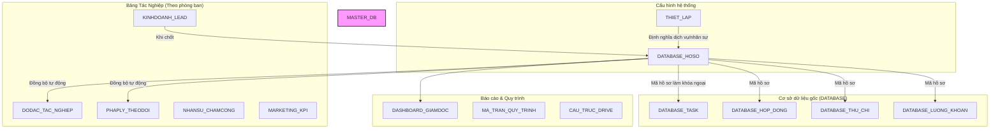

# Phân Tích Dự Án: ERP OpenClaw - Công Ty Đo Đạc Bách Khoa

Chào mừng bạn đến với tài liệu phân tích hệ thống quản lý đo đạc và vận hành tự động **OpenClaw** của Công ty TNHH Kiến Trúc Xây Dựng & Đo Đạc Bản Đồ Bách Khoa.

> [!NOTE]
> Hệ thống này được xây dựng xung quanh tệp cơ sở dữ liệu trung tâm **`BACHKHOA_FULL_AUTO_2026_migrated.xlsx`**, liên kết toàn bộ dữ liệu từ Kinh doanh, Đo đạc, Pháp lý, Kế toán, Nhân sự và Báo cáo Giám đốc.

---

## 1. Cấu trúc Workspace Hiện Tại

Không gian làm việc (`c:\Users\vanqu\OneDrive\Máy tính\BachKhoa`) bao gồm các tài liệu vận hành cốt lõi sau:

| Tên Tệp / Thư Mục | Loại | Mô Tả & Vai Trò |
| :--- | :--- | :--- |
| **`BACHKHOA_FULL_AUTO_2026_migrated.xlsx`** | Excel | **Cơ sở dữ liệu MASTER trung tâm** mới. Đã tích hợp và chuẩn hóa dữ liệu từ tất cả các nguồn cũ. |
| **`Bản sao của [Optimate] Quản lý hợp đồng - Công nợ.xlsx`** | Excel | Tệp theo dõi hợp đồng, dòng tiền thanh toán và công nợ cũ. |
| **`Bảng 02. Cơ chế khoán đo vẽ.xlsx`** | Excel | Bảng định mức đơn giá khoán cho phụ trách chính và phụ đo theo loại hồ sơ. |
| **`Bảng 03. Phòng đo vẽ .xlsx`** | Excel | Nhật ký tác nghiệp cũ của phòng đo đạc (bao gồm trạng thái đo, nộp biên nhận). |
| **`Công việc - Lê Văn Xây_v1.xlsx`** | Excel | Bảng tính lương khoán, KPI và khối lượng công việc của nhân viên đo đạc (mẫu Lê Văn Xây). |
| **`Thu chi Công Ty Bách Khoa năm 2026.xlsx`** | Excel | Sổ quỹ thu chi vặt hàng ngày của phòng kế toán. |
| **`Lập trình cds_Bách Khoa x Wifim.xlsx`** | Excel | Thông tin thiết lập ban đầu và nhu cầu chuyển đổi số của công ty. |
| **`SKILL.md`** | Markdown | Hướng dẫn vận hành AI Agent OpenClaw (quy định luồng tự động hóa & 8 module). |
| **`workflow-cong-ty.txt`** | Text | Tệp trống (sẵn sàng ghi chép quy trình phát sinh). |
| **`LOGO BACH KHOA.pdf`** | PDF | Logo chính thức của công ty. |
| **`openclaw_skill_architecture.png`** | PNG | Sơ đồ kiến trúc kỹ thuật của hệ thống OpenClaw. |

---

## 2. Kiến Trúc Cơ Sở Dữ Liệu Hợp Nhất (Master Database)

Tệp **`BACHKHOA_FULL_AUTO_2026_migrated.xlsx`** đóng vai trò là "Single Source of Truth" (Nguồn dữ liệu duy nhất). Cấu trúc các trang tính (Sheets) được chia thành 4 nhóm chính:

### Chi tiết các Sheet quan trọng trong MASTER Excel:
1. **`DATABASE_HOSO`**: Khóa chính là **`Mã hồ sơ`** (`BK-HS-xxxx`). Lưu trữ mọi thông tin từ ngày tạo, dịch vụ, khách hàng, khu vực, người phụ trách, deadline và cảnh báo trạng thái.
2. **`DATABASE_TASK`**: Quản lý chi tiết từng đầu việc (Task) được giao, gắn liền với Mã hồ sơ. Tự động tính toán trạng thái "Quá hạn?".
3. **`DATABASE_HOP_DONG`**: Quản lý giá trị hợp đồng, số tiền đã thu và số tiền còn nợ (công nợ).
4. **`DATABASE_THU_CHI`**: Nhật ký thu chi vặt gắn liền với mã hồ sơ/hợp đồng để phục vụ tính giá thành dự án.
5. **`DATABASE_LUONG_KHOAN`**: Tính lương khoán 3P tự động dựa trên đơn giá từ `Bảng 02. Cơ chế khoán đo vẽ.xlsx`.
6. **`DASHBOARD_GIAMDOC`**: Tổng hợp biểu đồ, số lượng hồ sơ đang xử lý, hồ sơ trễ hạn và tình hình tài chính của công ty.

---

## 3. Bản Đồ Nghiệp Vụ Tự Động Hóa (20 Tác Vụ Đề Xuất)

Theo tài liệu **`SKILL.md`**, hệ thống AI Agent OpenClaw sẽ tự động hóa các nhóm quy trình nghiệp vụ sau:

### 💼 Nhóm 1: Bán Hàng & CRM
* **NV01 & NV02 — Báo giá tự động**: OpenClaw nhận yêu cầu từ Web/Zalo/Messenger -> Tính giá theo bảng giá -> Xuất PDF gửi khách hàng -> Lưu Airtable/Google Sheet.
* **NV03 — Tạo hợp đồng tự động**: Tra cứu thông tin doanh nghiệp qua API MST.vn bằng mã số thuế -> Điền template Google Docs -> Xuất bản sao PDF lưu Drive -> Gửi link cho Sales & Khách hàng.
* **NV05 & NV06 — Pipeline & CSKH**: Chăm sóc tự động, nhắc nợ đến hạn, gửi lời chúc sinh nhật qua Zalo OA/Telegram.

### 📐 Nhóm 2: Hồ Sơ & Sản Xuất (Đo Đạc & Pháp Lý)
* **NV11 — Quản lý hồ sơ đo vẽ**: Theo dõi tiến độ hồ sơ từ lúc khảo sát -> Đo đạc thực địa -> Vẽ bản đồ -> Nộp pháp lý -> Bàn giao bản vẽ đạt cho khách.
* **NV14 — Tra cứu quy hoạch bằng AI**: Hỗ trợ phân tích tọa độ bản đồ VN2000, ảnh chụp hoặc file bản vẽ quy hoạch bằng Claude Vision để xuất báo cáo quy hoạch nhanh.

### 👥 Nhóm 3: Nhân Sự & Lương Khoán
* **NV12 — Tính lương khoán 3P**: Tự động lấy trạng thái "Nộp thành công/Bàn giao" -> Tra cứu cơ chế khoán (Ví dụ: Cắm mốc = 1.2M chính + 300k phụ) -> Cộng dồn vào bảng lương tháng của nhân viên.
* **NV19 — Chấm công Camera Hanet**: Tích hợp dữ liệu nhận diện khuôn mặt qua Webhook Hanet -> Đổ về Sheet chấm công -> Tính đi muộn/về sớm.

### 📊 Nhóm 4: Báo Cáo CEO
* **NV07 — KPI Dashboard & Telegram**: Cứ định kỳ (hàng ngày/tuần), bot quét dữ liệu Master Excel -> Gửi báo cáo nhanh về doanh thu, số hồ sơ mới chốt, số hồ sơ quá hạn trực tiếp vào nhóm Telegram của Giám đốc.

---

## 4. Đánh Giá Hiện Trạng & Đề Xuất Tiếp Theo

> [!WARNING]
> Dữ liệu cũ đã được gộp (migrated) thành công vào file `BACHKHOA_FULL_AUTO_2026_migrated.xlsx`. Tuy nhiên, để hệ thống tự động hóa hoàn toàn (OpenClaw ERP) đi vào hoạt động ổn định, cần triển khai các bước sau:

1. **Chuẩn hóa mã hồ sơ kết nối**: Một số khoản chi vặt trong `DATABASE_THU_CHI` và hợp đồng cũ chưa được map chính xác 100% với mã hồ sơ mới `BK-HS-xxxx`. Cần tiến hành quét và ánh xạ tự động.
2. **Cấu hình webhook kết nối n8n**: Xây dựng luồng đẩy dữ liệu tự động từ các biểu mẫu (Google Form/Airtable) mà nhân viên đo đạc nhập tại hiện trường về Master Excel.
3. **Cài đặt Telegram Alert Bot**: Thiết lập kịch bản thông báo nhanh cho Giám đốc khi phát hiện hồ sơ bị quá hạn hoặc có giao dịch thu/chi lớn.
